Tomcat的主要工作是：监听用户通过浏览器发送的网络请求，然后把请求连接上你的应用程序，做信息交换。在这个过程中，Tomcat里有acceptor、poller、 exec等等这些线程在做这个工作。

不过网上很多朋友都认为poller是Tomcat里做socket请求数据读写的线程，但是事实真的是这样吗？

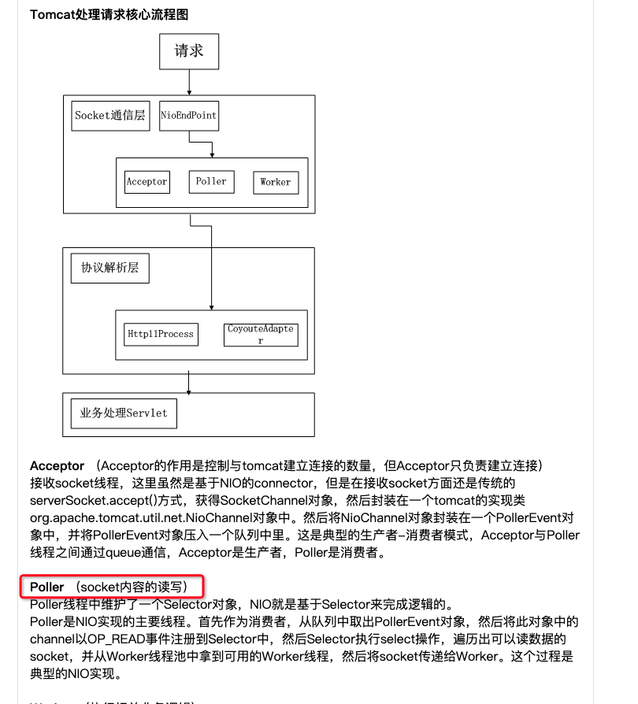

网络上的教程

## 实验
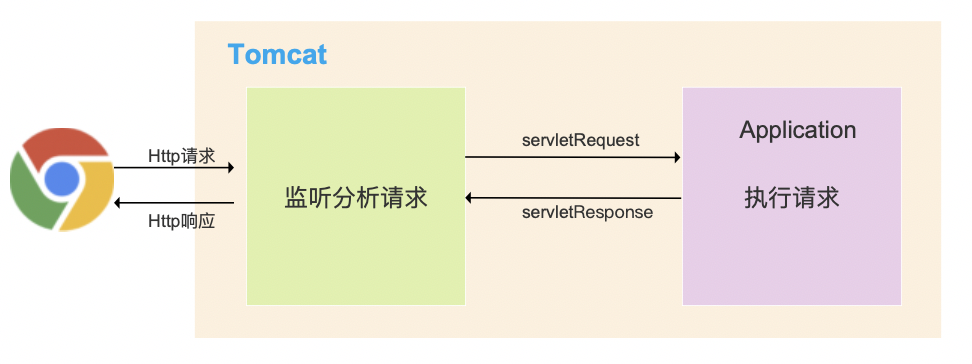
以往，Tomcat的工作就像一个黑盒子一样被封装好在底层架构里，我们看不到。本次我们借助了kindling摄像头工具做了个实验，让大家看到每个请求过来之后，所有工作线程的执行实况，以此来确认poller是不是做socket的读写的？
首先，我们先简单回顾一下Tomcat的工作流程：它有两大核心组件，connector和container，
其中container装着你的应用程序代码。打个比方，如果这是剧本杀，用户是玩家，你的程序代码是通关宝藏，那connector就是NPC。

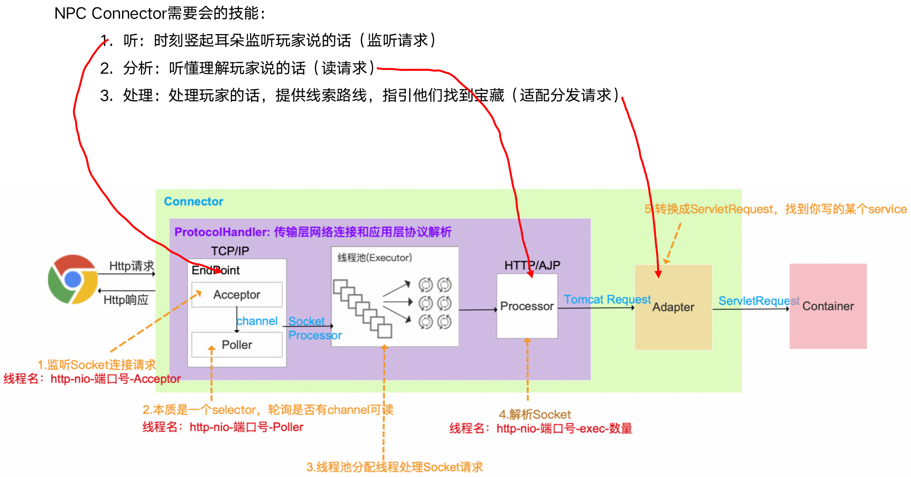

但是实际上，真正的网络请求，要远比剧本杀复杂的多，所以Tomcat也设计了线程池
来应对大量的并发情况。现在我们再来明确文章一开始提出的疑问：poller线程到底是不是Tomcat里执行socket的读写的线程？下图是我用kindling的摄像头工具捕捉记录了一次请求的执行情况。

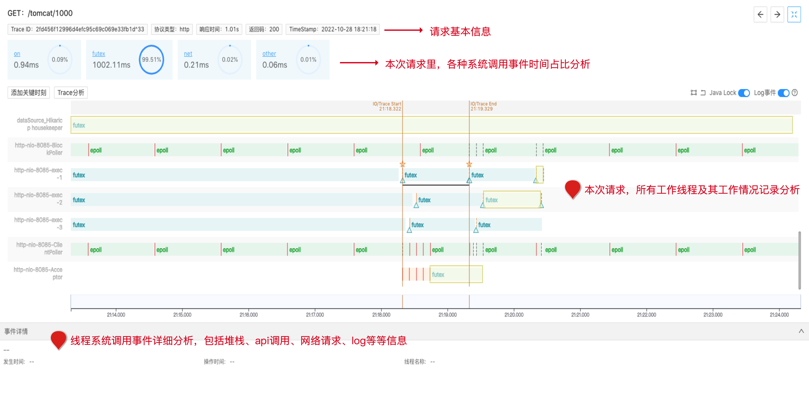
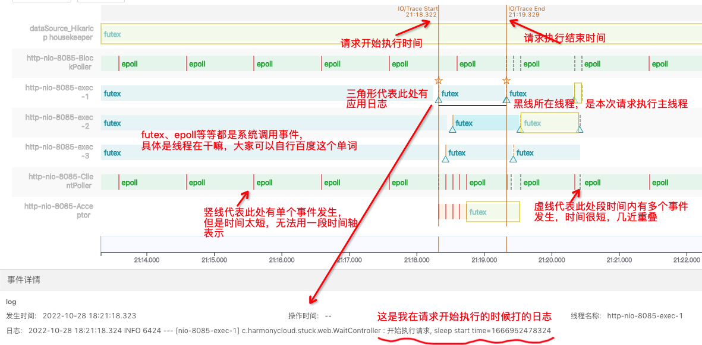

Kindling结果

 

大家可以先快速通过上面两张图，稍微理解一下这个工具怎么用。我交代一下设置的实验场景：一共做了5个并发请求，每次相隔100ms发出，请求的实现代码是sleep(1000)ms，配置的Tomcat最大的线程数是3。所以这也是一个资源饥饿的场景：并发数有5个，可是线程只有3个，我们一会也可以看看Tomcat是怎么应对的。我这里用工具捕捉的是第一个请求的执行记录。

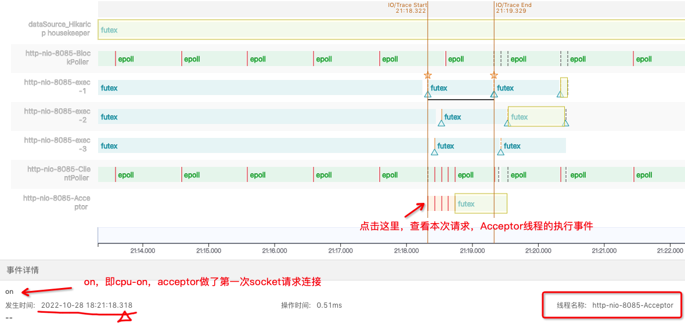
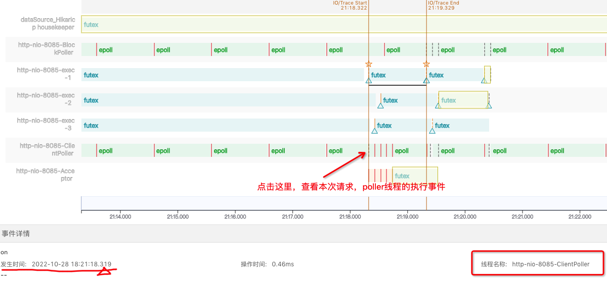

Kindling结果

 

我们可以从上面两张图看到，本次请求，最开始是由acceptor先做cpu-on，建立socket连接，然后把连接事件交给poller管理，大家注意看，poller执行的时间戳是.319，而acceptor是318，所以poller 一定实在acceptor之后才开始执行的。
之后，请求事件被交由Tomcat的线程池分配线程exec-1来执行，也就是图中黑线那段。futex代表该线程夯住，或者说在等待，的确，因为我的实现代码写的就是“sleep(1000)ms”。

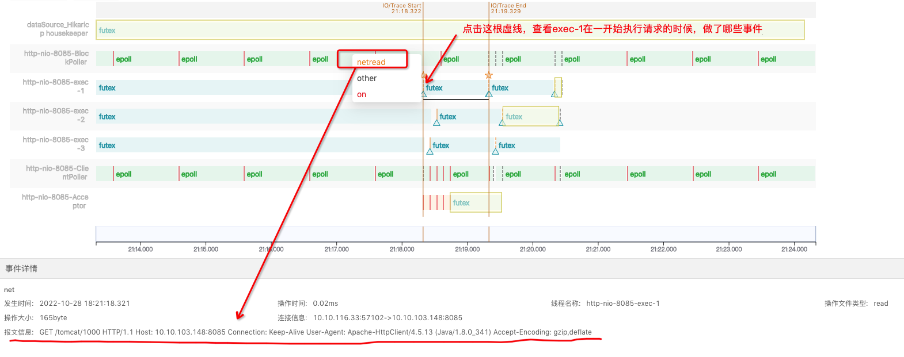
如上图所示，我们可以看到，请求流的读写是由执行线程exec-1来做的，netRead即网路流的读写。同理，请求报文的会写也是由exec-1来做的。如下图所示。（这里有两个netwrite是因为报文可能太大，写了两次，第三个netread是exec-1执行下一个请求的事件，因为时间相差太小，几乎重叠了）
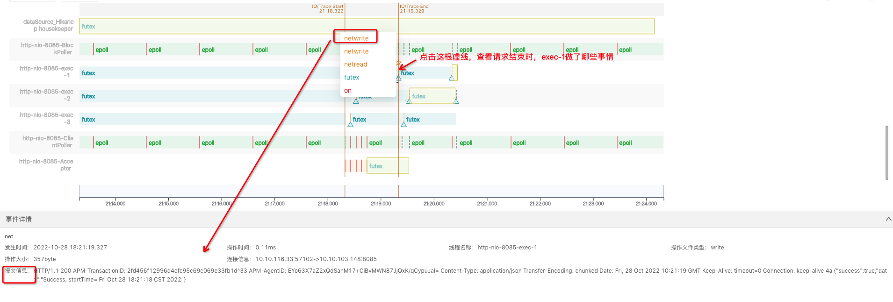

至此，我们可以明确开始提出的疑问了：Tomcat里对于请求流的读写不是由poller线程，而是由exec执行线程来做的。
我们再继续看，5个并发请求，Tomcat只有3个线程，它会怎么应对？

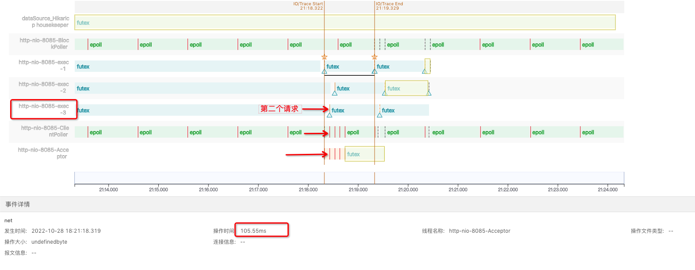
如上图所示，等了大概100ms左右，我的第2个请求进来了，Tomcat线程池分配给了exec-3来执行，同理，第三个请求分配给了exec-2来执行。
不过第4、5个请求情况就不一样了。如下图所示，第4、5个请求从客户端发出请求，acceptor建立好连接，poller做好请求事件管理之后，等待了一段时间，它们才被exec线程执行。因为此时Tomcat没有多余的线程了，它们需要等待有exec线程空下来，才能被执行。

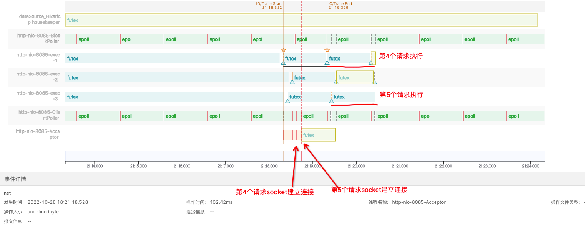
这里反映一种什么现象？对于客户端来说，我前3个请求都很正常，可是第4、5个请求是有一点慢的，它在等待了一段时间之后才开始执行。不过对于服务端来说，它的响应时间没有任何问题，因为服务端的响应时间，不是从建立连接开始，而是从exec线程真正处理这个请求开始计算的。
这也是我们生产环境上常见但是由十分难以排查的资源饥饿的问题，因为从表面上你很难发现症结。但是如果你懂一些Tomcat的原理，再加上kindling摄像头工具的辅助，定位起来是不是就容易很多了？

本次分享暂时到这里了，希望能给大家带来一些收获，也许有些同学也有了更多疑问需要被解答，那就请继续关注我们，或者扫描二维码联系我们，谢谢大家～