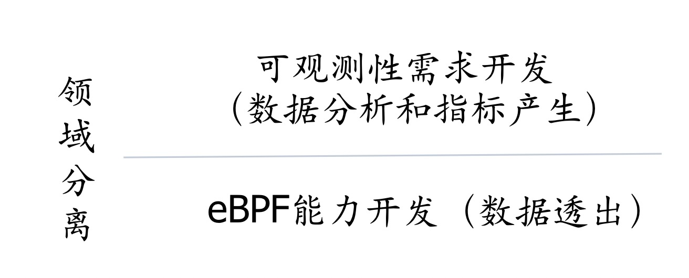

Kindling开源项目是一个基于eBPF技术的云原生可观测性项目。这篇文章将主要介绍探针的具体架构设计。
## Kindling探针的架构设计理念

Kindling架构设计中有一个很重要的理念：**关注点分离**（Separation of Concerns）。eBPF技术或者内核模块是一种内核技术，需要的背景知识是C语言和操作系统知识。而可观测开发者关注是要输出什么样的指标，同时因为平时使用Go、Java这一类语言较多，对C也比较生疏，所以我们的设计是基于两层的分层领域。下层是eBPF的开发能力，主要是为事件透出服务；上层是可观测性需求开发，主要是为数据分析和指标产生服务，同时可以方便扩展可观测场景化需求。



<center>Kindling领域分层图</center>
<br/>

另外一个重要的理念是：**不重复造轮子**，我们目标是把eBPF的能力以简单的方式透出给用户使用。所以Kindling的设计是以基于falcosecurity-libs为基础的。目前这个开源项目承担的主要职责就是系统调用的事件透出，对于可观测方面的能力需要进一步扩展。但是它有一个优势是它会将原始内核数据和cgroup信息进行关联，方便后续将数据关联到k8s相关的resources, 同时falcosecurity-libs也对原始数据做了预处理，比如将网络数据进行更丰富的关联，让用户能够直接拿到某个对fd操作的网络事件属于哪个四元组的信息，所以我们复用了这部分能力。但falcosecurity-libs本身并不支持kprobe、uprobe等能力，Kindling目前已经对其扩展了kprobe能力，后续也会持续不断的扩展uprobe等能力，同时还会集成其他开源工具的数据能力。 

一般来说，eBPF探针主要由两部分程序组成：内核态程序用作采集数据以及用户态程序用作分析数据。但基于以上两个理念，我们的架构并不是传统的两部分。我们基于关注点分离理念，为了让cloud-native领域的开发者能够更方便的使用eBPF的能力，把原来falcosecurity-libs的C/C++用户态程序拆分成了一个Go程序和一个C/C++程序，让用户能更关注自己擅长的领域。


<center>传统eBPF程序结构</center>

## Kindling探针架构介绍

Kindling探针整体包含三个部分：用户态Go程序、用户态C/C++程序和内核态drivers程序。用户态Go程序满足的是上层可观测需求的开发，其他两个部分实现是内核需求的开发。这样不同领域的人可以用自己熟悉擅长的语言开发自己关注的内容，同时探针也有较好的松耦合特性。Kindling具体组件描述如下：


<center>Kingdling架构图</center>

#### 内核态程序：drivers

为了更好的支持低版本内核的可观测能力，Kindling的探针使用内核模块的形式支持低版本内核，所以drivers又分为eBPF probe以及内核模块。drivers主要负责采集内核事件，将事件放入由直接内存映射技术创建的数据结构，供用户态程序获取并处理。在事件采集这一层后续会持续将其他开源工具集成进来，比如BCC、bpftrace。

#### 用户态C/C++程序：kindling-probe

kindling-probe是一个由C/C++语言编写的程序，运行时以一个单独的container运行在pod中，其主要的职责是负责和内核态程序进行交互并将内核事件暴露给上层处理程序。目前负责的工作主要有三个部分：
- 负责调用bpf API加载eBPF内核态的字节码或者安装低版本内核的内核模块
- 负责从mmap映射出来的ringbuffer结构中读取内核产生的原始事件并对原始事件进行预处理，最后转换为标准事件格式发送给kindling-collector
- 负责提供动态配置通道，例如可以通过配置实现内核数据过滤，减少原始数据量以及无关数据

#### 用户态Go程序：kindling-collector

用户态Go程序是一个可扩展模块，用户可以订阅自己关注的内核事件，基于自己的使用场景扩展自己的分析程序。目前Kindling实现的分析程序被称为kindling-collector，它在运行时也是以一个单独的container运行在pod中，其主要职责是负责获取事件并进行分析，并对数据进行label的丰富。

kindling-collector部分模块集成了Opentelemetry的SDK，这样Kindling的指标在输出时有较高的灵活性，可以输出到opentelemetry collector 、Prometheus 、Kindling标准版后端等多种可观测性平台。目前kindling-collector订阅的事件只是probe暴露出来的部分事件，主要是以系统调用以及kprobe为主，具体订阅信息如下：
```yaml
subscribe:
- name: syscall_exit-writev
category: net
- name: syscall_exit-readv
category: net
- name: syscall_exit-write
category: net
- name: syscall_exit-read
category: net
- name: syscall_exit-sendto
category: net
- name: syscall_exit-recvfrom
category: net
- name: syscall_exit-sendmsg
category: net
- name: syscall_exit-recvmsg
category: net
- name: kprobe-tcp_close
- name: kprobe-tcp_rcv_established
- name: kprobe-tcp_drop
- name: kprobe-tcp_retransmit_skb
```

#### 程序间通信方式

##### drivers和kindling-probe程序之间通信方式

eBPF程序采用BPF MAP 数据结构通信；内核模块采用mmap构造的ringbuffer进行通信。下图是eBPF程序使用的架构模型，为了兼容4.X内核，BPFMAP结构使用的是BPF_MAP_TYPE_PERF_EVENT_ARRAY，每个cpu都有相应的一个perf-event的map，在kindling-probe层会对事件进行排序组合。


<center>eBPF probe和probe通信</center>

##### Kindling通信标准化事件格式

正如不同微服务间团队的通信大多都基于一份RESTful的HTTP接口定义，Kindling在分层后也需要一种标准化的事件格式来屏蔽不同领域的实现细节，目前Kindling设计的事件格式被称为kindling-event。Kindling-event是kindling-probe程序暴露出来的内核事件，底层eBPF程序会遵循kindling-event的标准格式暴露数据，这样上层应用也能基于标准去分析事件。具体的kindling-event的结构如下。
```go
type KindlingEvent struct {
    Source Source
    // Timestamp in nanoseconds at which the event were collected.
    Timestamp uint64
    // Name of Kindling Event
    Name string
    // Category of Kindling Event, enum
    Category Category
    // Number of UserAttributes
    ParamsNumber uint16
    // User-defined Attributions of Kindling Event, now including latency for syscall.
    UserAttributes [16]KeyValue
    // Context includes Thread information and Fd information.
    Ctx Context
}

type Context struct {
    // Thread information corresponding to Kindling Event, optional.
    ThreadInfo Thread
    // Fd information corresponding to Kindling Event, optional.
    FdInfo Fd
}
```
