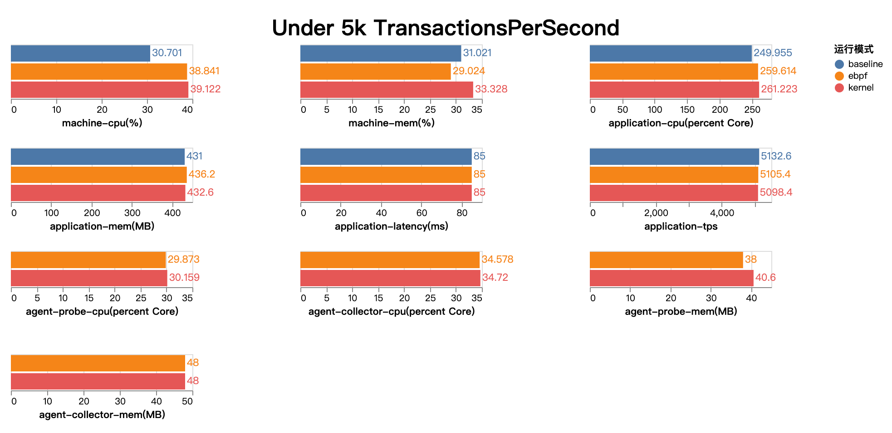
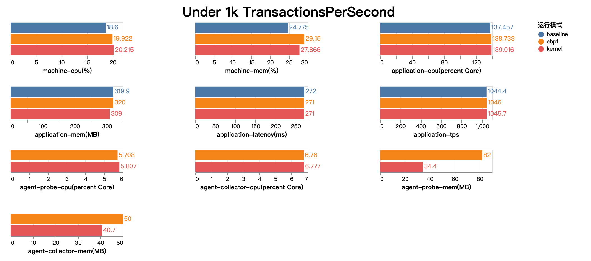

## 1. 背景
Kindling-agent是基于eBPF的监控工具Kindling中的采集端组件，能够通过采集和分析内核事件，获取运行于同一宿主机上的其他服务的业务、网络等指标。其工作模式是在主机上以独立进程的方式收集所需数据，所以只需要我们在应用所在主机部署Kindling-agent即可启动相应能力，随后可以通过prometheus和grafana套件对不同机器上的探针采集的数据进行整合分析和查看，当然也可以用其他工具获取数据并进行分析展示。

尽管Kindling-agent基于eBPF的方式进行的监控方式减少了对被监控应用的侵入，但始终还是和用户应用共享同一台宿主机的CPU,内存，磁盘，网络等资源。这使得所有想要使用Kindling-agent的用户都会想知道该工具在真实环境中的性能表现和预期资源使用。

Kindling项目提供了一系列的测试来验证该采集工具的性能表现，这些测试反应了Kindling-agent在不同压力下良好的性能表现和可靠性。

## 2. 测试目标
1. 检验高负载(5000 TPS)场景下，Kindling-agent对应用的性能影响和agent本身的资源使用情况。
2. 检验常规负载(1000 TPS)场景下，Kindling-agent对应用的性能影响和agent本身的资源使用情况。

## 3. 测试环境
| 类型 | 参数 |
| --- | --- |
| 内核版本 | 3.10.0-1160.53.1 |
| CPU | Intel(R) Xeon(R) Platinum 8269CY CPU @ 2.50GHz，8C |
| 内存 | 16G |

Jmeter和Kindling-agent以K8S工作负载的方式进行部署，测试应用和Jmeter分别运行在两台CentOS7(fedora)上。
## 4. 结果说明
每一组测试中包含了以下信息：
1. 基线指测试应用在无探针安装时的进行压力测试获得的指标，包括以下信息: 
- machine-cpu: 机器总CPU使用总体百分比
- machine-mem: 机器总内存使用总体百分比
- application-cpu: 测试应用CPU使用核数
- application-memory: 测试应用内存使用
- application-latency: 测试应用请求延迟
- application-tps：测试应用每秒事务数
2. 安装探针后的测试应用在压力测试时的性能指标
3. 探针自身的性能损耗，包括CPU和内存使用；在一些较低内核版本的机器中，Kindling使用内核模块代替eBPF实现了相同的功能，你将会在测试中看到两种实现下不同的性能表现

## 5. 测试用例
### 5.1 用例1
为了验证Kindling-agent在高负载下的性能表现，用例1使用了Skywalking的benchmark1程序。该程序为一个常规的Springboot应用，对外提供HTTP服务，其预期TPS为5000，预期延时为85ms。

Kindling会捕获该程序的异常/慢的请求数据（即Trace），并统计程序统计时间段内的关键性指标（Metric），如平均响应时间、错误率、请求字节数和请求数等。这些Trace和Metric能够有效的保障程序的可观测性。

下面的测试结果中是待测程序在5000 TPS下的性能表现,baseline表示未启用agent下的资源开销和性能表现。



在资源使用上，Kindling-agent 一共消耗了约 0.64C 来处理并统计 5000 TPS下的关键性能指标，并通过Prometheus暴露在HTTP接口上。

对于应用程序的资源使用，在基线测试中，应用程序需要花费2.5C处理现有的业务请求，在部署了探针后，程序需要使用2.6C处理现有的业务请求，即相对于基线增加了4%的额外开销；内存方面则几乎没有影响。

对于应用程序的服务表现，可以看到，即使在5000 TPS的负载下，Kindling-agent对应用程序的响应时间和TPS的影响都非常微小。大多数正常的业务都包含一定的处理逻辑，单节点吞吐量很少能够达到5000 TPS。因此，对于大多数的业务应用来说，不需要担心Kindling-agent对应用本身的处理能力造成影响。

### 5.2 用例2

如之前所述，用例1中的TPS明显高于正常的用户应用。为此，测试用例2增加了处理每个请求时的CPU使用，并下调了请求压力,使该场景更接近于生产环境下的常规压力。



在资源使用上，Kindling-agent 一共消耗了 0.12C 用于数据处理和统计。

对于应用的资源使用，在1000 TPS下，基线使用 1.37C 处理现有的请求，安装agent后相较于基线几乎没有额外开销；服务表现方面，在1000 TPS下，基线的响应时间为272ms , TPS为 1044; 安装agent后相较于基线几乎不变。总的来说，在常规负载下，Kindling-agent对用户应用几乎没有影响。

## 6. 总结

上述用例说明了Kindling-agent出色的性能表现。在较低的资源开销下，它支持轻量化部署，易于管理；能够深入分析请求到协议栈在内核执行情况；能够提供语言无关，应用无侵入的监控体验，为你的应用带来新一代的可观测能力。

## 附录
测试中使用到的所有资源使用指标均通过Jmeter的ServerAgent采集，应用响应延时和TPS通过Jmeter性能面板插件采集，非GUI模式下以jtf格式保存原始数据，后续通过 Jmeter的图像生成工具生成折线图并自行统计。

如果大家有兴趣在自己的环境中复现本次性能测试，可以参考该仓库中的测试脚本，仓库里也保存了本次测试的原始记录：[https://github.com/NeJan2020/KindlingPerfTest](https://github.com/NeJan2020/KindlingPrefTest)

除了测试脚本，下面还提供了你在测试时可能遇到的问题和解决方法，并附上了本次测试中使用到的Jmeter插件和源码的下载地址。

### 以工作负载方式部署Skywalking的测试用例

原始测试用例是直接以Java应用的方式运行并部署在物理机上，这里提供了相关的Dockerfile和deployment文件修改成K8s工作负载。
```dockerfile
FROM openjdk:8u322-jdk
ADD benchmark-3.tar.gz /opt
CMD ["/opt/benchmark-3/bin/startUp.sh"]
```
```yaml
apiVersion: apps/v1
kind: Deployment
metadata:
  name: benchmark-1
  namespace: benchmark
spec:
  replicas: 1
  selector:
    matchLabels:
      app: benchmark-1
  template:
    metadata:
      labels:
        app: benchmark-1
    spec:
      containers:
      - image: ${your-harbor}/${your-project}/benchmark-1
        imagePullPolicy: IfNotPresent
        name: benchmark
```

### Kindling-agent切换至内核模式运行的方法


* 在 Kindling-agent 的daemonset文件中，为kindling-probe容器添加环境变量 PREFER\_KERNEL\_PROBE=1，则会优先使用内核模式。示例如下：

```yaml
...
      containers:
      - name: kindling-agent
        image: kindlingproject/kindling-agent:latest
        ...
        env:
        - name: PREFER_KERNEL_PROBE
          value: 1
        ...
        securityContext:
          privileged: true
...
```

### 相关链接

1. 探针测试版本 <https://github.com/Kindling-project/kindling/tree/release-0.2.0>
2. 原始测试结果和测试脚本 [https://github.com/NeJan2020/KindlingPerfTest](https://github.com/NeJan2020/KindlingPrefTest)
3. Skywalking测试用例源码 <https://github.com/SkyAPMTest/Agent-Benchmarks>
4. 资源指标采集工具 <https://jmeter-plugins.org/wiki/PerfMon/>
5. 应用响应延时和TPS展示 <https://jmeter-plugins.org/wiki/ResponseTimesOverTime/>
6. 图形生成工具 <https://jmeter-plugins.org/wiki/JMeterPluginsCMD/>

