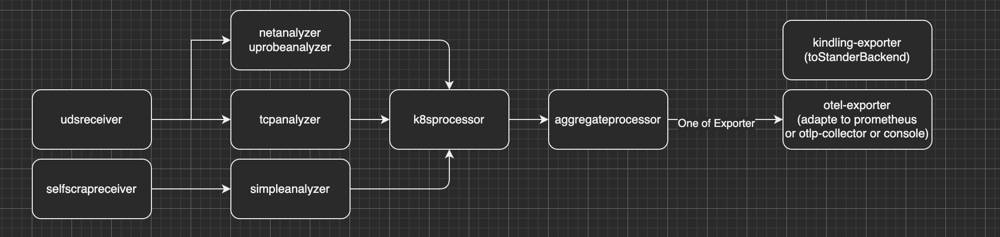

## 1. 流水线设计
Kindling-collector是一个Golang完成的数据中转和处理组件，其目前的设计为基于流水线处理内核事件，并以易于处理的格式/含义向后续处理组件（Backend）传递。
其流水线抽象后的设计如下：

1. Receiver 接受来自不同数据源的事件/监控信息，逐一交由Analyzer处理
   - CgoReceiver负责调用CGO接口获取来自kindling-probe的内核事件
   - SelfScrapeReceiver负责对本机系统进行监控并生成事件
2. Analyzer 基于原始内核事件，进行事件分析，生产更为易于理解的元素。不同的Analyzer实现负责处理的事件和生成的元素不同。
   -  NetworkAnalyzer 负责将请求相关的内核事件转化为单次请求详情，客户端包含请求发送到响应接受的完整过程，服务端包括请求接受到响应发送的完整过程
   -  TcpMetricAnalyzer 负责将Tcp报文相关的内核事件简单输出。
3. Processor 对Analyzer生成的元素进一步补充外部信息，并进行一些业务无关的修改
   - k8sProcessor 基于元素内部的containerId数据和IP:PORT信息尝试补充K8s信息
   - aggregatorProcessor会修改元素中的值结构，见流程分析中的**阶段**变化。
4. Exporter 负责对处理后的元素做最终的业务相关的修改，并以特定方式导出/发送至后续组件

一种可能的流水线结构如下：


Kindling-collector中一条基础的网络请求相关的流水线如下：
```
-> CgoReceiver -> NetworkAnalyzer -> K8sProcessor -> AggregateProcessor -> OTLPExporter
```
Kindling-collector中一条基础的TCP处理相关的流水线如下：
```
-> CgoReceiver ->TcpAnalyzer -> K8sProcessor ->AggregateProcessor -> OTLPExporter
```

可以看出，不同类型的数据在处理过程中会存在一部分相同的处理逻辑（比如填充K8s信息/聚合），我们在设计和实现Processor时，也尽可能确保Processor的独立性。

## 2. 数据结构分析
由Analyzer生成的元素是后续处理和分析的基础对象，我们现有的数据流水线能够处理的数据为:

- **网络请求服务响应情况**
- **Tcp报文传输情况**

这两类数据目前包含两类信息:

- 特征信息: 帮助我们后续对元素从不同维度上进行分组
   - 网络请求包含五元组，协议类型，协议详情等信息
   - tcp报文包含五元组
- 表现信息: 帮助我们对元素表达的内容进行评估
   - 网络请求包含network latency，IO bytes, return code 等信息
   - tcp报文包含重传内容大小，重传时间等

一部分的表现信息也是后续进行分组分析的要素，比如网络请求的return code。
因此，我们把元素中的信息分成了两种类型:

- 标签(label)数据：保存所有的特征信息，并会存储一部分的表现信息。存储在这里的表现信息都是可聚类的，来避免在分类时出现过多分类的情况
- 值(value)数据：保存部分的表现信息，所有的值数据都是可量化的，它们必须能够支持我们后续进行的一些聚合运算，如 count,sum,avg,histogram等

由于Analyzer/Processor可能会修改/增减元素中的字段和值信息，label和value数据都没有采用固定结构，而是以map的形式存储，Map中key值代表该数据表示的维度，value值代表该数据的具体数值。
下面是一段我们为流水线定义的数据结构的伪代码和相应含义。

```go
// DataGroup describes the result of analyzers.
// Notice: Currently the definition of DataGroup is not stable.
type DataGroup struct {
	Name      string 	      // 标志位，见后续说明
	Metrics   []*Metric	      // 存储值数据
	Labels    *AttributeMap   // 存储标签数据
	Timestamp uint64          // 时间戳
}

type Metric struct {
	Name	string
    //	Data can be assigned by:
    //	IntGauge
    //	HistogramGauge
    Data    oneOf{Int,Histogram}
}

type Int struct{
    Value int64
}

type Histogram struct{
    Sum int64
    Count uint64
    ExplicitBoundaries int64
    BucketCounts []uint64
}

type AttributeMap struct {
	values map[string]oneOf{string,int64,bool}
}
```

- Name为上述过程中提到的标志位。
- Metrics为上述过程中提到的值类型，它支持Int和Histogram两种类型，来支持我们对数据聚合的需要
- Labels为上述过程中提到的Label类型，它基于一个Key为string类型，value支持String，Int和Boolean类型的Map.

Kindling后续的Roadmap中，可能会在网络请求数据中引入新的日志信息，比如在请求信息中加入本次请求中的日志数据，日志大小，日志输出花费的时间，这类数据在目前的DataGroup中暂未覆盖。因此，该结构会在后续进一步迭代。

## 3. 数据处理流程
### 3.1 标志位
可变的数据结构给不同组件处理和分析这些数据带来了一定难度，当前已经实现的部分Processor还不能很好的实现通用化，即不需要修改代码就兼容所有已有或未来新增的流水线的数据结构（主要是性能和开发成本上的考虑）。为了支持这种非通用的组件，我们暂时在元素中加入一个标志位来说明当前输入的数据是哪个流水线，哪个阶段的数据。组件通过标志位判断是否支持处理该数据，并选择对应的处理逻辑。

并非所有的数据结构变化都会引起标志位的改变。目前标志位改变主要有两个原因：

1. 不同analyzer分析后输出的结果，其元素含义以及后续流水线均不同，因此标志位不同
2. 其他会引起值数据含义发生变化的操作，比如聚合Processor，其结果的含义由单条请求数据变成了时间段内的聚合数据。

### 3.2 Processor 在流水线中的功能
Processor的基础功能为接受一个DataGroup，经过处理后通过内部逻辑交给下一个流水线的下一个组件。你可以通过实现Processor接口来实现一个自己的Processor。
一个基础的Processor包含以下的要素：

```go
type Processor interface {
	consumer.Consumer
}

type Consumer interface {
	Consume(dataGroup *model.DataGroup) error
}

type XXXProcessor struct { 
    nextConsumer Consumer
}

func (x *XXXProcessor) Consume(dataGroup *model.DataGroup){
    var processedDataGroup *model.DataGroup
    // you logic to process this Data
    processedDataGroup =  process(dataGroup)
    // send to Next consumer
    x.nextConsumer.Consumer(processedDataGroup)
}

func NewXXXProcessor(
    config interface{}, 
    telemetry *component.TelemetryTools, 
    nextConsumer consumer.Consumer
) processor.Processor {
    // create a instance
}

```
我们会选择在Processor中完成的一些工作如下：

1. 补充部分在原始数据中未能获取的信息，如K8s信息填充
2. 通过一定的逻辑修改或计算值数据

其中，AggregatorProcessor的聚合功能实际上就是第二种工作。对于熟悉OpenTelemetry或类似的可观测性工具的开发者，其实AggregatorProcessor的功能类似于提取原始Trace中的数据并聚合成Metric数据。由于数据含义的转变，我们在AggregatorProcessor处理前后设置了标志位，用于后续的处理组件对两类数据进行适配。不过，目前只有Exporter需要对该标识位做兼容。

原则上所有对DataGroup的label或value的修改都可以在Processor中完成，但如果在processor中完成一些业务性的修改，比如将某个label的key重命名，如果是一些关键性的label，这种修改会提高和其他Processor共同工作的难度（一些比较常见的做法是将逻辑移植到配置文件中，但会带来冗长的配置文件）。为此，我们希望避免Processor中出现跟业务相关的修改，在Processor阶段使用的所有关键性的label和value的key都使用内部名称，被保存在model.constname/constlabels/constvalues包下。这类修改被移交到Exporter中完成。

### 3.3 Exporter 在流水线中的功能
和Processor类似，Exporter接受一个来自上游的DataGroup数据，并在内部进行处理，但不再向后继续传递处理结果。

```go
type Exporter interface {
	consumer.Consumer
}

type Consumer interface {
	Consume(dataGroup *model.DataGroup) error
}

type XXXExporter struct { 
}

func (x *XXXExporter) Consume(dataGroup *model.DataGroup){
    // you logic to export this data
}

func NewXXXExporter(
    config interface{}, 
    telemetry *component.TelemetryTools, 
) exporter.Exporter {
    // create a instance
}

```
Exporter原则上需要兼容所有的标志位，并对每一个标志位提供对应的转换功能，使数据最终以Metric或Trace的形式输出，同时业务相关的修改也在Exporter中完成，业务相关修改目前在tools下的adapter中实现。

Exporter还应支持默认数据输出能力，即当输入的数据没有需要完成的业务修改逻辑时，确保输入的数据能够被直接输出，默认情况下，所有的输入数据都会尝试以Metric方式输出。输出格式为Prometheus的Counter类型。其中，Data中的数据作为Metric的数值，Labels中的额数据作为Metric的label。

