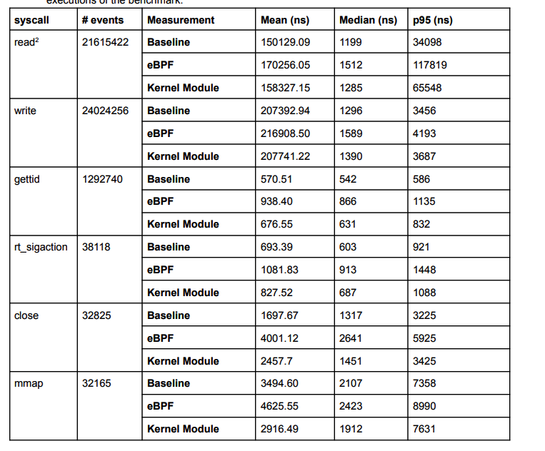
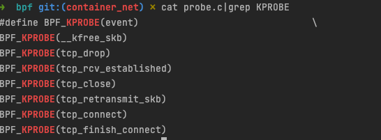
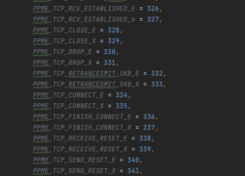

eBPF技术正以令人难以置信的速度发展，作为一项新兴技术，它具备改变容器网络、安全、可观测性生态的潜力。eBPF作为更加现代化的内核技术，相较于内核模块，它的编写难度已经有了较大的降低，但是不可否认对于普通开发者还是有一定门槛。因此，很多云原生软件会在ebpf系统调用（函数）和libbpf之上封装一层更加简单易用的api，比如falco的libs、bcc的libbcc、cilium的cilium-ebpf。笔者将这些依赖库称之为eBPF的基础设施。

Kindling专注于云可观测性领域，致力于排查各种复杂故障，包括但不限于网络、文件、内存、on-off cpu堆栈，去解决上述问题是Kindling的第一优先级，本着不重复造轮子的原则，Kindling无意于再创造一个eBPF的基础设施。

### 丰富的eBPF基础设施库
当下有很多库可以供开发者选择，比如libbcc、dropbox的goebpf、cilium的ebpf库、calico的底层库、falco的lib库。这些库主要协助完成以下功能：
- 将eBPF程序加载到内核中并且重定位
- 将map载入初始化，提供fd供用户态和内核态交互
- 更友好的开发使用体验

基于此，我们分别选择了2个基于c和go的基础设施库来对比：

|  | Libbcc | Gobpf | Falco-libs | Cilium-ebpf |
| --- | --- | --- | --- | --- |
| 开发语言 | c或cgo | go | c | c通过bpf2go转换成go |
| 是否支持CO-RE | 支持 | 支持 | 不支持（正在支持） | 支持 |
| api完善度 | 较好 | 较好 | 较好 | 很好 |
| 初始化流程完善程度 | 好 | 好 | 好 | 好 |

在这4个比较对象中，libbcc和gobpf一脉同源，gobpf是libbcc的go实现，其原理是用cgo包装了libbcc和libelf。faclo-libs是纯c语言的实现，cilium-ebpf则是纯go语言的实现。在功能实现方面，这些库都实现了eBPF程序加载使用的基本流程。不过这些库分别也拥有一些其独有的优势，比如：
- Cilium-ebpf由于cilium踩得坑较多，在一些细节方面更加出色，比如ebpf中使用memcmp函数存在一些可用性的BUG(详见：[https://lists.llvm.org/pipermail/llvm-bugs/2016-January/044502.html](https://lists.llvm.org/pipermail/llvm-bugs/2016-January/044502.html))，cilium就重写这些基础库函数，保证函数是可用的
- libbcc和faclo-libs由于是纯c的库，不需要经过cgo这样的方式调用，相对来说性能也更加出色一点
- libbcc有更好的脚本语言生态，bcc中很多python和lua这类运行在libbcc之上的脚本已经很成熟，能帮助用户更快和更容易的写出eBPF程序

### Kindling选择falco-libs的N大理由

既然基础的功能这些库都能实现，并且在细节方面cilium更加出色，那么为什么Kindling依旧选择了falco-libs作为了eBPF基础设施呢？理由如下：

#### 1. 对低版本内核的支持
众所周知，eBPF在4.14内核版本以上才能使用。但是现阶段很多发行版比如centOS7的内核版本都是3.x,无法使用eBPF（centOS7.6以上已经通过eBPF patch支持）。falco-libs使用内核模块实现了和eBPF相同的功能，且性能表现更加出色，Kindling认为centOS7.4等版本在国内现阶段还是广泛应用的，在低版本内核中体验到Kindling可观测性的功能是非常重要的。
由于采用了faclo-libs，Kindling支持的发行版本:  
| **发行版** | **版本** |
| --- | --- |
| Ubuntu | 16.04+ |
| Debian | 9.0+ |
| RHEL | 7+ |
| CentOS | 7+ |

内核模块更出色的性能表现（测试报告见[#267](https://github.com/falcosecurity/libs/issues/267)）：



#### 2. 对于系统调用的精细化整理
falco-libs是syscall方面的专家，而kindling对syscall的分析需求也必不可少。

syscall是Kindling可观测性事件的重要来源，syscall可以分析出一次网络调用的时间、具体网络报文，一次		文件读写等指标。在Kindling的未来功能规划里，oncpu offcpu剖析也需要用到futex,write,epoll等syscall。
	facalo-libs梳理了300多个syscall，将其中的主要参数从内核数据结构转换成如下类似事件结构： 
```
	/* PPME_SOCKET_GETSOCKOPT_E */{"getsockopt", EC_NET, EF_MODIFIES_STATE | EF_DROP_SIMPLE_CONS, 0 },
	/* PPME_SOCKET_GETSOCKOPT_X */{"getsockopt", EC_NET, EF_USES_FD | EF_MODIFIES_STATE| EF_DROP_SIMPLE_CONS, 6, {{"res", PT_ERRNO, PF_DEC}, {"fd", PT_FD, PF_DEC}, {"level", PT_FLAGS8, PF_DEC, sockopt_levels}, {"optname", PT_FLAGS8, PF_DEC, sockopt_options}, {"val", PT_DYN, PF_DEC, sockopt_dynamic_param, PPM_SOCKOPT_IDX_MAX}, {"optlen", PT_UINT32, PF_DEC}}},
	/* PPME_SOCKET_SENDMSG_E */{"sendmsg", EC_IO_WRITE, EF_USES_FD | EF_WRITES_TO_FD | EF_MODIFIES_STATE, 3, {{"fd", PT_FD, PF_DEC}, {"size", PT_UINT32, PF_DEC}, {"tuple", PT_SOCKTUPLE, PF_NA} } },
	/* PPME_SOCKET_SENDMSG_X */{"sendmsg", EC_IO_WRITE, EF_USES_FD | EF_WRITES_TO_FD | EF_MODIFIES_STATE, 2, {{"res", PT_ERRNO, PF_DEC}, {"data", PT_BYTEBUF, PF_NA} } },
```


#### 3. Falco-libs对事件的丰富化
Falco-libs会根据内核事件的tid,fd等信息自动补全事件的以下字段： 
| **字段** | **描述** |
| --- | --- |
| Category | 事件分类，比如该事件属于网络、文件、内存等 |
| FdInfo | FD相关信息，比如该FD代表的文件，网络协议，四元组等信息 |
| ThreadInfo | 线程名称，事件所属于的容器id等信息 |

这让Kindling将事件转换成指标和trace变得事半功倍。 

#### 4. 正在支持中的CO-RE
Faclo-libs截止目前还未支持CO-RE，不过其已经有独立的分支开始进行[相关内容支持](https://github.com/falcosecurity/libs/pull/268)，相信在不久的将来falco-libs将支持CO-RE。这使得笔者认为的falco-libs的最大短板将得到解决。

基于以上理由，笔者认为faclo-libs是当下最适合Kindling功能需求的基础eBPF库。

### 基于faclo-libs的拓展

- 由于faclo-libs专注于syscall，所以其对tracepint的支持较好，对于其他eBPF程序类型没有支持。kindling拓展了faclo-libs的代码使其支持了kprobe     

- 支持了centos7.6+使用eBPF
- 拓展了除syscall之外的更多事件，并且Kindling还将根据需求不断拓展新事件，以下是Kindling已经新增的事件：

- 拓展了用户态动态控制probe启停的能力
- 拓展了eBPF相关的基础函数，比如字符串比较等

这些改动都体现在该仓库[agent-libs(forked from draios/agent-libs)](https://github.com/kindlingproject/agent-libs).

### 对于未来
随着国内3.x内核版本操作系统的逐渐更新换代，Kindling有理由选择社区热度更火、细节方面更出色的cilium-ebpf作为底层基础库，也有理由选择经过无数环境验证的libbcc作为底层库。总之，一切取决与Kindling用户的需要，Kindling对此呈开放态度并且始终权衡利弊，选择当下最合适的方案。
