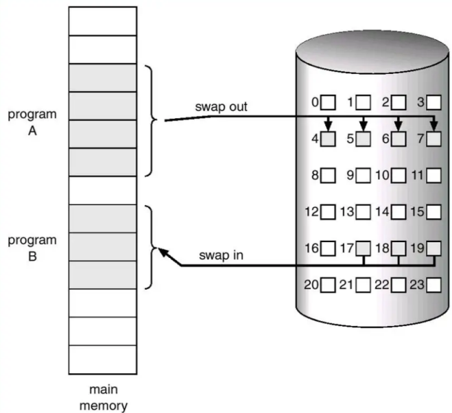

## 什么是 page fault
在 Linux 内核中，每一个进程都有一个独立的虚拟地址空间，而进程本身感受不到真正的物理内存的存在（比如某进程感知到的内存是连续的，但是实际上它被分配的内存是物理内存中分散的空间）。MMU（内存管理单元）负责完成对于这种虚拟地址-物理内存地址的转换工作。Linux 为每一个进程维护了一张页表，用于记录虚拟地址和物理内存地址之间的关系，并在进程运行时实时进行地址转换从而使得进程访问到真正的物理内存。


<center>图 1 内存管理单元 MMU</center>

而我们要提到的 page fault 便是在这种场景下产生的，page fault 大致可以分为三类：

- major page fault：进程要访问的页面不在真正的物理内存中，可能需要从磁盘中载入（比如 Linux 开启了 swap 机制，内核通过 LRU 页面置换算法将页面置换到了磁盘中暂存），这个时候将会产生一个 major page fault


<center>图 2 swap 页面置换机制</center>

- minor page fault：进程要访问的页面在物理内存中，但是 MMU 还没有建立进程的虚拟地址和相应物理地址的映射关系，这个时候就会触发 soft page fault（比如说我们使用 malloc 函数在堆上申请内存，在进程不访问这片虚拟内存之前它的物理内存页是不会被实际分配的，当进程第一次访问使用 malloc 分配的内存空间时，由于会分配物理内存，这时候只需要再建立虚拟内存-物理内存的映射关系即可）

- invalid page fault：就是 segment fault，进程的内存越界。

在 Kindling 中，我们重点关注前两种 page fault，事实上，结合实际需求，我们其实往往只需要关注 major page fault 即可，因为 minor page fault 从某种意义上来说并不算是一种”fault”，它是内核中普遍且常见的一种现象，而 major page fault 的出现往往意味着系统开始我们内存可能不太够用了，这时候我们就需要重点关注是哪些线程触发了这些 major page fault，从而帮助我们更好的定位和排查问题。
## 有关 page fault 的 tracepoint

Linux 内核为 page fault 提供了 tracepoint，`/sys/kernel/debug/tracing/events/exceptions` 里面有相关的 tracepoint 结构体描述，`/sys/kernel/debug/tracing/events/exceptions` 分为 pagefaultkernel 和 pagefaultuser，对应于内核和用户态的 page fault（内核也可能 page fault，比如 copyfromuser 的时候）。我们打开里面的 format 文件可以看到如下结构：
```
name: page_fault_kernel
ID: 115
format:
    field:unsigned short common_type;    offset:0;    size:2;    signed:0;
    field:unsigned char common_flags;    offset:2;    size:1;    signed:0;
    field:unsigned char common_preempt_count;    offset:3;    size:1;    signed:0;
    field:int common_pid;    offset:4;    size:4;    signed:1;

    field:unsigned long address;    offset:8;    size:8;    signed:0;
    field:unsigned long ip;    offset:16;    size:8;    signed:0;
    field:unsigned long error_code;    offset:24;    size:8;    signed:0;

print fmt: "address=%pf ip=%pf error_code=0x%lx", (void *)REC->address, (void *)REC->ip, REC->error_code

name: page_fault_user
ID: 116
format:
    field:unsigned short common_type;    offset:0;    size:2;    signed:0;
    field:unsigned char common_flags;    offset:2;    size:1;    signed:0;
    field:unsigned char common_preempt_count;    offset:3;    size:1;    signed:0;
    field:int common_pid;    offset:4;    size:4;    signed:1;

    field:unsigned long address;    offset:8;    size:8;    signed:0;
    field:unsigned long ip;    offset:16;    size:8;    signed:0;
    field:unsigned long error_code;    offset:24;    size:8;    signed:0;

print fmt: "address=%pf ip=%pf error_code=0x%lx", (void *)REC->address, (void *)REC->ip, REC->error_code
```
这个结构里面有个 error_code 的字段，含义如下：
- error_code:当异常发生时，硬件压入栈中的错误代码。
- 当第 0 位被清置0 时，则异常是由一个不存在的页所引起的，否则是由无效的访问权限引起的。
- 如果第 1 位被置 0，则异常由读访问或者执行访问所引起，如果被设置，则异常由写访问引起。
- 如果第 2 位被置 0，则异常发生在内核态，否则异常发生在用户态。

## page fault 探针实现思路

### 方案一 基于 switch 等事件

可在 switch，execeve，fork，vfork，clone 这些事件中引入 pgftmaj，pgftmin 等参数，区别于 tracepoint 的方式，其 pgftmaj 和 pgftmin 是通过内核的 taskstruct 结构体中的参数获取的。以 switch 为例，这种实现方式会在线程进行上下文切换时获取 pgftmaj&pgft_min 的值，这样做的好处是可以实时监测到每一次线程调度时的 page fault 的变化情况，对于单进程来说，这样的实现方式是没有太大问题的。

### 方案二 基于 page fault 事件

在 Kindling 中，我们尝试在 pagefaultuser 和 kernel 的 tracepoint 点中获取进程结构体信息，从而实现这一部分功能，由于 page_fault 只在产生页错误时触发，因此事件数量得到了控制，避免了过多事件导致的性能问题。


<center>图 3 page fault 实现原理</center>

## 总结

为了兼顾性能，我们这里选择了基于 page fault tracepoint 的方式来实现，并在其中通过内核 task_struct 补充所需参数的信息。整个机制以事件为驱动，只有当内核产生了 page fault 事件时才会对数据进行获取。我们可以通过 page fault 信息（尤其是 major page fault）帮助我们定位和排查问题。
