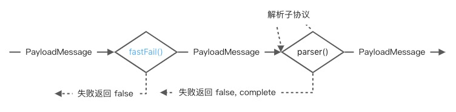

# 1 项目概览

Kindling collector 项目作为 Go 端分析器，使用类似 opentelmetry 的 pipeline 进行数据分析。协议解析功能涉及其中 5 个组件：

- CgoReceiver - 事件接收器，接收探针事件并传递给后续的网络分析器。
- NetworkAnalyzer - 网络事件分析器，将接收的 Read / Write 事件匹配成单次请求后，根据协议解析请求内容生成关键指标，传递给后续的分析器。
- K8sMetadataProcessor - K8S 指标处理器，补充 K8S 指标并传递给后续的聚合处理器
- AggregateProcessor - 数据聚合处理器，将接收的指标数据生成 Trace 和 Metric，传递给给后续的转发器。
- OtelExporter - Opentelmetry 转发器，将 Metric 数据转发给 Prometheus 进行展示；将 Trace 数据转发给其他后端。

其中协议解析流程主要在 NetworkAnalyzer 组件中进行，将接收的请求/响应事件成对匹配后，交由 parseProtocols()函数解析出协议指标。

## 1.1 协议解析流程

NetworkAnnalyzer.parseProtocols()方法定义了整体解析流程，根据协议解析器分别解析请求和响应，当最终都成功时输出指标。


## 1.2 协议解析设计思路

正常的协议解析只负责逐帧解析指标功能。
</br>

</br>

现已支持 5 种协议解析，当协议越来越多时，遍历引起的解析会越来越耗时，那么需引入 fastfail 快速识别协议:
</br>

</br>
对于复杂的多报文协议，如 Kafka 有不同的 API 报文，而相同 API 也有不同的版本报文。将所有报文解析逻辑都写在一起会使整个类过于臃肿且不易维护。为此引入树形多报文结构用于快速且低耦合地实现开发。
</br>


### 1.2.1 报文解析结构体

在树形报文解析过程中，有如下 2 个场景需要考虑

- 当父协议解析了指标 A，子协议解析可能会用到 A 指标，那么父子协议解析的指标需要透传。
- 父协议已解析了部分报文长度的内容，那么子协议在开始解析时可直接跳过相应长度的内容进行解析，此处引入偏移量用于下一个协议跳过解析。

定义 PayloadMessage，封装报文内容、读取偏移量和指标存储的 Map。

```go
type PayloadMessage struct {
    Data         []byte
    Offset       int
    attributeMap *model.AttributeMap
}
```

### 1.2.2 报文解析 API

由于引入协议树，协议解析过程 parse() (ok bool)将不再适用。协议树中的个协议的解析成功不表示整个协议解析成功，需解析整颗树的协议是否成功，将 API 扩展为 parse() (ok bool, complete bool)。

- 对于单层协议(HTTP)，返回为(ok, true)
  

基于以上几点需求，设计树形结构的报文解析器 PkgParser。PkgParser 定义了 fastFail(快速识别失败) 和 parser(解析单个报文)函数；每个协议只需注册自身的 PkgParser 即可接入整套流程。

- `fastFail(message *PayloadMessage) (fail bool)` 声明协议是否识别失败，用于快速识别协议:
- `parser(message *PayloadMessage) (ok bool, complete bool)` 解析协议，将解析出的指标存储到 message 的 Attributes 中。返回是 2 个参数：
  - 是否解析成功
  - 是否解析完成（默认为 true，当为 false 主要是用于嵌套解析过程，例如先定义一个头解析，再定义不同的消息体解析）

## 1.3 请求 / 响应解析

ProtocolParser 定义了请求和响应的解析器，并提供 ParseRequest()和 ParseResponse() API 用于解析请求和响应。

其中 response 的 message 携带了 request 解析出的 attributes 指标，用于匹配。例如，Kafka 的 correlationId 在 request 和 response 报文中需一致，且 response 报文解析用到了 request 的 key。


# 2 开发流程


## 2.1 添加协议名

```
const (
	HTTP      = "http"
  ...
	XX        = "xx" // 此处替换具体协议名
	...
)
```

## 2.2 创建协议

analyzer/network/protocol 目录下创建文件夹 xx，xx 替换为具体协议，并创建 3 个文件 xx_parser.go、xx_request.go 和 xx_response.go

```
analyzer/network/protocol/xx
├── xx_parser.go           协议解析器
├── xx_request.go          实现请求解析流程
└── xx_response.go          实现响应解析流程
```

### 2.2.1 xx_request.go

实现 fastfail()和 parser()函数

```go
func fastfailXXRequest() protocol.FastFailFn {
	return func(message *protocol.PayloadMessage) bool {
        // 根据报文实现具体的 fastFail()函数
		return false
	}
}

func parseXXRequest() protocol.ParsePkgFn {
	return func(message *protocol.PayloadMessage) (bool, bool) {
        // 解析报文内容
		contentKey := getContentKey(message.Data)
		if contentKey == "" {
            // 第一个参数 false 表示解析失败，第二个参数表示报文解析完成
			return false, true
		}

        // 通过 AddStringAttribute() 或 AttIntAttribute() 存储解析出的属性
		message.AddStringAttribute(constlabels.ContentKey, contentKey)
        // 解析成功
		return true, true
	}
}
```

### 2.2.2 xx_response.go

实现 fastfail()和 parser()函数

```go
func fastfailXXResponse() protocol.FastFailFn {
	return func(message *protocol.PayloadMessage) bool {
        // 根据报文实现具体的 fastFail()函数
		return false
	}
}

func parseXXResponse() protocol.ParsePkgFn {
	return func(message *protocol.PayloadMessage) (bool, bool) {
        // 通过 GetStringAttribute() 或 GetIntAttribute() 读取 request 解析后的参数
		contentKey := message.GetStringAttribute(constlabels.ContentKey)
		
        // 解析响应报文
        errorCode := getErrorCode(message)
        if errorCode > 20 {
            // 有 errorCode 或 errorMsg 等常见，需定义 IsError 为 true 用于后续 processor 生成 Metric
			message.AddBoolAttribute(constlabels.IsError, true)
			message.AddIntAttribute(constlabels.ErrorType, int64(constlabels.ProtocolError))
		}
		message.AddStringAttribute(constlabels.XXErrorCode, errorCode)
        
        // 解析成功
		return true, true
	}
}
```

### 2.2.3 xx_parser.go

定义协议解析器

```go
func NewXXParser() *protocol.ProtocolParser {
	requestParser := protocol.CreatePkgParser(fastfailXXRequest(), parseXXRequest())
    // 当存在嵌套的协议解析 eg. 解析头 + 解析各类不同报文
    // 可通过 Add()添加子协议，生成一颗协议树解析，顶部是公共部分解析，分叉是各个不同报文解析
    //             Header
    //             / | \
    //         API1 API2 API3
    //         /|\
    //       v1 v2 v3
	responseParser := protocol.CreatePkgParser(fastfailXXResponse(), parseXXResponse())
	return protocol.NewProtocolParser(protocol.XX, requestParser, responseParser, nil)
}
```

### 2.2.4 factory.go

注册协议解析器

```go
var (
    ...
    xx_parser   *protocol.ProtocolParser = xx.NewXXParser()
)

func GetParser(key string) *protocol.ProtocolParser {
    switch key {
        ...
        case protocol.XX:
            return xx_parser
        ...
        default:
            return nil
    }
}
```

### 2.2.5 kindling-collector-config.yml

配置新增协议

```go
analyzers:
  networkanalyzer:
    protocol_parser: [ http, mysql, dns, redis, kafka, xx ]
```

# 3 开发案例 - Dubbo2 协议

## 3.1 dubbo2 协议分析


根据官网提供的协议规范，解析网络抓包的数据。

- 前 2 个 byte 为魔数，可用于 fastfail()方法
- 第 3 个 byte 包含 Req/Resp、序列化方式等信息，可用于解析协议中判断是否合法报文。
- 第 4 个 byte 用于返回报文的错误码
- 第 16 个 byte 开始需通过指定的序列化方式解析报文内容，service name + method name 可用于 contentKey 标识该请求的 URL


## 3.2 声明协议名

```
const (
	...
	DUBBO2    = "dubbo2"
	...
)
```

## 3.3 实现 dubbo2 解析

创建协议相关文件

```
kindling/collector/analyzer/network/protocol/dubbo2
├── dubbo2_parser.go            Dubbo2 解析器
├── dubbo2_request.go           实现请求解析流程
├── dubbo2_response.go          实现响应解析流程
└── dubbo2_serialize.go         Dubbo2 反序列化器
```

### 3.3.1 dubbo2_request.go

声明 request 请求的 fastFail 函数

- dubbo2 有魔数 0xdabb 可快速识别

```go
func fastfailDubbo2Request() protocol.FastFailFn {
	return func(message *protocol.PayloadMessage) bool {
		return len(message.Data) < 16 || message.Data[0] != MagicHigh || message.Data[1] != MagicLow
	}
}
```

声明 request 请求的解析函数

- 将解析出 服务/方法作为 类似于 URL 的 Key
- 存储报文内容

```go
func parseDubbo2Request() protocol.ParsePkgFn {
	return func(message *protocol.PayloadMessage) (bool, bool) {
		contentKey := getContentKey(message.Data)
		if contentKey == "" {
			return false, true
		}

		message.AddStringAttribute(constlabels.ContentKey, contentKey)
		message.AddStringAttribute(constlabels.Dubbo2RequestPayload, getAsciiString(message.GetData(16, protocol.GetDubbo2PayLoadLength())))
		return true, true
	}
}
```

解析 Dubbo2 请求

- 过滤非法请求
- 考虑到 dubbo2 存在单向和心跳请求，这些请求不做解析
- 根据报文结构解析相应指标

```go
func getContentKey(requestData []byte) string {
	serialID := requestData[2] & SerialMask
	if serialID == Zero {
		return ""
	}
	if (requestData[2] & FlagEvent) != Zero {
		return "Heartbeat"
	}
	if (requestData[2] & FlagRequest) == Zero {
		// Invalid Data
		return ""
	}
	if (requestData[2] & FlagTwoWay) == Zero {
		// Ignore Oneway Data
		return "Oneway"
	}

	serializer := GetSerializer(serialID)
	if serializer == serialUnsupport {
		// Unsupport Serial. only support hessian and fastjson.
		return "UnSupportSerialFormat"
	}

	var (
		service string
		method  string
	)
	// version
	offset := serializer.eatString(requestData, 16)

	// service name
	offset, service = serializer.getStringValue(requestData, offset)

	// service version
	offset = serializer.eatString(requestData, offset)

	// method name
	_, method = serializer.getStringValue(requestData, offset)

	return service + "#" + method
}
```

### 3.3.2 dubbo2_serialize.go

由于 dubbo2 内置了多套序列化方式，先定义接口 dubbo2Serializer

```go
type dubbo2Serializer interface {
	eatString(data []byte, offset int) int

	getStringValue(data []byte, offset int) (int, string)
}
```

dubbo2 默认的序列化方式是 hessian2，此处实现 hessian2 方式

```go
type dubbo2Hessian struct{}

func (dh *dubbo2Hessian) eatString(data []byte, offset int) int {
	dataLength := len(data)
	if offset >= dataLength {
		return dataLength
	}

	tag := data[offset]
	if tag >= 0x30 && tag <= 0x33 {
		if offset+1 == dataLength {
			return dataLength
		}
		// [x30-x34] <utf8-data>
		return offset + 2 + int(tag-0x30)<<8 + int(data[offset+1])
	} else {
		return offset + 1 + int(tag)
	}
}

func (dh *dubbo2Hessian) getStringValue(data []byte, offset int) (int, string) {
	dataLength := len(data)
	if offset >= dataLength {
		return dataLength, ""
	}

	var stringValueLength int
	tag := data[offset]
	if tag >= 0x30 && tag <= 0x33 {
		if offset+1 == dataLength {
			return dataLength, ""
		}
		// [x30-x34] <utf8-data>
		stringValueLength = int(tag-0x30)<<8 + int(data[offset+1])
		offset += 2
	} else {
		stringValueLength = int(tag)
		offset += 1
	}

	if offset+stringValueLength >= len(data) {
		return dataLength, string(data[offset:])
	}
	return offset + stringValueLength, string(data[offset : offset+stringValueLength])
}
```

对外暴露公共方法，用于获取序列化方式

```go
var (
	serialHessian2  = &dubbo2Hessian{}
	serialUnsupport = &dubbo2Unsupport{}
)

func GetSerializer(serialID byte) dubbo2Serializer {
	switch serialID {
	case SerialHessian2:
		return serialHessian2
	default:
		return serialUnsupport
	}
}
```

### 3.3.3 dubbo2_response.go

声明 response 响应的 fastFail 函数

- 与 request 类似，采用魔数 0xdabb 可快速识别

```go
func fastfailDubbo2Response() protocol.FastFailFn {
	return func(message *protocol.PayloadMessage) bool {
		return len(message.Data) < 16 || message.Data[0] != MagicHigh || message.Data[1] != MagicLow
	}
}
```

声明 response 响应的解析函数

- 根据 status 解析出对应的 errorCode
- 存储报文内容

```go
func parseDubbo2Response() protocol.ParsePkgFn {
	return func(message *protocol.PayloadMessage) (bool, bool) {
		errorCode := getErrorCode(message.Data)
		if errorCode == -1 {
			return false, true
		}

		message.AddIntAttribute(constlabels.Dubbo2ErrorCode, errorCode)
		if errorCode > 20 {
            // 有 errorCode 或 errorMsg 等常见，需定义 IsError 为 true 用于后续 processor 生成 Metric
			message.AddBoolAttribute(constlabels.IsError, true)
			message.AddIntAttribute(constlabels.ErrorType, int64(constlabels.ProtocolError))
		}
		message.AddStringAttribute(constlabels.Dubbo2ResponsePayload, getAsciiString(message.GetData(16, protocol.GetDubbo2PayLoadLength())))
		return true, true
	}
}
```

解析 Dubbo2 响应

- 过滤非法响应
- 根据报文结构解析相应指标

```go
func getErrorCode(responseData []byte) int64 {
	SerialID := responseData[2] & SerialMask
	if SerialID == Zero {
		return -1
	}
	if (responseData[2] & FlagEvent) != Zero {
		return 20
	}
	if (responseData[2] & FlagRequest) != Zero {
		// Invalid Data
		return -1
	}

	return int64(responseData[3])
}
```

### 3.3.4 dubbo2_parser.go

声明 dubbo2 解析器

- 通过 CreatePkgParser()分别定义 Reques / Response 解析器
- 通过 NewProtocolParser()将 Request / Response 解析器生成 Dubbo2 解析器

```go
func NewDubbo2Parser() *protocol.ProtocolParser {
	requestParser := protocol.CreatePkgParser(fastfailDubbo2Request(), parseDubbo2Request())
	responseParser := protocol.CreatePkgParser(fastfailDubbo2Response(), parseDubbo2Response())
	return protocol.NewProtocolParser(protocol.DUBBO2, requestParser, responseParser, nil)
}
```

## 3.4 注册 dubbo2 解析器

在 factory.go 中注册 dubbo2 协议的解析器

```go
var (
    ...
    dubbo2_parser   *protocol.ProtocolParser = dubbo2.NewDubbo2Parser()
)

func GetParser(key string) *protocol.ProtocolParser {
    switch key {
        ...
        case protocol.DUBBO2:
            return dubbo2_parser
        ...
        default:
            return nil
    }
}
```

## 3.5 声明支持协议

在 deploy/kindling-collector-config.yml 中声明 dubbo2 协议

```go
analyzers:
  networkanalyzer:
    protocol_parser: [ http, mysql, dns, redis, kafka, dubbo2 ]
    protocol_config:
      - key: "dubbo2"
        payload_length: 200
```
