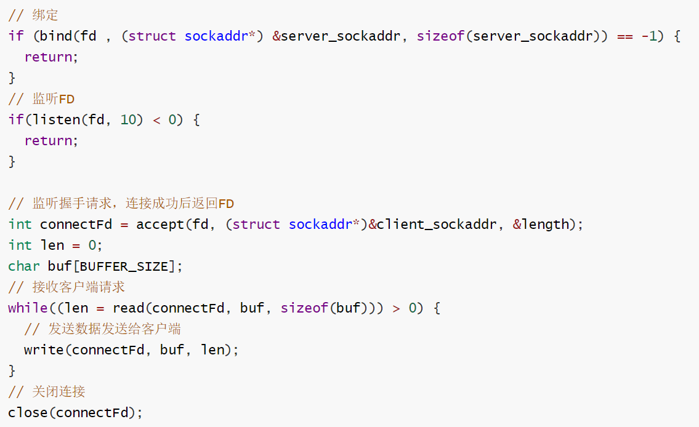
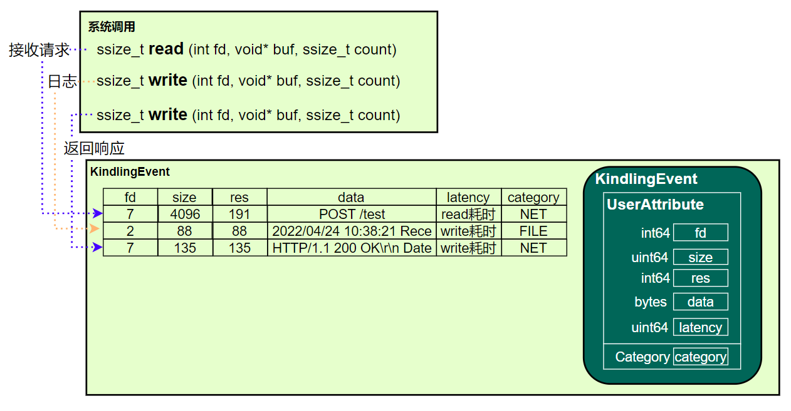
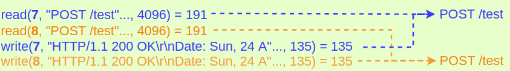
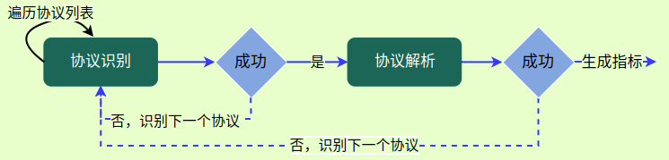
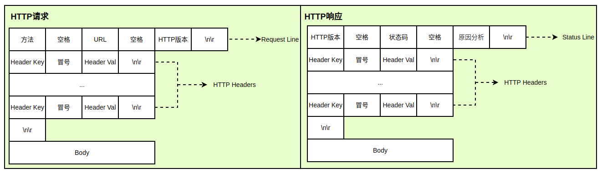
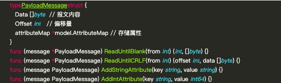
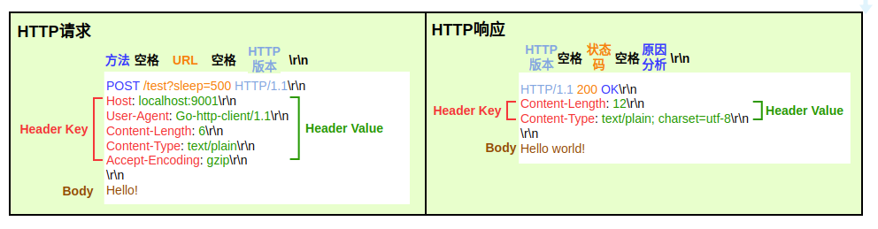
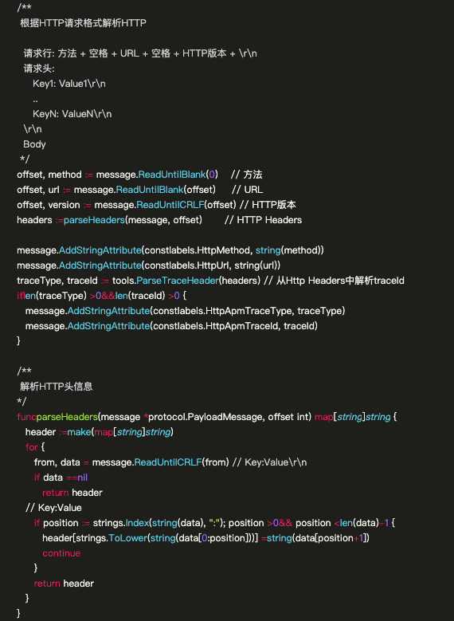
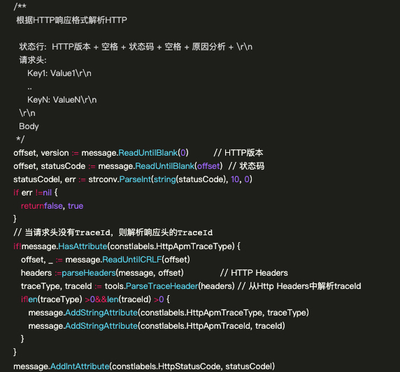

Kindling是一款基于eBPF技术的云原生可观测性开源项目。本文将主要介绍如何通过Kindling对HTTP协议进行解析。

在故障排查过程中，我们通常对请求性能、请求内容和返回内容感兴趣。这使我们能知道请求和接收了什么内容，是否有异常等基本信息。如何获取请求的具体详细信息，传统方式是通过tcpdump获取请求包数据，然后通过wireshark查看其具体协议内容。

tcpdump虽然在生产环境中经常使用，但由于获取的数据量和大小限制，不适合一直开启，只有在排查问题时使用。而获取的数据也无法直接查看，需下载到本地通过wireshark分析查看。基于tcp的诸多问题，所以Kindling通过eBPF方式实现请求的具体分析。

那么Kindling是如何实现实时可用的协议解析功能呢？主要涉及3块功能：
- 数据采集
- 请求/响应关联
- 请求/响应解析


<center>协议解析流程图</center>

## 1 数据采集

先来查看下一个简单的HTTP服务


<center>HTTP服务伪代码</center>
当接收到请求时会有accept/read/write/close等函数执行，这些函数最终执行内核的系统调用。


<center>HTTP服务接收请求流程图</center>

使用strace命令查看一次请求的系统调用情况
- read接收HTTP请求/test
- 第一个write日志输出
- 第二个write 返回HTTP结果

```bash
> strace ./test-netserver
accept4(3, 0xc000079aa0, [112], SOCK_CLOEXEC|SOCK_NONBLOCK) = -1 EAGAIN (Resource temporarily unavailable)
...
read(7, "POST /test"..., 4096) = 191
write(2, "2022/04/24 10:38:21 Received HTT"..., 88) = 88
write(7, "HTTP/1.1 200 OK\r\nDate: Sun, 24 A"..., 135) = 135
```

从日志中可分析出，请求通过read系统调用，日志和响应都是通过write系统调用。
Kindling已实现对系统事件调用进行抓取，并将相关的read和write系统调用转换为Kindling事件，最终生成3条事件。


<center>系统调用与Kindling事件映射</center>

参数说明：
- fd 读写请求的文件描述符
- size 请求报文大小
- res 返回大小
- data 请求报文内容
- latency 读/写操作耗时
- category 事件类型，NET是指网络事件，FILE是文件读写事件

## 2 请求/响应关联
常规的TCP请求都会用同一个FD进行通信，只需根据进程号和FD就能关联同一个请求和响应。


<center>请求-响应关联</center>

## 3 请求/响应解析

虽然有了报文，但不同的协议定义的规范也不同。那么如何知道该报文是什么协议，并且用该协议进行解析呢？主要涉及2块内容：
- 协议识别
- 协议解析


<center>请求-响应解析流程图</center>

### 3.1 协议识别
通过特征或关键字快速匹配协议，减少协议解析的次数，提升整体解析的性能。


<center>HTTP报文规范</center>

对于HTTP请求来说，通过HTTP版本号(HTTP/1.0或HTTP/1.1)可以快速识别协议。
但由于抓包大小限制，如果一个请求的URL长度超过包的大小，那么无法获取后续的HTTP版本号，于是采用端口协议配置方式也能识别协议。

### 3.2 协议解析
协议解析是为了产生指标用于后续分析，在解析过程中需根据协议自身的格式进行解析。
由于报文内容是byte数组格式，Kindling提供了封装好的API用于解析。


<center>API</center>
以HTTP协议为例，可解析出如下信息：
- 请求行 - 方法、URL信息
- HTTP头信息 - traceId信息
- 状态行 - 状态码信息


<center>HTTP解析样例</center>

#### 3.2.1 解析HTTP请求
解析请求过程就是对请求进行逐帧解析，读取到对应的属性后最终将值存储到attribute中。



#### 3.2.2 解析HTTP响应
解析响应跟解析请求类似，也是逐帧解析，将解析出的属性存储到attribute中。
此外，需考虑报文非法场景（状态码非数值），确保解析正常结束。 

