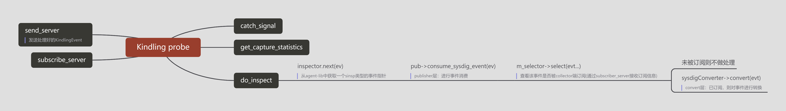

### 概述
Kndling probe将来自agent-libs的事件数据进行了进一步处理，将其封装成KindlingEvent，并通过CGO接口接收来自Collector端的订阅，并将被订阅的KindlingEvent发送到Collector端做进一步处理。

### 实现流程浅析
从执行入口main函数着眼来看，我们可以看到Kindling probe有2个比较重要的方法，分别是subscribe_server以及send_server。它们的作用如下：

- subEventForGo：接收来自collector端的事件订阅
- getKindlingEvent：向collector端发送处理好的KindlingEvent

有关probe对事件的处理流程概要如下图所示：


### 数据处理&发送逻辑
限于篇幅，这里我们重点看一下getKindlingEvent的实现。getKindlingEvent首先调用inspector->next(&ev)从agent-libs中获取了一个sinsp类型的事件指针，紧接着，过滤掉了自己这个进程本身以及一些不包含信息的io事件，随后，将agent-libs里的有效内容转移到kindling-event.

```cpp
int getEvent(void **pp_kindling_event)
{
	int32_t res;
	sinsp_evt *ev;
	res = inspector->next(&ev);
	if(res == SCAP_TIMEOUT)
	{
		return -1;
	}
	else if(res != SCAP_SUCCESS)
	{
		return -1;
	}
	if(!inspector->is_debug_enabled() &&
	   ev->get_category() & EC_INTERNAL)
	{
		return -1;
	}
	auto threadInfo = ev->get_thread_info();
	if(threadInfo == nullptr)
	{
		return -1;
	}
	auto category = ev->get_category();
	if(category & EC_IO_BASE)
	{
		auto pres = ev->get_param_value_raw("res");
		if(pres && *(int64_t *)pres->m_val <= 0)
		{
			return -1;
		}
	}
    logCache->addLog(ev);
	cpuConverter->Cache(ev);
	uint16_t kindling_category = get_kindling_category(ev);
	uint16_t ev_type = ev->get_type();
	if(event_filters[ev_type][kindling_category] == 0)
	{
		return -1;
	}
	kindling_event_t_for_go *p_kindling_event;
	if(nullptr == *pp_kindling_event)
	{
		// New a kindling_event_t_for_go
        ...
	}
	p_kindling_event = (kindling_event_t_for_go *)*pp_kindling_event;
	if (ev_type == PPME_CPU_ANALYSIS_E) {
	    return cpuConverter->convert(p_kindling_event, ev);
	}
	sinsp_fdinfo_t *fdInfo = ev->get_fd_info();
	p_kindling_event->timestamp = ev->get_ts();
	p_kindling_event->category = kindling_category;
	p_kindling_event->context.tinfo.pid = threadInfo->m_pid;
	p_kindling_event->context.tinfo.tid = threadInfo->m_tid;
	p_kindling_event->context.tinfo.uid = threadInfo->m_uid;
	p_kindling_event->context.tinfo.gid = threadInfo->m_gid;
	p_kindling_event->context.fdInfo.num = ev->get_fd_num();
	if(nullptr != fdInfo)
	{
		p_kindling_event->context.fdInfo.fdType = fdInfo->m_type;
		switch(fdInfo->m_type)
		{
		case SCAP_FD_FILE:
		case SCAP_FD_FILE_V2:
		{
			...
			break;
		}
		case SCAP_FD_IPV4_SOCK:
		case SCAP_FD_IPV4_SERVSOCK:
			...
			break;
		case SCAP_FD_UNIX_SOCK:
			...
			break;
		default:
			break;
		}
	}
	uint16_t userAttNumber = 0;
	switch(ev->get_type())
	{
	case PPME_TCP_RCV_ESTABLISHED_E:
	case PPME_TCP_CLOSE_E:
	{
		...
		break;
	}
	case PPME_TCP_CONNECT_X:
	{
		...
		break;
	}
	case PPME_TCP_DROP_E:
	case PPME_TCP_RETRANCESMIT_SKB_E:
	case PPME_TCP_SET_STATE_E:
	{
		...
		break;
	}
	case PPME_TCP_SEND_RESET_E:
	case PPME_TCP_RECEIVE_RESET_E:
	{
		auto pTuple = ev->get_param_value_raw("tuple");
		userAttNumber = setTuple(p_kindling_event, pTuple, userAttNumber);
		break;
	}
	default:
	{
		uint16_t paramsNumber = ev->get_num_params();
		if(paramsNumber > 8)
		{
			paramsNumber = 8;
		}
		for(auto i = 0; i < paramsNumber; i++)
		{
			strcpy(p_kindling_event->userAttributes[userAttNumber].key, (char *)ev->get_param_name(i));
			memcpy(p_kindling_event->userAttributes[userAttNumber].value, ev->get_param(i)->m_val,
			       ev->get_param(i)->m_len);
			p_kindling_event->userAttributes[userAttNumber].len = ev->get_param(i)->m_len;
			p_kindling_event->userAttributes[userAttNumber].valueType = get_type(ev->get_param_info(i)->type);
			userAttNumber++;
		}
	}
	}
	p_kindling_event->paramsNumber = userAttNumber;
	strcpy(p_kindling_event->name, (char *)ev->get_name());
	strcpy(p_kindling_event->context.tinfo.comm, (char *)threadInfo->m_comm.data());
	strcpy(p_kindling_event->context.tinfo.containerId, (char *)threadInfo->m_container_id.data());
	return 1;
}
```

### 接受订阅逻辑

probe启动时，会调用init_sub_label将所有订阅信息清空
probe端接收订阅之后的核心处理逻辑是sub_event这个函数，这个函数主要做了两个工作，一是将所有接收到的订阅事件存储到event_filters中，event_filters是一个以事件号和类型为index的二维数组。

```cpp
void init_sub_label()
{
	for(auto e : kindling_to_sysdig)
	{
		m_events[e.event_name] = e.event_type;
	}
	for(auto c : category_map)
	{
		m_categories[c.cateogry_name] = c.category_value;
	}
	for(int i = 0; i < 1024; i++)
	{
		for(int j = 0; j < 16; j++)
		{
			event_filters[i][j] = 0;
		}
	}
}

void sub_event(char *eventName, char *category)
{
	cout << "sub event name:" << eventName << "  &&  category:" << category << endl;
	auto it_type = m_events.find(eventName);
	if(it_type != m_events.end())
	{
		if(category == nullptr || category[0] == '\0')
		{
			for(int j = 0; j < 16; j++)
			{
				event_filters[it_type->second][j] = 1;
			}
		}
		else
		{
			auto it_category = m_categories.find(category);
			if(it_category != m_categories.end())
			{
				event_filters[it_type->second][it_category->second] = 1;
			}
		}
	}
}
```
