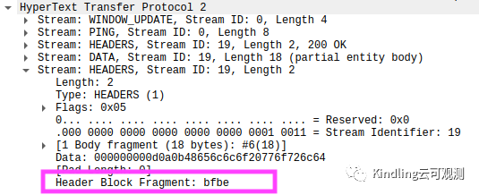
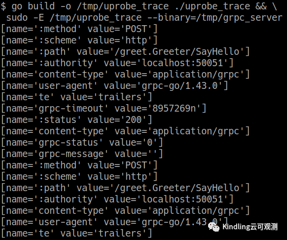
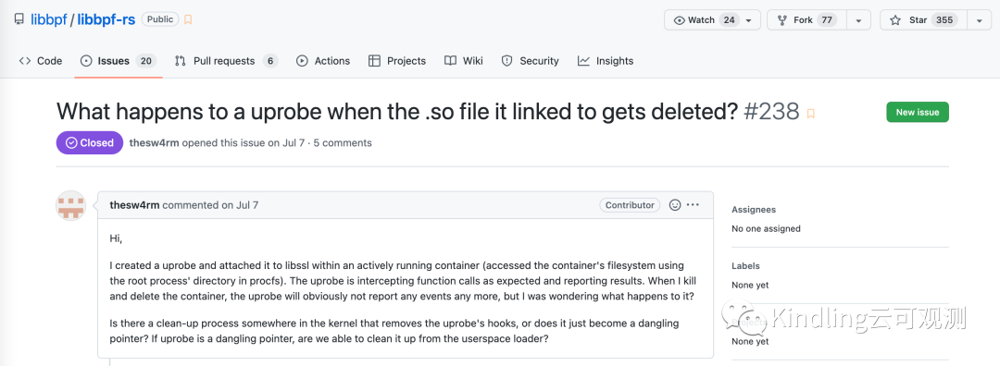
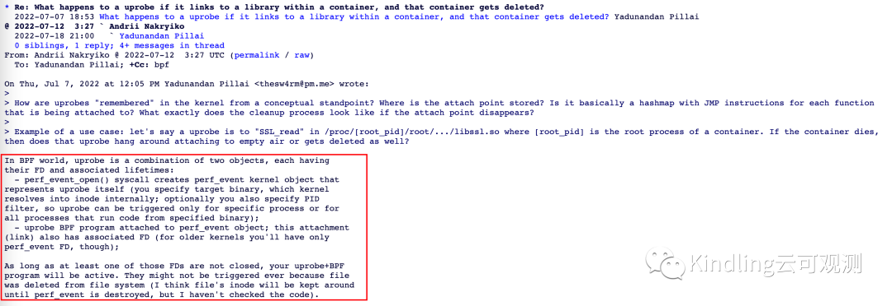
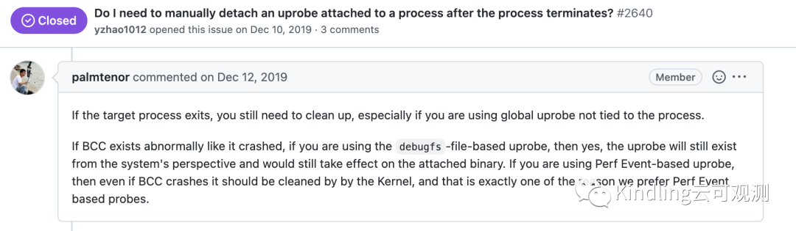
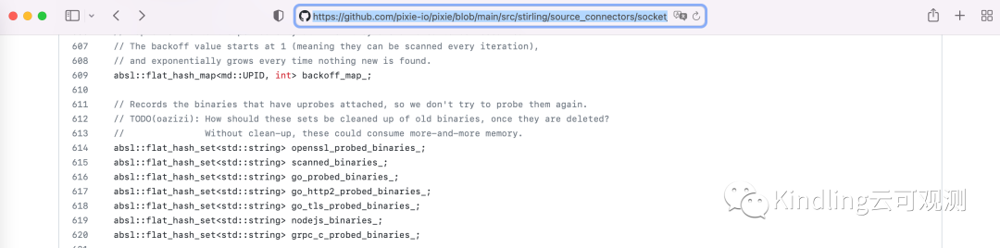
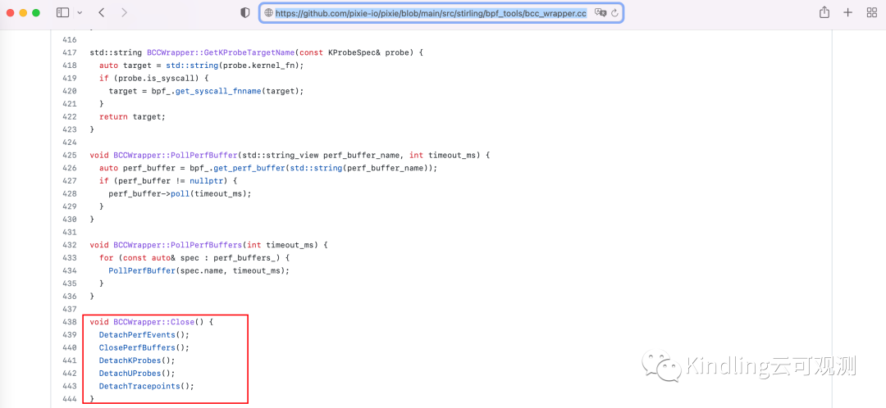
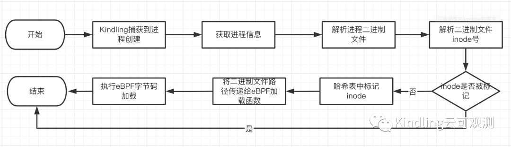
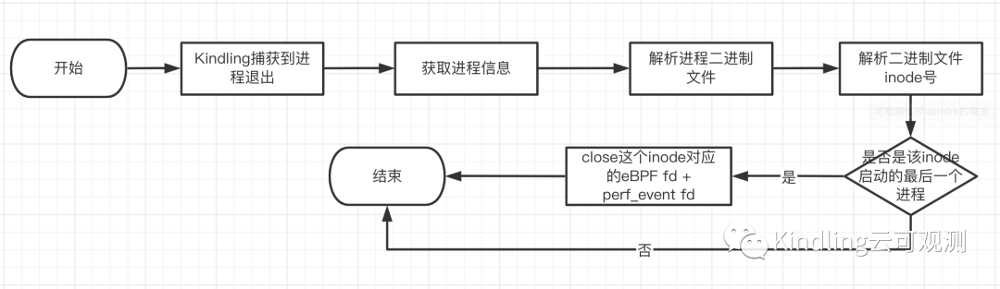

> 本文作者：浙江大学软件学院研究生——叶兴明

### 什么是uprobe
uprobe是一种用户空间探针，uprobe探针允许在用户空间程序中动态插桩，插桩位置包括：函数入口、特定偏移处，以及函数返回处。当我们定义uprobe时，内核会在附加的指令上创建快速断点指令（x86机器上为int3指令），当程序执行到该指令时，内核将触发事件，程序陷入到内核态，并以回调函数的方式调用探针函数，执行完探针函数再返回到用户态继续执行后序的指令。

uprobe基于文件，当一个二进制文件中的一个函数被跟踪时，所有使用到这个文件的进程都会被插桩，包括那些尚未启动的进程，这样就可以在全系统范围内跟踪系统调用。

### uprobe使用场景简要介绍
uprobe适用于在用户态去解析一些内核态探针无法解析的流量，例如http2流量（报文header被编码，内核无法解码），https流量（加密流量，内核无法解密）。

例如：对于grpc（基于http2）请求调用流量，请求开始之后，无法使用wireshark去正常解析报文header部分：

但是如果使用uprobe，对grpc服务端对应的二进制文件注入uprobe字节码，就可以在报文header部分被编码之前就截获相关流量，从而可以正常展示出header信息

### 可观测性对uprobe的需求

可观测性旨在通过分析系统生成的数据理解推演出系统内部的状态，一般都需要24小时不间断运行，由于uprobe基于文件，且依赖于hook点在二进制文件指针中偏移量的特性，当两者结合在一起时，可观测性对uprobe主要有如下三大需求：

#### 01 常规功能— 基础加载，基础清理
基础的eBPF字节码的加载功能，至少保障对硬编码的 [二进制文件：hook点] 能正常加载；项目退出时清理所有运行过程中向内核态中注入的eBPF字节码以及创建的perf资源。

####02 函数符号偏移量解析— 保证字节码加载到正确位置

首先最基础的是函数符号偏移量的解析，一般uprobe的hook点就是二进制符号表中的一个函数符号。uprobe挂载的hook点名称一般是在代码中固定，但是hook点在不同二进制文件中的偏移量是不同的，所以我们需要能动态的解析二进制文件的符号表，根据hook点名称获取其在不同的二进制文件中的偏移量，并通知给eBPF的加载程序，以让eBPF字节码加载到二进制文件的对应的位置。

####03 动态加载eBPF字节码— 确保字节码作用到新创建的进程

动态加载eBPF字节码意味着，在可观测性项目启动之后，对于新创建的进程，需要能够动态地将eBPF字节码加载到进程上，底层实现就是将eBPF字节码加载到进程对应的二进制文件上，一个二进制文件可能会启动多个进程，因此还需要避免对同一个二进制文件多次加载同一段eBPF字节码，否则两份eBPF程序都会执行，输出两份相同的数据，造成数据冗余。

uprobe本质上是附加到文件，但是很难捕捉到文件的创建，所以可以转化思路，捕捉进程的创建，通过进程信息关联到二进制文件。

####04 Docker容器删除后内核残留资源清理— 保障内核中悬浮资源被清理
在云原生环境下，容器的删除重建是一种非常频繁的操作，容器被删除之后，容器中的进程如果加载了uprobe，在内核中会残留相应的eBPF字节码以及perf_event资源，并处于active状态，对于可观测性项目这种需要7*24小时不间断运行的项目，项目理论上不会退出或重启，那么这些残留资源将始终得不到清理，在内核中会不断累积，占用内核空间资源。

关于当uprobe所附加到的文件被删除时，是否需要清理相关资源的问题，我调研了相关资料，并在libbpf的issues中找到类似提问，这是一个很多人普遍有的疑问。

为了让更多bpf社区的人可以阅读，issue的讨论最后被转移到了Linux内核邮件讨论区。

从讨论区我们可以知道，在BPF的世界，uprobe由两个对象组成，分别是uprobe字节码本身和关联的perf_event资源，都以文件描述符fd的形式存在于用户空间。当uprobe所附加的二进制文件被删除时，只要这两个文件描述符没有被释放，对应的资源就始终存在于内核空间，处于active状态，属于悬浮的资源，只有当加载eBPF字节码的程序完全退出时，内核才会统一去清理这些悬浮资源。

像比如说BCC项目，我们可以从BCC项目的一个issue中知道，对于Perf Event-based uprobe，BCC完全退出时，内核会统一清理所有相关的悬浮资源。

###业界对uprobe的实现现状
####01 BCC
BCC是eBPF编程的脚⼿架，提供了对eBPF的⽀持，对eBPF编程进⾏了封装，提供了简单、丰富的api。BCC对uprobe的支持如下：

已支持：

- 常规功能（基础加载，基础清理）

- 函数符号偏移量解析

BCC本身只是用于简化传统eBPF编程的工具，并没有可观测性的需求，因此BCC没有实现动态加载动态清理的功能。

未支持：

- 动态加载eBPF字节码

- Docker容器删除后残留资源清理

####02 Pixie
Pixie 是一个用于 Kubernetes 应用程序的开源可观察性工具，是可观测领域的佼佼者，对uprobe的支持方面做的非常完善，属于业界的标杆，Pixie对uprobe的支持如下：

已支持：

- 常规功能（基础加载，基础清理）

- 动态加载eBPF字节码

- 函数符号偏移量解析

另外Pixie支持了对二进制字段偏移量的动态解析，也就是说对于不同版本的库，对库中的一些变量字段Pixie都能自动的解析出变量字段在堆栈中相对于栈顶指针的偏移量，因为即使是同一个库，同一个变量字段在高版本库和低版本库中相对堆栈顶的偏移量也有一定的可能会出现差异。

暂未支持：

- Docker容器删除后内核残留资源清理

从Pixie的源码来看（初学者的个人理解，如果遗漏欢迎指出），Pixie维护了一个加载了uprobe的二进制文件的集合，但是对于旧的二进制文件或者说是已经被删除了的二进制文件，Pixie目前还无法识别到二进制文件的删除（TODO），从而清理相关的内核悬浮资源。

目前Pixie只是在Pixie程序整个退出时使用BCC的 detach_uprobe() API 做一次统一的eBPF程序的卸载以及悬浮资源的清理。

Pixie的这种实现很简洁，这种实现在大部分情况下都不会造成很大的影响，但是在某些极端情况下，比如说当需要加载大量的uprobe程序，并且频繁出现容器删除重建的情况时，内核中残留资源不断累积，会给内核带来一定的损耗。

### Kindling的实现
已支持：

- 常规功能（基础加载，基础清理）

- 函数符号偏移量解析

- 动态加载eBPF字节码

- Docker容器删除后内核残留资源清理

正在支持：

- ⼆进制字段偏移量动态解析功能

我们实现了可观测性对uprobe的四大主要需求，并且在清理eBPF字节码和perf_event资源以及避免对进程（二进制文件）重复加载uprobe两个方面，我们相对目前业界做法做了一些改进。

####01 动态加载中避免重复加载的改进
我们通过解析文件inode去控制对同一个文件只加载一次相同的eBPF字节码，相比目前业界实现，可以更好的处理一些二进制文件删除重建的情况。

####02 动态清理的引入
由于Kindling本身就具备捕获进程创建退出的能力，在这个基础上可以很轻易的加入动态清理的功能，我们实现了在运行过程中，动态地识别无效的eBPF字节码及perf资源，在Kindling不需要退出的情况下，动态清理无效的eBPF字节码及perf资源。这样即使长期运行，内核中也不会存在任何无效的悬空资源。

