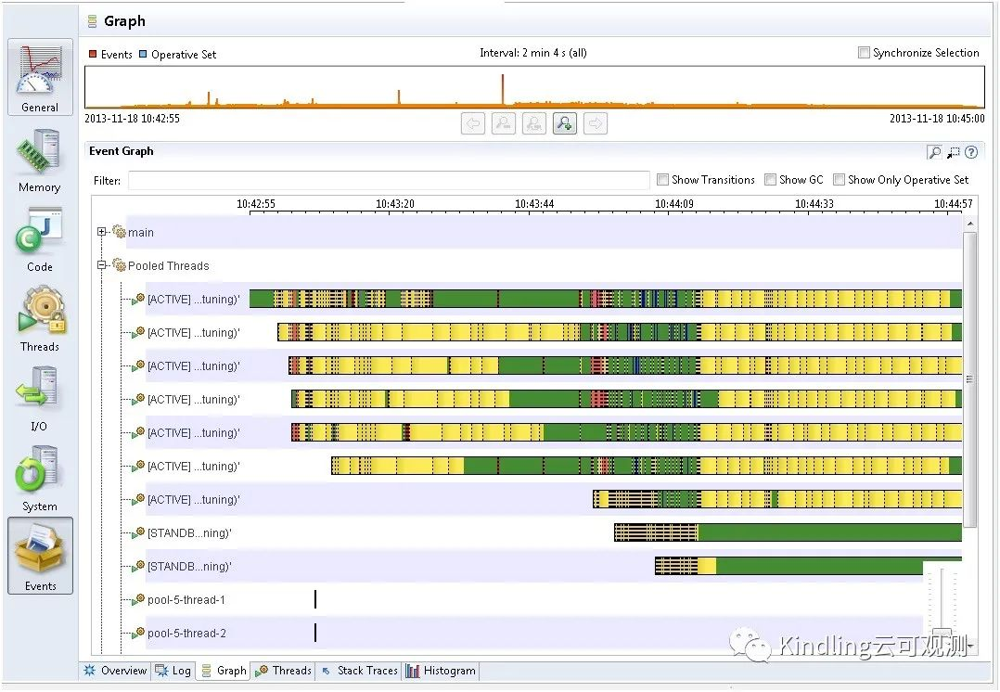
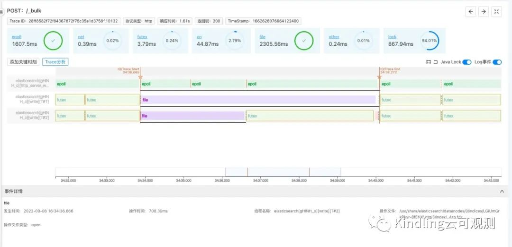

根据Splunk的可观测性全球调研报告，可观测性当前主流技术Tracing、Logging、Metrics已经在更多机构广泛的被使用起来了, 并取得了不错的效果。但是机构可观测性的成熟度仍然面临着以下的挑战：
1. Struggling with the ability to correlate data from multiple sources in a timely fashion (according to 29%, up from 23% a year ago).
2. Collecting an amount of data that exceeds human capacity to digest (27%, up from 21%).
3. Experiencing a lack of visibility across distributed environments (26%, up from 20%).
4. Using legacy tools that lack visibility to cloudnative environments (26%, flat year-over-year, but unseated as the most frequently cited challenge).

第三点和第四点，我们认为当前的skywalking、prometheus工具只要能够广泛使用起来，就能满足这个挑战。但是第一点和第二点当前可观测性工具是很难直接解决的，当前可观测性用户很容易迷失在指标迷阵当中，不知该在什么时间查看何种指标，如何理解大规模细粒度的指标。
为了帮助大家理解这个价值和挑战，可以想象如果您是开发者，分布式追踪Tracing工具定位到某个节点实例的问题之后，会不会经历如下灵魂拷问：

- “这个时间段好像这个指标有点异常，线下看看能不能重现出来”
- “这很有可能是网络波动导致的，费这个劲研究干啥？等下次出现的时候再查吧”
- “这个时候大概率产生了GC，把GC日志打开再观察一段时间，GC的时间好像并不久呀？接下来咋办”
- “所有指标看上去都没有问题，那多加点日志，打日志总能找出问题的代码块”
- “有问题的代码段终于找到了，也给出了合理的解释，但是仍然解释不了为什么其他实例没有问题呢？生产环境不只一个实例呀”
我们认为基于eBPF可观测性摄像头能够将这些问题迎刃而解，除了这些问题以外，还能够帮助用户解决以下问题：
- 了解程序异常退出最后现场——哪些线程在干什么
- 了解程序执行时，依赖资源（网络、存储）是否正常响应
- 知道线上故障，是否是依赖库有bug引起
- 知道机器IO遇到瓶颈点，程序在读写什么文件导致的
- 了解一次请求慢的过程吗？确认CPU资源在程序执行过程中产生了竞争，是否出现了CPU调度延时现象
- 了解程序hang住时，线程分别在做什么
- 了解程序CPU突然飙高时，程序在执行哪些代码
- 了解用户请求是否受到Java 程序GC的影响
- 了解高并发访问的情况下，用户请求是否排队，如果增加线程池是否能够解决问题
- 了解程序发生锁时相关线程的日志信息，锁持有的堆栈和锁被哪个线程长期占有

### 1. 细粒度的观测指标是找到问题根因的关键线索

《关于eBPF与可观测性，你想知道的都在这里》 一文指出当前可观测性的不足：
“因此，在使用可观测系统定位问题时，往往还需要更细粒度的观测、更深层次的数据支撑，以及需要基于一些事件驱动的判断。”
我们团队对这句话有着很深的感悟，要能够快速定位线上的问题，就需要更多维度、更细粒度的观测指标。我们团队接触eBPF技术始于2019年，意识到eBPF技术给这个可能性打开了一扇窗，我们按照大神Brendan的《性能之巅》以及《BPF之巅》中提到的关键指标都做了实验和推理，但发现理想很丰满，现实很骨感。

### 2. 业务健康与指标难以给出直接因果关系，需要牛人经验
期望通过指标就能够定位出问题根因，是一道高墙，太难突破了。我们很难由某几个指标的异常就推断出问题所在，因为问题的场景非常多。而网上大神分享的生产故障排障经验，很多时候是灵光一闪，突然想到要去做某些排查，或者是按照排除法，将所有不可能排查完剩下就是最可能的。
我们无比膜拜能灵光一闪的大牛，也对兢兢业业排查所有可能的大佬充满敬意，但是他们的经验无法成为标准化的产品经验，也就无法推广帮助到更多的普通开发者。主要原因是灵光一闪的根本规则，很难总结成规律而固化下来，而排查所有可能性带来的后果就是效率太低，甚至有些时候线上紧要关头都很难有充足的时间让人去做所有可能性的尝试。
我们曾与阿里龙蜥团队交流，他们也遇到了和我们同样的困扰，Sysak项目已经总结了阿里生产环境遇到过很多细粒度的指标，但是这些细粒度指标异常不意味着业务异常，而业务异常的时候，我们也难以直接发现这些指标到底谁是元凶。

牛人难寻，牛魔王更难寻
想找到问题的根因还是非常依赖于牛人的经验，所以大家经常在新闻中看到码农的悲惨生活，度个假也得带着电脑随时待命解决线上问题，半夜被夺命连环Call叫起来解决问题。想要所有人都能够轻易解决线上问题是项目团队的奢望，因为从应届生到成为牛人是一个打怪升级的漫长历程，每个项目团队永远都缺牛人。

### 3. Continues Profiling 与 JFR带来的思路

正在我们觉得这块巨石很难推动之时，国外Continues Profiling领域俨然成为可观测性领域的下一个热点。虽然Continues Profiling技术火焰图我们早就了解过，也曾使用它解决过CPU过高的问题，但是不理解为什么Continues Profiling是可观测领域的下一个热点，在我们的认知当中，可观测性领域的问题可不止有CPU上的问题，更多的是网络、存储、锁等问题。
我们在翻阅了国外同领域大神的演讲和技术文章之后，意识到他们想做的是将OnCPU与OffCPU串联起来，一时激动异常，觉得这样确实可以完整还原程序执行过程。要排查问题，就得先理解问题，将OnCPU与OffCPU串联起来可以完整地理解程序执行过程，在此基础上，我们只需要找到与执行过程相关的指标，就可以精准定位问题了。
怀着异常激动的心情，我们在团队内部展开了脑暴，但是很快就有人泼了冷水，提出来这样做的效果和Java JFR（Java Flight Recorder）的Thread分析效果基本一致，但是当前这个技术基本上很难被使用起来。

Oracle JFR JMC Thread分析图

精力再次被聚焦到“为什么大家都不使用Oracle JMC thread分析图呢”。在重点研究了JMC thread几天之后，我们得出了以下结论

- Thread太多，在同一时间内，很难知道哪些thread是我们需要关心的，如果将所有thread都排查一次，效率太低，而且要理解“每一个thread是做什么的”本身就是一件很难的事情，需要对框架非常熟悉

- Oracle JMC thread分析的关联信息太少，即便找到了当时处理用户请求的Thread，我们仍然很难从这些事件中得到特别多有用的信息。比如：当时读写的文件名是什么？网络调用是哪个socket？当时读写报文有多大？这些信息都没有的时候，我们很难去排查定位问题，仍然需要借助其他工具解决

我们之前研究过JFR，认为第二个问题不是特别大的难题，JFR技术要得到这些细粒度的数据都是可以关联获取的，Oracle之所以没有做，主要受限于第一个难题没有办法解决。

### 4. 程序摄像头的具体实现思路eBPF or JFR

我们团队有APM产品研发经验，所以对于第一个难题，我们很快就想到了解决方案，就是和APM对接。APM的Trace本质上就是按照线程维度在执行的，而Trace是关联着业务请求的，所以只要将Trace按照线程维度对接之后，就可以很清晰的知道一次用户请求到底有哪些thread参与处理了。
那剩下的第二个难题我们此时有两种解决方案，第一个是按照eBPF粒度去获取程序执行过程当中的细粒度指标，第二个是按照JFR技术，顺着Oracle已有的基础展开研发即可，毕竟国内当前主流的开发语言还是Java语言。如何选择，将我们的思考总结出来：

**采用eBPF技术获取细粒度指标**

优势：
- 多语言通用
- 反应的是程序实际执行情况（由于Linux有很多异步操作，比如文件读写在应用层只是一次系统调用，数据只是被写到了pagecache当中，并没有产生实际文件读写，这点在应用层是很难判断到底当前程序有没有发生切换）类似这些在应用层面无法获取的指标唯有ebpf可以在内核层面获取。未来可以关联更多类似这种指标
劣势：
- 研发难度大，我们搜索了github上以及全球相关的技术文章，都没有发现相关技术实现，甚至连清晰的思路文章都没有
- 开发人员对内核的状态不熟悉，比如futex，可能是程序主动sleep导致，也可能是空闲导致，开发人员如何精准理解程序在内核当中所处于的状态是个挑战

**采用JFR技术获取细粒度指标**

优势：

- 有前人铺下来的路可以遵循，研发简单，沿着Oracle thread分析应该是一条道路
- 开发人员对于java语言熟悉，对JFR产生事件有着更熟悉的认知

劣势：

- 只能支持Java语言，而且对JDK版本有一定要求
- 某些情况可能不能真实反应程序执行情况，比如由于CPU调度导致程序在runqueue等待时间过长，从程序自身是无法感知到的。

### 5. Kindling的技术选择——基于eBPF程序摄像头期望真实反应程序执行情况

最后我们选择了eBPF技术路线，而不是JFR技术路线，我们希望能够真实反应程序执行情况，特别是在云原生环境，由于多容器并存，CPU调度可能存在潜在问题，即便用户刚刚开始可能不是特别熟悉内核的变化，但是科班出身的程序员应该很快能够重新回忆起操作系统上的知识。
为了让用户能够更好地理解程序在内核中的状态，我们从JVM中补充一些信息（比如锁相关信息）至futex当中。同时为了达到同样的目的，我们将线程输出的日志关联至日志输出的时刻，开发者可能对某些系统调用不熟悉，但是对其开发的日志还是熟悉的，日志的输出可以清晰反应出是哪段代码输出了相关信息。
最终我们认为将关联实现之后，程序摄像头能够帮助用户很好的理解程序执行真实过程，同时能够理解细粒度的指标是如何影响程序执行的。

### 6. ElasticSearch在程序摄像头下的观测效果图

目前我们认为eBPF程序摄像头已经具备一定的解释力了。可以看下我们通过程序摄像头对ElasticSearch的观测效果：

程序摄像头观测图

通过和APM trace关联，我们能够得到处理Elastic Search bulk insert操作是由三个线程并发同时工作完成的，在摄像头界面都会以下划线高亮出处理请求的线程。同时线程呈现了IO trace start与IO trace end，这个表示是操作系统层面已经开始对此请求开始了读写，具体时间戳我们也记录并展现出来。同时和APM trace对接，我们也记录了Trace start与Trace end，这个是APM的trace开始与结束时间，本次界面当中由于IO trace start和APM trace start 时间基本重合了，但是如果线程池线程不够用，我们就能发现IO trace start已经开始一段时间了，APM trace start 才开始的情况。
这三个线程一个线程在做epoll网络IO，另外两个线程在几乎所有时间都在做文件读写，同时我们发现当时的磁盘IO才3M每秒，马上意识到当时的磁盘IO有问题，正常的磁盘IO应该是几十M每秒，甚至上百M每秒，在重新换了台机器之后， ElasticSearch性能得到大幅提升。

### 7. eBPF程序摄像头的未来
期望社区朋友们给我们提提意见，大家除了在文章开头碰的问题以外，还有没有一些比较棘手的可观测难题不好解决的，或者使用过程当中的反馈，期望都能加入我们一起探讨，大家一起共建更多的eBPF程序摄像头案例场景。
欢迎大家添加小编微信共同探讨
