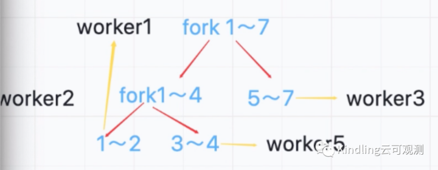

---
title: "* 5分钟真正看懂ForkJoin是如何“分而治之”？有什么隐藏的坑？"
description: ""
lead: ""
date: 2022-11-15T14:41:39+01:00
lastmod: 2022-11-15T14:41:39+01:00
draft: false
images: []
type: docs
menu:
  blogs:
    parent: "seeing-is-believing"
    identifier: "forkjoin-368e7c47d3173fbdb48e694ba59489ba"
weight: 010
toc: true
---

ForkJoin是一种专为CPU密集型任务而生的线程池（比如计算1～100亿的和），它能充分利用CPU资源，把大任务拆分成众多小的子任务，多线程并行。但是你知道：
- 子任务的计算量拆分到多少才算合理吗？为什么你用了ForkJoin反而降低性能？
- 大量线程并行，如何规避线程阻塞？
- 虽知“先fork再join”，但谁负责join？有什么坑需要注意？
- ForkJoinPool的invoke和submit启动方式竟然还有隐藏的坑你知道吗？

本期眼见为实系列，我们将借助Kindling程序摄像头，查看一次请求计算下所有ForkJoin线程的工作情况记录和分析，来探究上述问题的答案。

实验1：分析ForkJoin线程工作
---

首先我基于ForkJoin写了一个实验demo：计算1～7的和。下图就是我用程序摄像头捕捉的一次请求计算的trace分析。

（上图中futex是指线程在等待，我让线程执行计算后都sleep了一段时间，便于放大线程轴观察）
    通过每个线程的日志，我们分析发现，ForkJoinPool-worker-1线程最先拿到了fork 1～7任务，把它拆解成子任务1（计算1～4），子任务2（计算5～7），因为我设置的ForkJoin的最小任务计算数是3，所以子任务1还需要fork，而子任务2可以直接计算了。最终拆解结果如下图：
    

我们可以看到，worker-2线程拆解出来的1～2的子任务又丢给了worker-1线程计算，此外，最后是由worker-2 join了1～4的结果，worker-1 join了 1～7的结果，即谁fork的任务，就由谁来join任务。
通过这个实验我们还可以看出，当某个线程执行时间长，需要join它结果的线程就会一直等待。如下图红框所示，我让worker-2join完1～4结果之后sleep了30ms，然后worker-1线程这段时间被锁住了，通过点击黄色lock区块，我们可以看到堆栈信息，很明显，它在做等待，直到worker-2 sleep完成。

这也是ForkJoin为什么适合CPU密集型计算而不适合IO密集型，因为磁盘IO、网络IO的操作特点就是等待，容易造成线程阻塞。另外，我们子任务的拆分要合理，避免造成任务阻塞。那怎么拆分子任务才算合理呢？像我这个实验demo的拆解其实是不合理的，需要考虑创建子任务、线程调度等操作都需要消耗时间和内存。官网文档给出的经验是：最小子任务需要计算100～10000个基本计算步骤，但是这个相对的最优解应该结合大家的实际业务需求，实践得出。大家就可以借助Kindling程序摄像头来做，在设置不同子任务粒度之后，可以观察计算的响应时间，和每个线程的工作实况、耗时分析。

实验2：ForkJoinPool 的submit和invoke启动方式
---

invoke(ForkJoinTask)，submit(ForkJoinTask)都有返回值，invoke的tasks会被同步到主线程，但是submit是异步执行，需要通过task.get实现同步到主线程，什么意思呢？我们做了一个实验，下面是实验demo：

请求开始打了日志，然后分别用invoke、submit启动ForkJoinPool测试，请求结束的地方也打了日志，然后sleep了500ms（是为了放大线程轴，一会让大家看得更清楚）。下图是两种情况的测试结果。

我们可以看到用submit启动线程池，主线程和ForkJoin线程是异步执行，而invoke启动时，主线程同步等待ForkJoin线程执行。在等待的时候，主线程被lock住（即上图中4个问号的黄色高亮区块），点击查看堆栈，确认它确实在等待。

通过这个实验发现，我们在使用forkJoin的时候一定要注意pool的启动方式，不然就会有隐藏的坑，比如下面这个场景：
    先用forkJoin给所有订单计算利润，存到数据库订单表里，然后基于订单利润再计算每个销售的订单提成，存到提成表里。
    如果开发同学不注意，计算提成的时候取的是订单表的利润，然后用的submit启动方式，那可能会造成，开始计算提成的时候，利润还没算好。
