---
title: "* 5分钟理解微服务熔断，就是这么简单一回事"
description: ""
lead: ""
date: 2022-11-15T14:41:39+01:00
lastmod: 2022-11-15T14:41:39+01:00
draft: false
images: []
type: docs
menu:
  blogs:
    parent: "seeing-is-believing"
    identifier: "micro-service-fuse-368e7c47d3173fbdb48e694ba59489ba"
weight: 010
toc: true
---

>微服务熔断，是当微服务中某个子服务，发生异常不可用，其他服务在进行远程调用时不能正常访问而一直占用资源，导致正常的服务也发生资源不能释放而崩溃，这时为了不造成整个微服务群瘫痪，进行的保护机制

### 01 关于微服务熔断，意想不到的实验结果

我们基于SpringCloud，搭了一个简单的微服务场景，应用A调B，在A的测试接口上设置了Hystrix熔断器，熔断超时时间是1s，如下图：

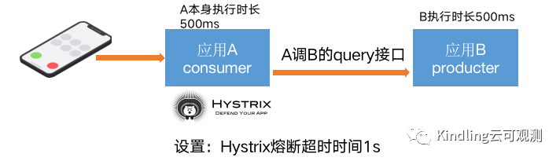

你是否知道：

- 这个熔断超时时间指的是A接口的执行时间，还是仅A调用B的调用时间？

- A、B执行逻辑计算的时间都设置了500ms，熔断超时时间是1s，熔断器未开启时，A是否能拿到B的返回结果？

- A接口超时、抛Exception这两种场景都能触发它的降级熔断，底层触发逻辑有什么不一样？看似同步的请求竟然是通过异步线程来实现的？

- 当A触发熔断器开启后，它是否还能成功调用到B接口？难道就这样让用户一直失败

实验结果究竟如何，我们一起往下看。（心急的小伙伴可以直接滑到文末，查看答案～）

### 02 可视化熔断实验的demo介绍

本次实验，基于SpringCloud，Eureka作为注册中心，单机部署，采用OpenFeign实现RPC调用，Hystrix实现熔断机制，下面是应用A（即consumer）的测试接口代码：

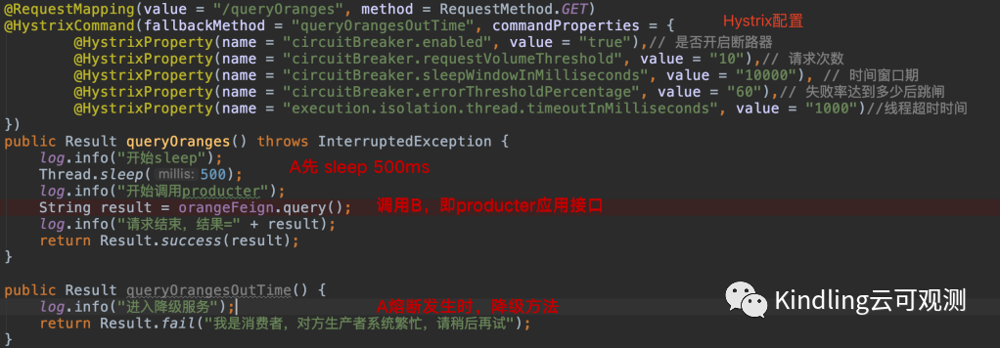

我们借助Kindling程序摄像头，它能够查看分析一次请求调用下的所有线程的工作情况记录的能力，来看下实验结果。

### 03 实验1: 当A未接入断路器，A调用B的线程分析

当A未接入断路器，请求是通过执行线程exec来执行，请求开始，打了A开始Sleep的日志，A sleep 500ms之后，又打了开始调用B（即producter）的日志，最后拿到B的执行结果，请求结束。

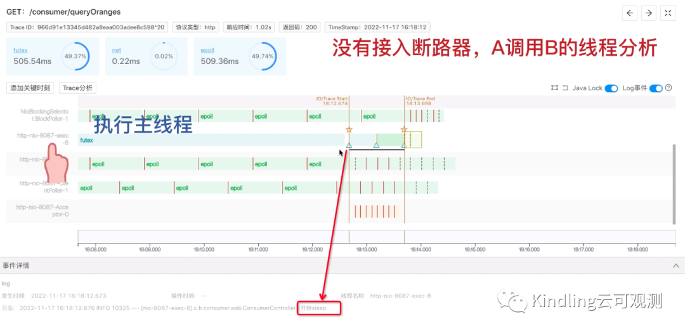

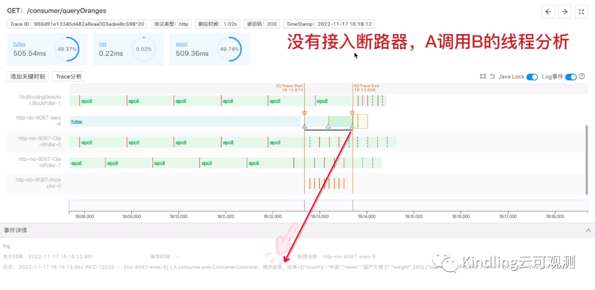

### 04 实验2: 当A接入断路器，A调用B的线程分析

当A接入断路器后，执行线程exec上没有打执行日志了，反而是多了一个hystrix-ConsumerController线程，打了A开始sleep的日志。

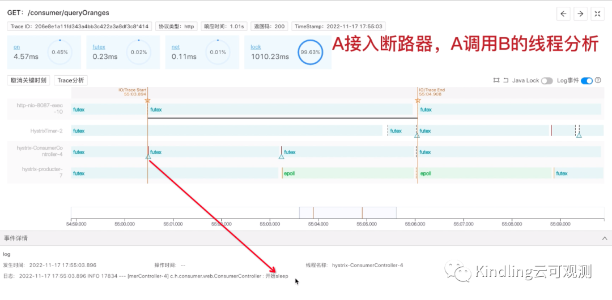

接着又由这个线程sleep500ms，再调用B，但是我们在这个线程上找不到net B的请求事件，我们可以看到，是由另外一个线程hystrix-producter来和B建立网络连接。

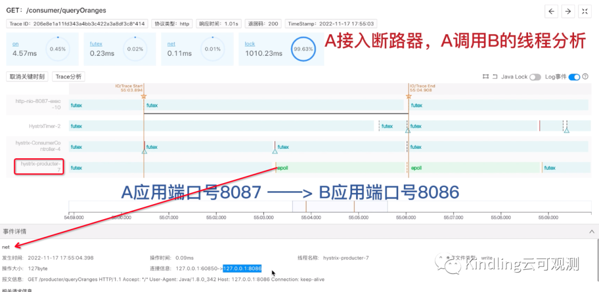

但是我们点击这个线程，查看它从B读到的执行结果，它能拿到正常的返回结果：

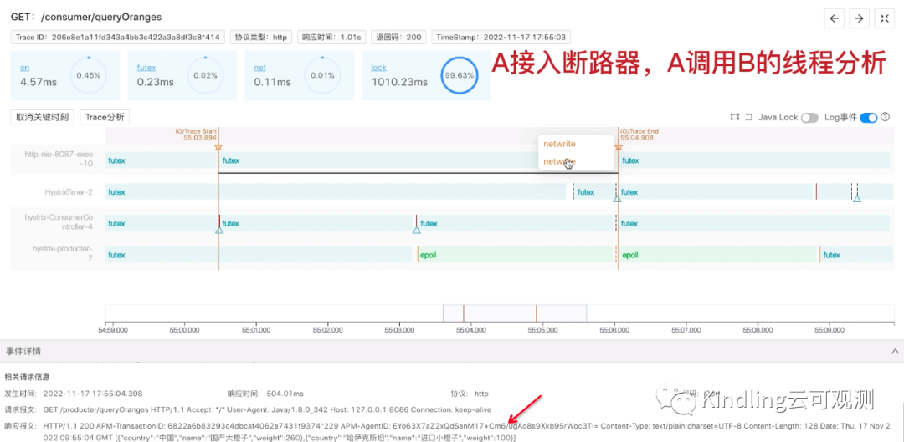

但是，我们发现最后A返回给用户的报文却是：

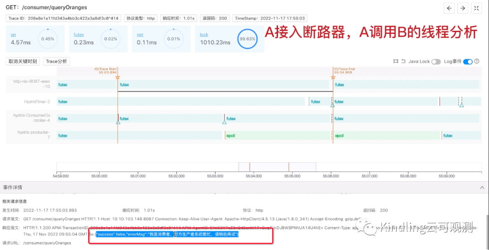

其实这就是A接口上的熔断超时时间在起作用，如下图，Asleep了500ms，B也执行了500ms，再加上系统调用等时间开销，A接口的执行时间肯定会超过我们设置的熔断超时时间是1s，所以，Hystrix上的Timer线程，监测到时间超时，进入了降级服务。

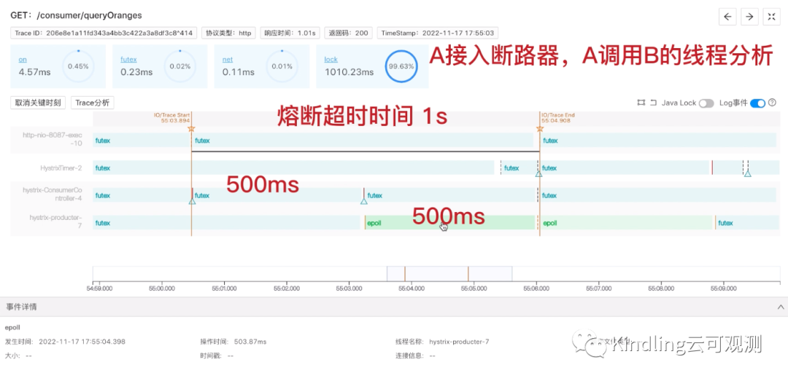

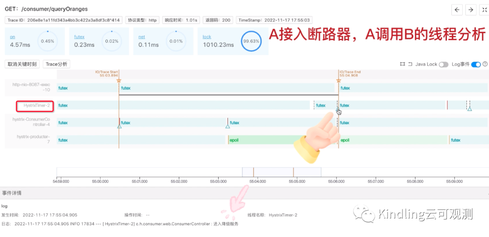

### 05 实验3: 当A接入断路器，B直接返回Exception，线程分析

这个实验，我们让B不再执行500ms，而是直接返回Exception，也就是说，A不会再因为超时而进入降级服务。同样的，它也是由多个Hystrix线程执行业务，但是和上一个实验中，Timer线程监测到超时而触发降级的情况不同，这里是由hystrix-consumerController直接触发降级。

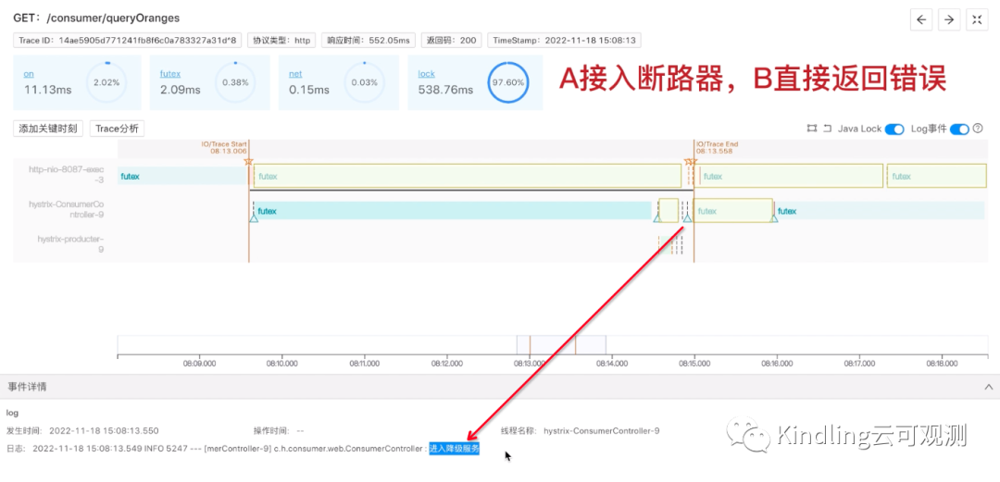

虽然最后这两个实验都是进入了降级服务，但是通过Kindling程序摄像头我们就能清楚的看到，它是怎么被触发降级的。

### 06 Hystrix配置讲解

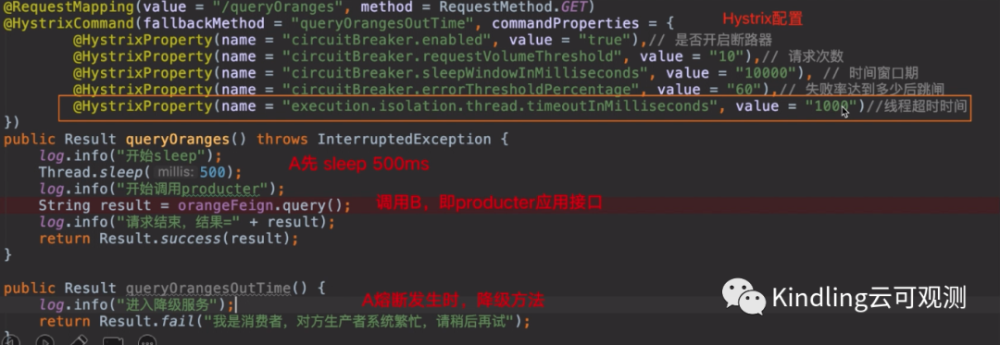

再回到配置这里，刚才实验中提到的熔断超时时间就是通过上图中，红框里的配置实验的，另外，第1条配置是Hystrix的开关。第2、3、4条配置是一起的，我这里配置的意思是：当10s内，接口的请求次数达到10次，且失败率在60%以上，就会触发熔断。

### 07 实验4: 当A接入断路器，且触发熔断后，请求调用情况

当A熔断器开启，所有请求直接返回降级结果，如下图：

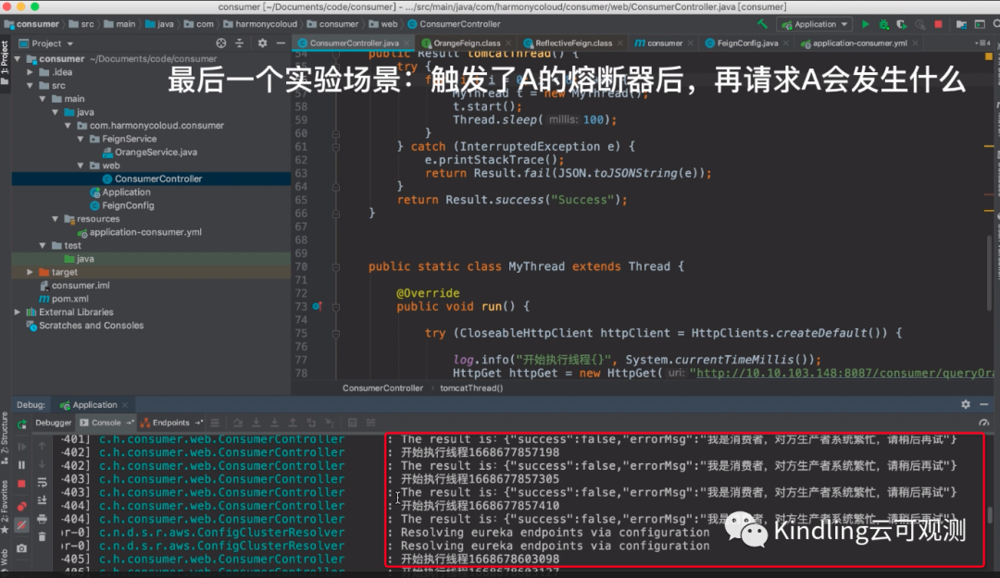

但是等过了熔断时间窗口期，我们发现，Hystrix有让一少部分请求正常执行：

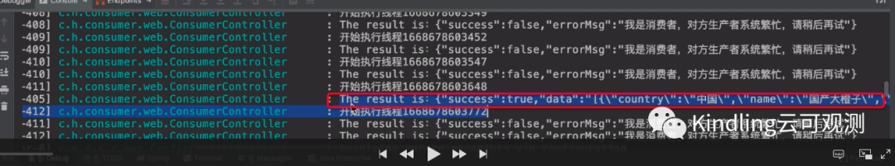

这就是熔断器的自我恢复机制，熔断器一共有三种状态，断开后，过了时间窗口期，它就会允许一部分请求进行尝试，如果成功次数达到阈值，熔断器就会关闭，服务恢复。

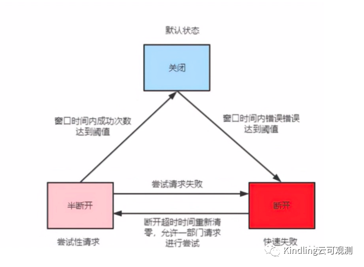

最后总结一下开篇疑问：

- 熔断超时时间指的是接口的执行时间

- 接口超时是有HystrixTimer线程定时监测到时间超时，触发的降级，而接口异常是通过Hystrix执行线程触发降级

- 熔断器触发之后，过了窗口时间，熔断器会允许少部分请求正常执行，尝试自我恢复

- Hystrix的底层用的也是线程池，一个线程执行业务，一个线程做网络调用，还有个线程做超时检测

