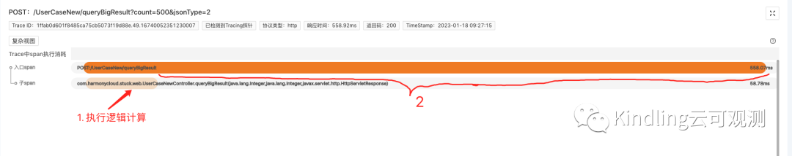
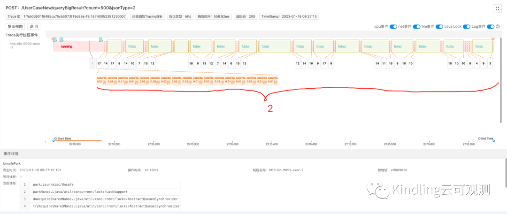
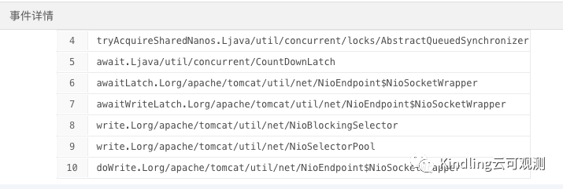
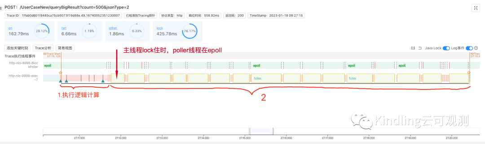
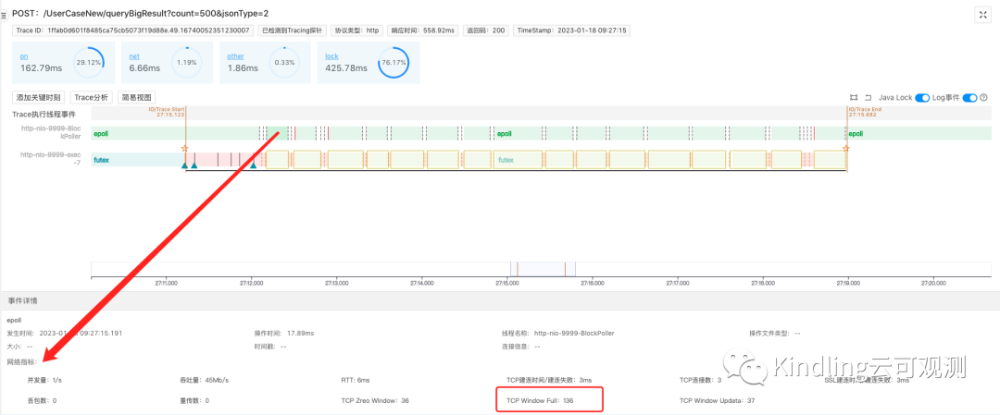
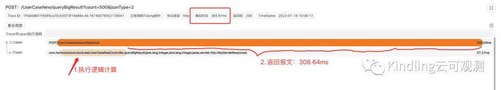

​
### 01 问题现象
前几天小编居家远程办公，在测试环境访问某返回3.4M数据的接口，响应速度远不如预期。一开始怀疑是用远程用vpn连接访问导致的。但回到公司之后，我再次通过内网多次访问该接口，响应时间依然不理想，在600～700ms左右，最快也需要500ms多。但办公室带宽100M，打满带宽所需耗时为 3.4MB / (100MBit/s / 8) = 272ms，这里面存在至少200多ms的时间缺口，是什么原因导致的？又该如何调优？

### 02 常见但易被忽略的类似场景
我们可能从来没有注意到一个事情：在实际生产环境访问大数据量的接口时，我们自然而然地认为响应速度相对慢些是正常的，但真的完全是因为返回报文太大的缘故吗？现在的带宽大都是百兆，服务器之间的带宽更是上千兆，而往往查询十几M的数据也要几秒钟，这里面还有没有可调优的缺口？
我们突然意识到，如果能排查出该慢请求背后的根因，找到调优方法，这可能会对众多开发者提升生产环境接口的性能产生很大的价值和参考意义。

### 03 初步排查
我们用程序摄像头Trace Profiling捕捉了该慢请求，trace的span信息如下：

我们发现该接口真正处理业务的时间只有58.78ms，看来我们需要重点分析2处的500ms系统在干嘛？

点击span信息，从底层视角，查看线程事件分析：

我们发现，在2处，系统在netwrite写回报文给客户端的时候，发生了很多lock事件占用了大部分耗时。既然系统已经开始netwrite了，那我们可以断定这部分高耗时就是网络传输的原因导致的。再点击lock事件，查看具体堆栈信息：

可以看出这是tomcat的nio阻塞住了，这也再次佐证了我们的推测。

### 04 进一步排查
我们排除了硬件等网络资源问题，基本就可以定位问题就是在服务端与客户端的传输上。但是具体原因是什么呢？我们切换到程序摄像头Trace Profiling的复杂视图页面(简易视图仅展示工作主线程，复杂视图展示本次请求所有相关线程），通过查看与网络传输相关的线程事件，看看能不能找到进一步的线索：

我们发现，在主线程lock住的时候，tomcat里的poller线程刚好在做epoll(即线程在查询系统内核文件描述符的读写状态)，通俗点来讲就是：
主线程往客户端写回报文，被阻塞lock住的时候，poller线程正好在帮主线程查询系统内核态是否可写。我们由此可推测，该慢请求是由于客户端接收数据窗口的buffer不够，导致服务端向其传输报文时，总是不可写，从而引发了阻塞等待。（有疑问的同学可以百度Tomcat nio原理、TCP网络传输协议等相关知识，或添加文末小编微信，共同探讨）

上述结论推导可能需要开发者有一定的计算机网络基础知识和经验，考虑到这一点，Kindling开源团队目前也已用探针采集到了每次慢请求对应的网络关键指标，比如RTT、丢包率、TCP Window Full等，后续程序摄像头的迭代发布时，会将这些指标关联到Trace上，效果如下图：

这样的话，比如就本次慢请求而言，当我们看到TCP Window Full 数值较大，而其他指标无异常，我们果断能推断，客户端的接收窗口buffer size过小，导致它经常发生Window Full。相对而言，当经验不足的开发者排查该问题也能简单很多。

### 05 实验论证
我修改了我自己这台电脑的socket接收缓存buffer大小，默认是128k，调到了4M，再次访问这个返回3.4M数据的接口，响应时间提升至365.91ms，其中，向客户端传输报文的时间是308.64ms，已经接近于100M带宽下的理想时间274ms(Wifi办公场景下存在网络存在抖动和占用)。

为排除其他因素的影响，我们再次使用服务器进行测试，继续用程序摄像头Trace Profiling捕捉分析请求，服务器间网络带宽为1GB，多组实验结果如下：

## 06 总结
通过多组实验对比，显然，接口返回报文的速度并不是随着接收端socket  buffer的大小成线性正比，这其中牵涉到TCP传输协议的算法逻辑，感兴趣的同学可以继续深入了解，或者添加小编微信共同探讨。当然，也不能将其盲目调到很大，这可能会给接收方造成处理压力，反而适得其反，大家可以借助程序摄像头Trace Profiling做实验，结合自己的业务场景合理调整。
