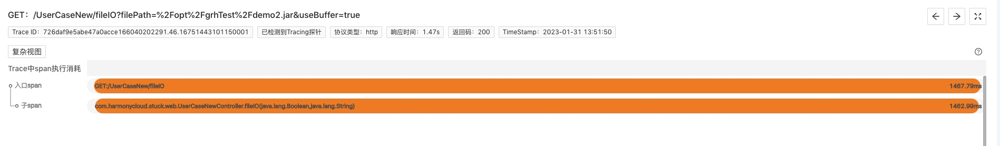
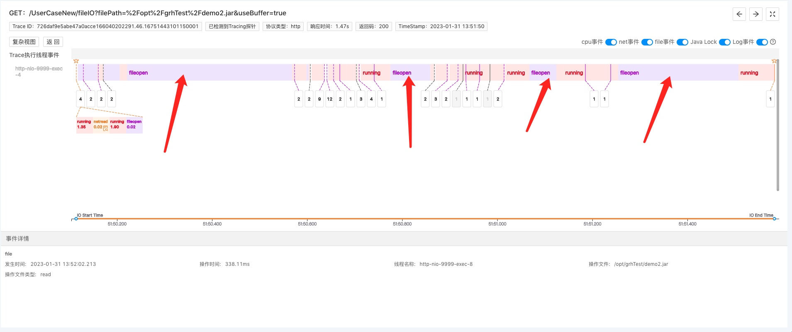
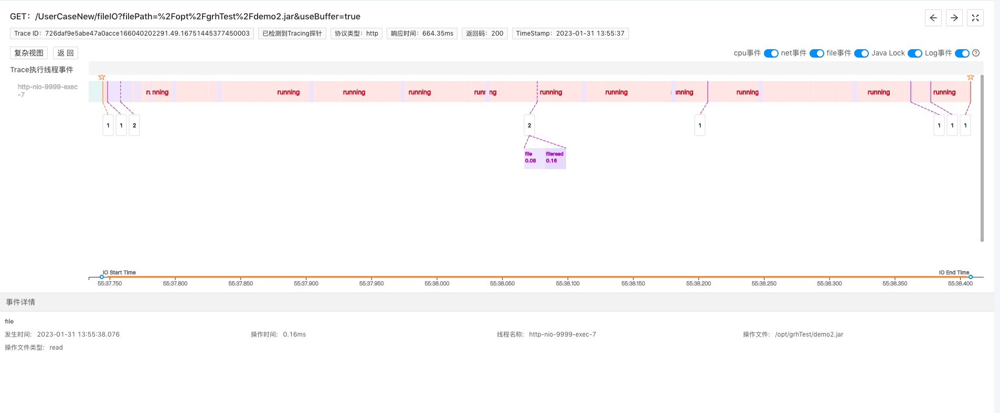
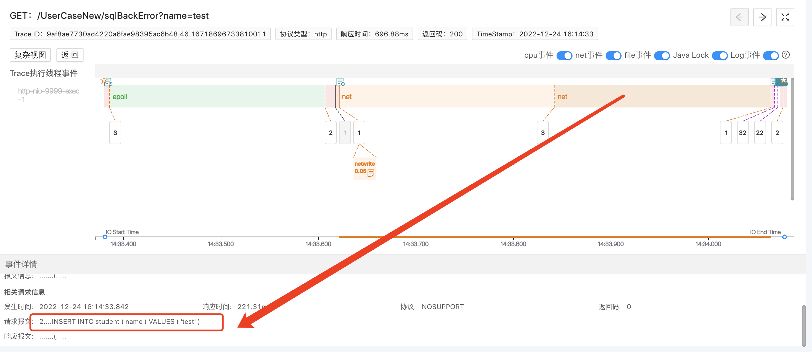

### 01 问题背景
某接口在测试环境耗时600～700ms左右，但在生产环境耗时在1.4s以上，接口实现逻辑包含数据库操作、文件操作、下游微服务调用和其他业务逻辑计算代码，该如何快速排查？

团队里的其他开发同学还在手忙脚乱地按以下这些常规步骤排查：

* 确定问题源：分析日志、代码等数据信息，确定接口是由于哪一部分逻辑代码引起的异常耗时
* 根据问题源，逐步排查是否是资源故障：检查磁盘、CPU、内存的利用率，看是否有任何资源被过度使用；检查磁盘是否有性能瓶颈；检查网络利用率，是否存在网络拥堵。
* 检查硬件
* ......
这是采用排除法倒推，依赖经验，排查时间因个人的能力而异。另外查看某些指标还需要和运维协作，而且指标也是通过时间范围去进行历史搜索，看个大概值，可能存在误差。

### 02 开发小白高光逆袭，一眼定位根因
就像犯罪现场的监控视频能让警察一眼看到真正的凶手是谁一样，有一个机智的开发同学借助Kindling程序摄像头精准还原接口执行现场的能力，一眼定位根因。

他用程序摄像头捕捉了生产环境该接口的执行Trace，从Span分析上看，只看到文件操作占了大量耗时，无法确定其中原因，所以像Skywalking这种常见的Trace追踪工具，只能排查到这一步，无法知道在1.47s异常耗时内，程序做了哪些事情。而Kindling还能看到更底层的“接口执行现场”信息：

**生产环境：该问题接口Trace中的Span分析**

当他继续点击span，看到Trace执行主线程的事件分析，他发现了问题苗头：

**生产环境：该问题接口Trace分析**

如上图，该Trace的工作主线程，耗费了大量的时间在做fileopen事件，理论上，fileopen(即操作系统打开存储在磁盘上的目标文件)只需几个ms足矣。主要耗时应该只是cpu做的running事件，即系统将文件数据从内核态拷贝到用户态。

于是，他再次用程序摄像头捕捉了测试环境下该接口的Trace：

**测试环境：该问题接口Trace分析**

显而易见，测试环境fileopen事件耗时正常，所以接口响应时间正常。由此他断定该接口响应时间在生产环境异常是由于磁盘性能问题导致的。

### 03 排障总结
接下来的思路就简单清楚了，检查磁盘，最后发现该磁盘损坏，替换后恢复正常。当大家遇到云服务器磁盘性能出现问题时，可以通过下列方法解决：

优化磁盘读写性能：如果发现磁盘读写性能较差，可以考虑将文件系统格式化为更高效的格式，并且启用磁盘缓存。
更换磁盘：如果磁盘读写性能确实过差，可以考虑更换磁盘，以便获得更好的性能。
更改云服务器硬件配置：如果云服务器磁盘性能不够，可以考虑更改云服务器硬件配置，以提高云服务器磁盘性能。
优化系统配置：可以考虑修改系统配置，以便优化磁盘读写性能，如更改文件系统缓存大小等。
检查磁盘状态：如果磁盘性能问题无法解决，可以考虑检查磁盘状态，以便找出磁盘故障。
其他同事按照常规排障思路，最后也能定位到是磁盘性能的问题，但期间投入的时间是不可控的，下文是关于使用Kindling程序摄像头技术排障的介绍，我认为它是颠覆性的工具，有兴趣的同学欢迎继续往下看。

### 04 附录 - Kindling程序摄像头技术介绍
kindling程序摄像头精准还原现场，10分钟黄金时间排障
很多公司愿意花高薪招聘资深开发，有很大一部分原因是花钱买他的经验，借助专家能力保障系统的稳定性和性能。但很多普通开发者从业经验深浅不一，我们不是专家，难道我们就只能吭哧吭哧敲CURD代码，一遇到生产故障就毫无头绪，只能找大佬吗？

kindling程序摄像头的初衷就是，以标准化步骤，帮助所有开发实现分钟级定位全资源种类故障根因，降低专家门槛。

> 以标准化步骤

1. 找：通过Trace系统，结合时间点，找出相关可能存在问题的关键Trace
2. 查：通过关键Trace，查询其对应的Span信息
3. 分析：分析Span信息中的何种指标与预期不符

其实这个观点一开始我是拒绝的，故障千奇百怪，怎么可能通过3条标准步骤就排查出根因？这牛是不是吹得有点过了？但是，经过多次实验反复论证，我逐渐意识到Kindling敢这么“吹牛”的原因：

生产环境是黑盒子，大多数情况下，我们都是从故障结果反推过程然后排除各种可能性，最后得到根因。而Kindling程序摄像头以系统内核级别线程事件分析的角度，精准还原程序执行现场。它让我们从过程分析根因，“雁过留痕”，所有故障都会在程序执行过程中产生和正常情况下不同的痕迹，这3条标准步骤就是带我们找到这个痕迹，进而定位根因。

> 分钟级别定位：行业内排障时效性目标，1分钟发现-5分钟响应-10恢复

没有Kindling，我照样还是能排查出故障根因，话虽如此，条条道路通罗马，但生产环境排障时效性是关键。没有任何人、任何排障工具能保证1-5-10的时效性目标。在以往排障过程中，我们需要在数据库、日志、终端、apm等排查工具来回切换，和运维协作，从海量的数据中筛选组织出有效的信息。这一过程是最耗时、最依赖个人经验的。
而恰恰Kindling的程序摄像头技术就是帮开发&运维完成了这一过程，它基于eBPF技术融合了Tracing，logging，metrics。换句话说，它已经把该接口相关的所有数据（比如，mysql、redis等网络请求的连接信息和报文信息、日志、堆栈、锁信息、文件IO信息等等）都筛选捕捉出来，附着在对应的线程事件上。如下图是数据库网络连接事件样例，点击事件即可查看具体信息：

基于此，对于问题我们不会再毫无头绪、无从下手，也不再需要去看这个查那个，浪费时间，我们只需要查看哪个指标异于预期，进而分析根因。

> 定位全资源种类故障根因

正如上一点提到的，Kindling程序摄像头技术融合了很多指标数据，后续也会继续把接口执行时刻的网络指标（比如带宽、rtt等），CPU利用率，磁盘性能指标、内存利用率等等信息捕捉融合到Trace分析中，以实现全资源种类故障根因定位。
1.
