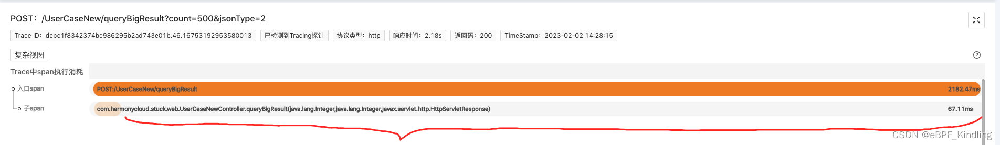
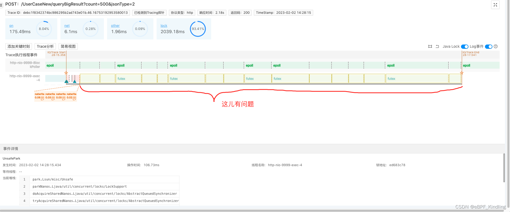
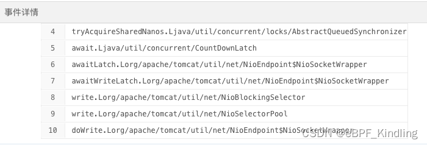
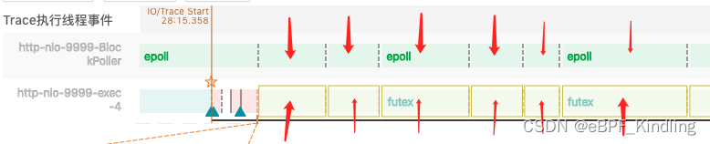
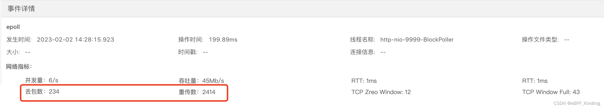

### 01 问题背景
自建机房，生产环境上某接口耗时超过2s，接口实现逻辑包含：

* 数据库读写
* 下游api调用
* 数据统计

开发本地自测，接口耗时却只有106ms。

于是开发问运维：“生产环境的网络确定没问题吗？”

运维：“不可能，监控大盘显示网络指标正常，不然为什么就你这个接口慢，其他应用接口都好好的呀？”

### 02 真的是代码问题吗？
开发再次review自己的代码，是否是哪部分代码因为生产环境的不同配置，而影响执行时间呢？

时间一分一秒过去，他也用了Skywalking这类工具分析Trace：但他只能看到接口的执行耗时统计，根本看不出接口在这些时间内做了哪些事情，为什么慢？

开发只好求助leader，leader说：“你用Kindling程序摄像头查一下这次请求试试，或许能看到更底层原因。”

### 03 无所谓，Kindling会出手
Kindling程序摄像头工具从系统内核级别，以线程事件分析的角度精准的还原程序执行现场，

生产环境这个黑盒子里发生了什么一目了然：

上图是该接口的Span分析，我们可以看到接口执行业务的时间只花了67.11ms，在这之后有1s多的异常耗时。

点击Span，查看该接口的执行线程更详细的事件分析：

可以看到，上图中的标注段，在系统已经开始执行netwrite(即往客户端写回报文)后，执行线程又执行了很多lock事件，这就是1s多的异常耗时所在。

既然系统已经开始写回报文，那我们可以推断这部分高耗时就是由于网络传输引起的。

### 04 根因已定位，这锅开发不背
点击lock事件，查看线程锁住时的代码堆栈：

可以看出这是tomcat的nio阻塞住了，这也再次佐证了是网络传输原因的猜想。

于是，结合查看tomcat里负责网络传输的BlockPoller线程继续分析：

可以看到，在执行线程lock住时，BlockPoller线程刚好在做epoll事件(即线程在查询系统内核文件描述符的读写状态)，通俗点来讲就是，它正在帮执行线程查询系统内核态是否可写，而报文一直传不过去。

于是点击epoll，查看具体的网络指标：

果然！网络丢包数过大，不断重传，这才是导致接口高耗时的元凶！

### 05 排查总结
开发拿着这个指标找到运维，运维ping这个应用所在的服务器ip，发现丢包率是4%。最后检查发现这台机器是新加的，还未完善好网络配置，而k8s集群自动调度将其注册运行，导致丢包率过高。

监控大盘上是没有丢包率这个指标的，运维只能看到带宽等指标正常，所以他认为网络正常。

而Kindling能捕捉到接口执行时刻的丢包数、重传数等更细粒度的网络指标。

为什么这台机器上别的接口响应正常？

因为该接口需要返回的报文较大，报文越大，传输时间受丢包率的影响接近指数型增长，所以响应时间很慢。

而其他接口因为报文较小，1个数据包(1.5Kb)以内就可传输完毕，所以命中丢包的几率很小，受到的影响微乎其微。所以运维无法及时感知。

当大家遇到丢包率过高时，可以采取以下可能的解决办法：

- 检查网络设备的配置：确保设备的配置是正确的，并且没有任何冲突。

- 更换网络设备：如果现有设备已经不能满足网络需求，可以考虑更换设备。

- 减少网络中的干扰：其他无线电设备如微波炉、无线路由器等可能会干扰网络信号。

- 升级网络带宽：如果网络带宽不足，可以考虑升级带宽以提高网络性能。

- 更换服务提供商：如果当前的网络服务质量不佳，可以考虑更换服务提供商。

### 06 附录 - Kindling程序摄像头技术介绍
Kindling程序摄像头能在分钟级内定位全资源故障根因，比如上文中提到的网络资源类故障，用普通的Trace追踪工具只能定位到Span级别，很难明确是网络的原因，更无法定位是丢包引起的传输时间异常。

而Kindling基于eBPF技术融合了Tracing，logging，metrics，换句话说，它已经把该接口执行时刻的所有数据（比如网络、磁盘、内存等性能指标，mysql、redis等网络请求的连接信息和报文信息，日志，堆栈，锁信息以及文件IO信息等等）都筛选捕捉出来，附着在对应的线程事件上，精准还原程序执行的现场。而以往我们排障时需要依赖的这些数据，都是通过开发和运维协作，借助众多数据库、apm、终端等工具，人工从海量的数据中筛选组织出来的。耗时不说，而且有时候大家都很自信，不相信是自己负责的东西出了问题。
