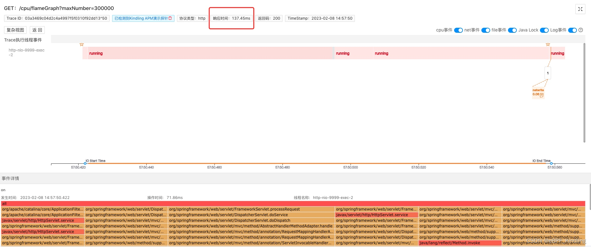
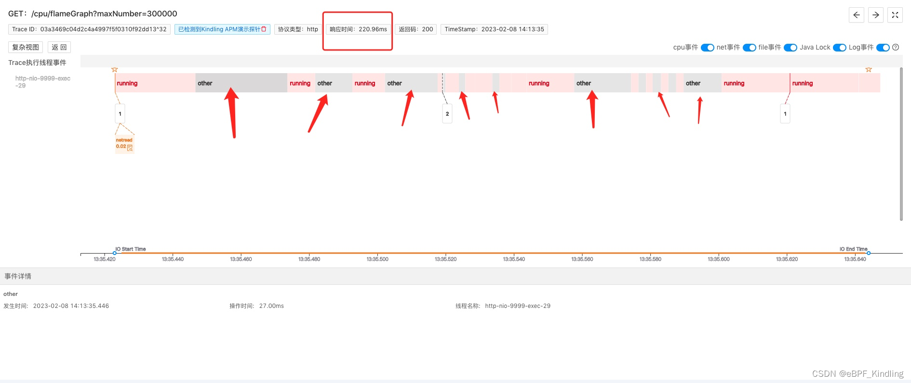
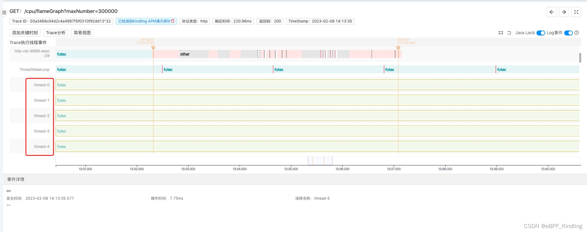
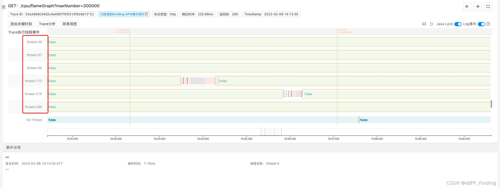

### 01 问题背景

某电商老板为了提高用户体验，让开发两周内将所有主流程接口的RT(接口响应时间)必须优化到200ms以内。

但是某应用有个接口，逻辑很简单，主要是数据计算
；正常耗时一般都在130ms左右；但它总时不时的飚到200ms以上；应用所在机器的内存、网络、磁盘等资源都正常，CPU在50%左右；并发量不高

开发查了一天，代码的计算逻辑已经优化到极致，问题依然没有解决。

### 02 Trace Profiling程序摄像头发现问题根因
同一个请求、同一个逻辑，资源稳定，为什么有时候耗时高有时候正常？

解决问题的关键就是找出请求在执行过程中的不同之处。

我用Kindling程序摄像头分别捕捉了正常和异常两种情况下的请求。

1. 正常-200ms以下：

2. 异常-200ms以上：

可以清楚的看到，耗时200ms以上的请求，耗费了大量的时间在做other事件

（即CPU runqueue，kindling开源团队目前还在调整，后续会将这个名词明确展示）。

“ 啥是CPU runqueue？什么情况下会导致程序CPU runqueue时间长？

这其实是我们大学课程计算机原理里的基础知识：

> CPU runqueue 是一个表示等待 CPU 时间的概念。它是一个系统的活动队列，用于存储正在等待 CPU 资源的进程。

> 当一个进程请求 CPU 资源时，它会被添加到 runqueue，等待 CPU 分配时间片。当 CPU 时间片分配给进程时，该进程会从 runqueue 中移除。

> runqueue 时间是指进程在 runqueue 中等待 CPU 时间的长度。
> 如果 runqueue 时间过长，则意味着 CPU 资源紧张，无法及时处理所有请求。

”

另外可以切换到Kindling程序摄像头里这个耗时超200ms的复杂视图：

继续滑动查看更多线程：

可以看到有上百个线程在并发执行任务

（后经查代码确认这是某开发在应用里写的定时任务）

这就意味着CPU runqueue里有很多任务在排队，虽然这台机器的CPU利用率是在50%左右，看似不高，但并发线程越多，CPU调度起来越慢，所以有些请求如果被排在后面，执行就会较慢。

找到根因，调优办法很简单：

* 增加CPU资源

* 或者检查这些大量并发线程执行的任务是否能够优化，减少CPU的开销。

* 或者调整进程的优先级，来控制CPU资源的分配

### 04 调优总结
CPU利用率太低意味着CPU没有得到合理利用，资源浪费；过高又会对系统的性能造成影响。

大多数运维是根据经验去判断CPU的最高阀值，但是不同的业务情况，对CPU利用率的要求其实是不一样的。

大家都知道CPU打满到100%肯定会让应用崩溃，那80%对性能的影响又有多大？40%就靠谱了吗？

这个指标无法作为应用性能的衡量标准，究其根本，CPU runqueue的时间才是衡量关键。我们需要根据实际情况调优。

而Kindling程序摄像头是一个很好的工具，如上文所举的案例，我们能借助它“看到”不同CPU资源下，程序的实际执行情况，快速找到调优方向。
