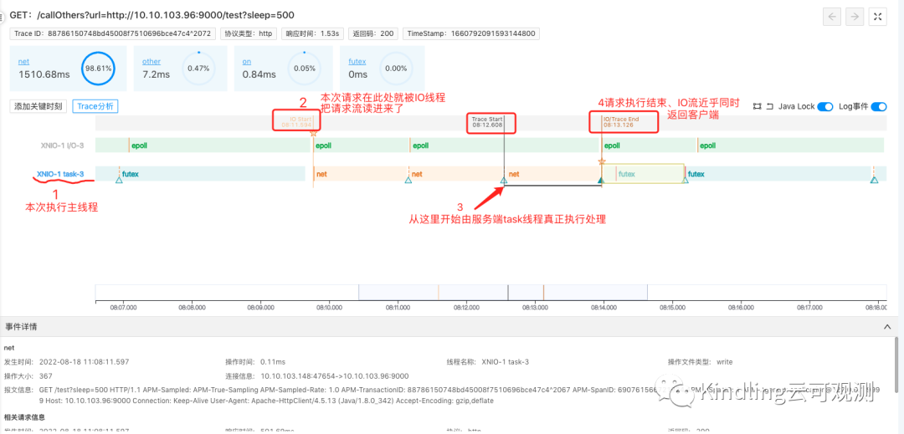
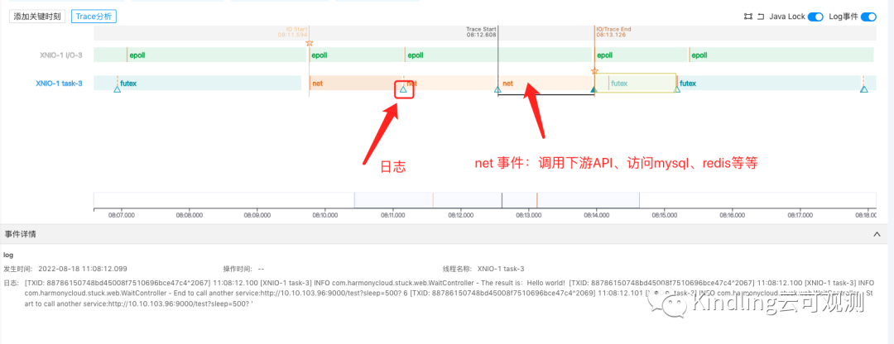

> 本文作者是曾有4年开发经验，期间担任过多个项目团队的开发leader，现任Kindling开源团队的产品经理。
作者曾因一次愚蠢的操作引发了线上P0故障，导致月工资扣了10%，年底绩效-1，连带上级leader也被扣钱，全公司邮件通报批评，大型社死现场。作者想通过自己这次悲催的经历，告诉普通开发同学如何实现在10分钟黄金时间内快速排障。

如果你问我是否见过凌晨4点的太阳？

- 我只记得曾经在凌晨1点被生产环境的告警短信炸醒；

- 在凌晨2点被运维的电话喊醒；

- 在地铁上、演唱会上、火锅店里端着电脑查bug；

......

### P0故障描述&排查过程

我相信很多很多一线开发同学对于上述场景深有感触，生产环境非乐土，各有各的苦，我当时背的这个P0故障现象是：晚8点我们电商平台开启促销活动后，客服收到很多用户反馈说系统响应特别慢，大量用户下单失败。我们看到监控大盘和日志，没有报错和告警，接口响应时间也没有什么波动，但是我们看到客户端出现大量超时报错，所以怀疑服务hang住了，重启服务后，客户端短暂恢复，5分钟后又出现timeout错误。
面对“精彩纷呈”的bug们，我们通常的常规操作是：
- 看监控大盘，基础资源（网络、内存、并发量）等等是否有异常

- 查日志

- 查数据库

- 根据场景看测试/本地环境是否能复现调试

- 基建完备的公司可能接入了Trace追踪，可以查Trace明细

- 寻求资深大佬的帮助

我当时也用了这一套“组合拳”，查了一会无果，我真的是欲哭无泪。眼瞅着波及范围面越来越广，其他普通订单也受到影响，P1升级P0，只能“壮士断腕”，立即回滚。

是不是很诡异？如果是你接下来怎么查？

最后我只能根据本次迭代发布代码，和上一稳定版本仔细比对变更，我相信很多开发都用过比对变更的代码内容去倒推故障原因的方法，小发布还好，但我们这次促销活动是大迭代，变更量大，此操作费时费力。

最后定位到原因是当时我在本地调试的时候自测某个场景，把服务器的最大线程数改的特别小，但是提交代码的时候没注意提交上去了，导致大量用户请求发过来之后，服务端线程资源不够，请求只能排队等待。做code review的leader也没注意，所以他的当月工资也被扣了10%。而当时我们的监控大盘也缺少对应用所用线程池的关键指标的监控。

### 同一问题，怎么在10分钟内快速排障

今天我模拟了当时的场景，接入Kindling程序摄像头Trace Profiling工具，可以看到用户在客户端感受到的慢请求如下图：

（该工具记录了一次慢请求下所有工作线程的执行实况）

这个图怎么看？

序号1线程是本次请求执行主线程，我们可以看到本次请求，在2处就已经被负责IO的的线程把请求流读进来了，但是在3处才开始由服务端的task线程真正执行处理。

4表示请求执行结束，IO流近乎同时返回客户端

这说明请求慢是因为请求在排队等待资源，请求流IO进来的时候系统没有足够的资源去处理它。而普通监控系统对于服务响应时间是从CPU执行计算这一刻开始的，所以这就造成了虽然客户端感知到了慢，但从服务端看起来还是风平浪静。

但是当年并没有程序摄像头Trace Profiling这个工具，10分钟内根本查不出来，故障时间越长，锅越大。

话说回来，程序摄像头工具的能力远不止此：

比如上图中的三角形图标就表示，此处有打印业务日志，并且点击后可在事件详情中查看；橙色的区块表示这是net事件，点击后也能查看报文，如果这个net事件是访问数据库，我们也能看到具体执行的sql语句......

也就是说，它把你需要查看的各种数据信息，都完整附着在对应的线程上，保留下来。像以前我们查日志都是登陆到日志系统，根据时间或者TraceID等关键字去筛选；查生产数据库的话还要走各种审批流程，等审批下来，饭碗都快没了。

关于程序摄像头更详细的监控排障能力介绍可参考：

eBPF程序摄像头——力争解决可观测性领域未来最有价值且最有挑战的难题

刚入行的时候我们经常干出把本地调试代码误提交、merge错分支、把别人的代码覆盖掉等等这些蠢事。

排查问题也像无头苍蝇一样，尤其是遇到通过日志、或者本地复现都查不出原因的bug时，更是欲哭无泪。Trace Profiling就是为了帮助开发从与生产bug“纠缠恶斗”中解救出来，它真实还原了程序执行现场，把bug的“犯罪证据”都搜罗起来给你整理展示。

我们后期会继续推出相关系列文章，以大家在生产环境中会遇到的常见故障场景为例，实现在10分钟黄金期内快速排障。
