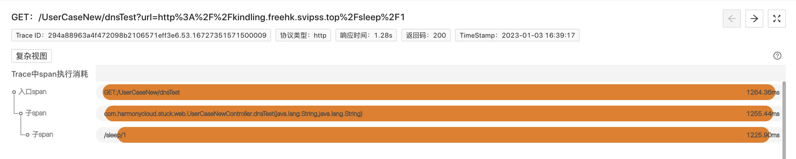
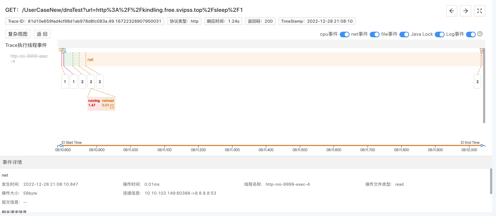
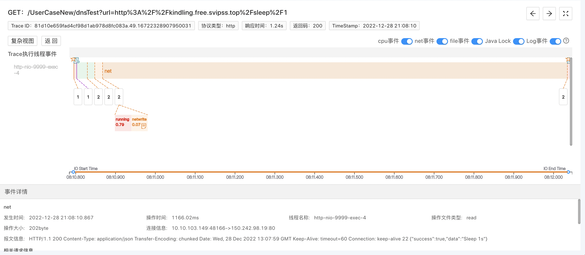

### 1. 常规排障痛点
- 此类问题一般需要运维和开发协同排查
- 排查通常采用排除法，依赖常规思路经验，分别检查网络、应用有没有问题，排查时间周期不可预估

### 2. 程序摄像头Trace Profiling标准化步骤排障

> 要启用程序摄像头Trace Profiling，请先[安装kindling](/docs/installation/kindling-agent/install-kindling-in-kubernetes/), 
再[启用Trace Profiling功能](/docs/usage/enable-trace-profiling/)
 

#### 2.1 找关键Trace
通过Trace系统，结合时间点，找出相关可能存在问题的关键Trace，并在程序摄像头系统上找到需要排查的Trace的profile记录。

 

#### 2.2 查Span信息
选择好profile之后，本页面会展示该Trace的span执行消耗分析，如下图。 

#### 2.3 分析Trace执行线程事件
> 在我们普遍的认知中，网络问题往往需要通过运维协助，查看网络指标才能定位解决。但其实网络问题出现时，势必会在请求的执行过程中留下痕迹。而程序摄像头Trace Profiling能够捕捉所有类型（包括应用访问mysql、redis等）的网络请求以及其报文信息，把系统网络问题通过线程系统调用事件、整合metric数据，反应在请求的执行过程中，我们借此能做到快速定位网络应用问题的边界，排查根因。

在下图中，我们可以看到，本次请求的工作线程做了两次网络调用net事件，点击第一次，从报文中可以看到，请求在做DNS解析。  点击第二次，从报文中可以看到，请求被转发到服务的IP地址调用。 

这就是很多开发同学可能忽视的一点，当我们通过域名调用api时，会先进行域名解析，然后再转发到对应的服务ip上。当因为DNS解析失败导致请求失败时，大家可能会误以为是服务不可用，弄错排查方向。

#### 2.4 案例demo在线演示地址

[通过域名访问API接口，含DNS解析过程](http://kindlingx.com:9504/#/thread?folder=Demo_Demo-69579c8597-9bzbj_javedemo_24666&file=20230302033757.870217719_http_L1VzZXJDYXNlTmV3L2Ruc1Rlc3Q%3D_true)

[通过IP访问API接口，不含DNS解析过程](http://kindlingx.com:9504/#/thread?folder=Demo_Demo-69579c8597-9bzbj_javedemo_24666&file=20230302033945.882282241_http_L1VzZXJDYXNlTmV3L2Ruc1Rlc3Q%3D_true)

### 3. 精准还原执行现场，10分钟黄金时间排障
生产环境的场景远比本次案例复杂的多，它的运行过程像个黑盒子，程序摄像头Trace Profiling能够监测记录所有系统内核调用事件、且与metric数据整合，为我们打开了“黑盒子”。以此实现10分钟黄金时间快速排障，通过线程按时间轴执行事件的方式精准还原请求执行现场，降低排障门槛，降低对专家经验的依赖。

### 4. 关于程序摄像头 Trace Profiling

[官网地址](http://kindlingx.com/)

[GitHub](https://github.com/kindlingproject/kindling)
