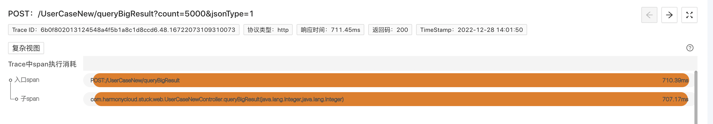
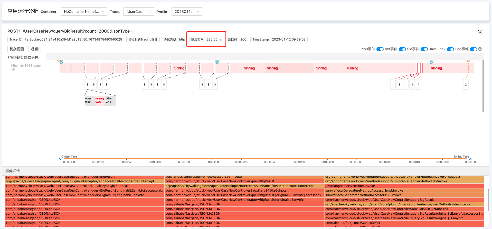
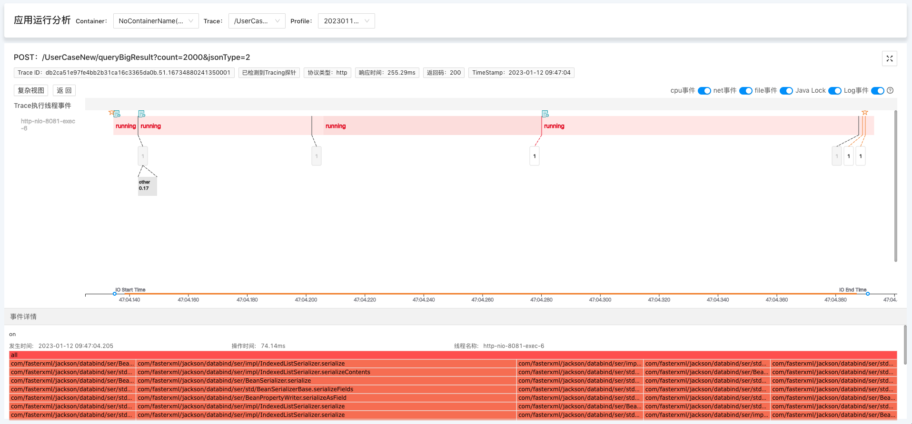
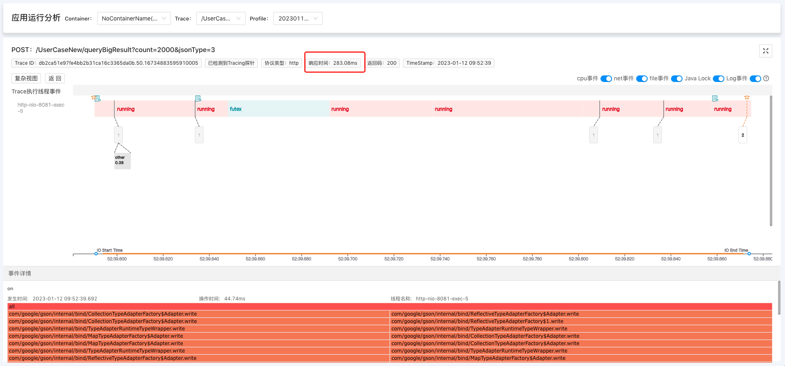
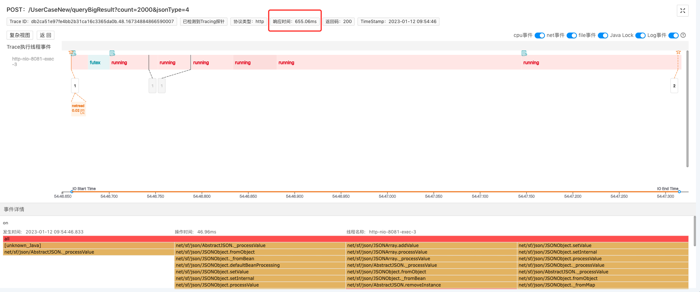

### 1. 常规排障痛点
当生产环境CPU使用率过高时，我们的常规思路是，登陆上机器：

1. 排查占用CPU的进程
2. 找出实际占用最高CPU的线程
3. 用jstack获取对应线程的堆栈信息，找出耗CPU的代码位置对应修复 此举易行，但是这一套操作下来，很花时间，而且如果CPU一会高，一会正常该怎么排查？比如：对象序列化、反序列化是开发的超高频操作，但是很多小伙伴可能不知道，这是很费CPU的。尤其在对象很大的时候，在生产环境就容易引起CPU飙高，但持续时间又很短，难以捕捉的情况，这种无法稳定复现的该怎么排查？

### 2. 案例说明
 
 我们模拟了上述场景，对一个6M大小的对象用不同的序列化框架进行序列化操作，并捕捉了请求Trace，耗时如下：
- Fastjson：285.00ms
- Jackson：255.29ms
- Gson ：283.08ms
- net.sf.json：655.06ms​

我们来看下程序摄像头是如何通过标准化排障步骤，实现10分钟内快速排查这个因大对象序列化导致Trace异常耗时问题的：
                 

### 3. 程序摄像头Trace Profiling标准化步骤排障
> 要启用程序摄像头Trace Profiling，请先[安装kindling](/docs/installation/kindling-agent/install-kindling-in-kubernetes/), 
再[启用Trace Profiling功能](/docs/usage/enable-trace-profiling/)
 

#### 3.1 找关键Trace
通过Trace系统，结合时间点，找出相关可能存在问题的关键Trace，并在程序摄像头系统上找到需要排查的Trace的profile记录。 

#### 3.2 查Span信息
选择好profile之后，本页面会展示该Trace的span执行消耗分析，如下图。但是我们只能看到Span耗时很长，但不知道时间消耗在哪里。 

#### 3.3 分析Trace执行线程事件
> CPU问题的关键是找到问题代码堆栈，我们普遍的排查方式是“事后诸葛”：出现问题了，再去打堆栈，费时不说，有些更是难复现。而程序摄像头Trace Profiling正如其名，它是系统请求执行过程的监控，它不仅完整记录我们需要的高CPU耗时堆栈，而且通过捕捉一次请求下所有的系统调用事件、整合metric数据，精准还原现场。颠覆我们以往的排障思路：不再是从问题现象，反查、排除和推理，而是从问题发生现场过程，快速定位根因。

点击Span展开，查看对应的详细信息，通过线程事件详情来分析CPU异常原因。  我们可以看到，本次Trace的执行主线程花了大部分时间在做running（及cpu逻辑计算）事件，点击running事件，可查看堆栈信息。堆栈显示，这是系统在执行JSON.toJSON操作，从这里我们可以推断出，本次Trace是因为执行了大对象的序列化操作，导致CPU耗时异常。

#### 3.4 案例demo在线演示地址

[演示地址](http://218.75.39.90:9504/#/thread?folder=Demo_Demo-69579c8597-9bzbj_javedemo_24666&file=20230303020244.683372477_http_L1VzZXJDYXNlTmV3L3F1ZXJ5QmlnUmVzdWx0_true)

### 4. 精准还原执行现场，10分钟黄金时间排障
生产环境的场景远比本次案例复杂的多，它的运行过程像个黑盒子，程序摄像头Trace Profiling能够监测记录所有系统内核调用事件、且与metric数据整合，为我们打开了“黑盒子”。以此实现10分钟黄金时间快速排障，通过线程按时间轴执行事件的方式精准还原请求执行现场，降低排障门槛，降低对专家经验的依赖。

### 5. 序列化知识点拓展
对象序列化、反序列化是开发的超高频操作，但是很多小伙伴可能不知道，这是很费CPU的操作。而常见的Jackson、fastjson、Gson、net.sf.json这4中序列化框架性能相差很大，尤其是序列化对象很大的时候，在生产环境就容易引起CPU飙高，但持续时间又很短，难以捕捉的情况。 上面的demo中我们用的是Fastjson框架，我们再用Trace Profiling来捕捉记录一下其他3种序列化框架的测试请求对比看下： 

#### 5.1 Jackson 255.29ms
[演示地址](http://218.75.39.90:9504/#/thread?folder=Demo_Demo-69579c8597-9bzbj_javedemo_24666&file=20230303020319.872203123_http_L1VzZXJDYXNlTmV3L3F1ZXJ5QmlnUmVzdWx0_true)

#### 5.2 Gson 283.08ms

[演示地址](http://218.75.39.90:9504/#/thread?folder=Demo_Demo-69579c8597-9bzbj_javedemo_24666&file=20230303020336.57066572_http_L1VzZXJDYXNlTmV3L3F1ZXJ5QmlnUmVzdWx0_true)

#### 5.3 net.sf.json 655.06ms​

[演示地址](http://218.75.39.90:9504/#/thread?folder=Demo_Demo-69579c8597-9bzbj_javedemo_24666&file=20230303020349.999938181_http_L1VzZXJDYXNlTmV3L3F1ZXJ5QmlnUmVzdWx0_true)

 我们可以看到，4种序列化框架工具效率相差很大，相对其他排障工具，程序摄像头Trace Profiling“更人性化”地帮你捕捉了高CPU耗时的堆栈信息。

### 6. 关于程序摄像头 Trace Profiling

[官网地址](http://kindlingx.com/)

[GitHub](https://github.com/kindlingproject/kindling)
