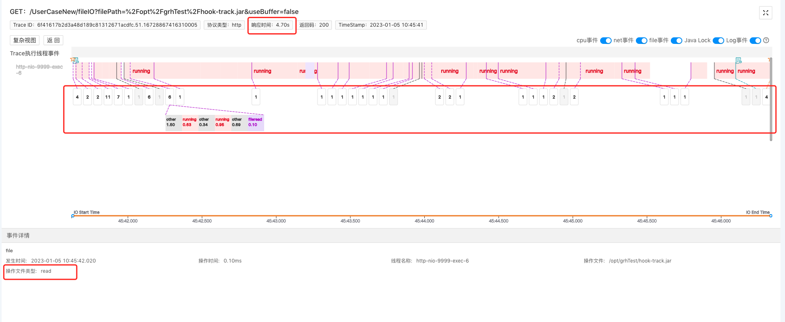
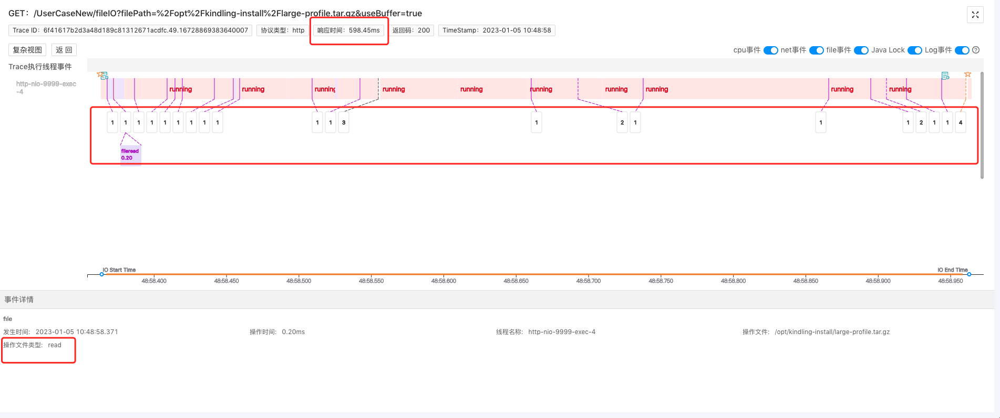

### 1. 文件IO问题排障痛点
- 根因难明确：当出现文件IO问题时，我们首先会用命令排查磁盘IO性能，定位具体那个进程、线程、文件占用IO比较大。一层层剖析，定位到某个file后，如果我们发现文件也不大，网络也很稳定，此时我们该怎么继续排查？
- 依赖经验：文件的读写代码，很多开发都是ctrl C & ctrl V 借鉴过来的，很容易忽视文件IO原理，这就可能对性能造成很大影响，需要依赖资深开发的经验。

### 2. 程序摄像头Trace Profiling标准化步骤排障

#### 2.1 找关键Trace
通过Trace系统，结合时间点，找出相关可能存在问题的关键Trace，并在程序摄像头系统上找到需要排查的Trace的profile记录。 

#### 2.2 查Span信息
选择好profile之后，本页面会展示本Trace的span执行消耗分析，如下图。但是我们光从span信息中无法得出影响文件读写速率的原因。 

#### 2.3 分析Trace执行线程事件
> 文件IO问题可能是由于硬件、网络、代码等各种原因导致的，通常情况下，我们是根据经验，采用排除法一个个去查，但是我们换个角度打开思路：任何原因导致了IO问题，势必会在系统执行的过程中留下痕迹，而程序摄像头Trace Profiling能够通过捕捉记录一次请求下所有的系统调用事件、整合metric数据，精准还原故障现场。比如我们下述所提到的因代码问题导致的文件IO慢，就是通过“现场痕迹”快速定位故障根因。

我们点击span展开，查看对应的详细信息，通过线程事件详情数据来分析文件IO慢的根因。 这个测试请求，是读一个224.6Kb的文件，但是竟然花了1.06s，通过线程执行事件分析，我们可以看到系统内核做了很多fileRead事件。（网络带宽正常，此类指标数据后期会补充到页面上，目前开源版暂未支持）  点击running事件，查看线程堆栈：  根据堆栈，我们大致能推断这是系统在将文件数据从内核态拷贝到用户态。 到这里我们其实有了大致的推断：带宽等网络指标正常，系统做了大量的fileread事件，再结合计算机基础知识，说明这个文件IO过程没有buffer，或者说buffer空间太小，导致系统需要不断将文件数据从内核态拷贝到用户态。

再给大家对比看一下，正常加了buffer的文件IO过程是怎么样的：读取3.4M的文件，只花了1.1s。  加了buffer之后，读取一个大很多文件，但系统内核的fileRead事件做得更少，它只需要少次地从内核态读取到用户态，所以这就是加buffer后IO性能更高的根本原因。

### 3. 精准还原执行现场，10分钟黄金时间排障
对于文件IO问题，程序摄像头Trace Profiling能够：

- 捕捉一次请求下，系统具体操作了哪些文件及耗时分析
- 捕捉在文件读写时，系统内核的调用事件，展示文件IO的原理过程

生产环境的场景远比本次案例复杂的多，它的运行过程像个黑盒子，程序摄像头Trace Profiling能够监测记录所有系统内核调用事件、且与metric数据整合，为我们打开了“黑盒子”。以此实现10分钟黄金时间快速排障，通过线程按时间轴执行事件的方式精准还原请求执行现场，降低排障门槛，降低对专家经验的依赖。
