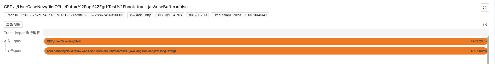

### 1. 文件IO问题排障痛点
- 根因难明确：当出现文件IO问题时，我们首先会用命令排查磁盘IO性能，定位具体那个进程、线程、文件占用IO比较大。一层层剖析，定位到某个file后，如果我们发现文件也不大，网络也很稳定，此时我们该怎么继续排查？
- 依赖经验：文件的读写代码，很多开发都是ctrl C & ctrl V 借鉴过来的，很容易忽视文件IO原理，这就可能对性能造成很大影响，需要依赖资深开发的经验。

### 2. 案例说明
我们写了一个demo接口，读取一个1.07M的文件，但是竟然花了4.70s，我们来看下来看下程序摄像头是如何通过标准化排障步骤，实现10分钟内快速排查这个Trace异常耗时问题的：

### 3. 程序摄像头Trace Profiling标准化步骤排障

> 要启用程序摄像头Trace Profiling，请先[安装kindling](/docs/installation/kindling-agent/install-kindling-in-kubernetes/), 
再[启用Trace Profiling功能](/docs/usage/enable-trace-profiling/)
 

#### 3.1 找关键Trace
通过Trace系统，结合时间点，找出相关可能存在问题的关键Trace，并在程序摄像头系统上找到需要排查的Trace的profile记录。 

#### 3.2 查Span信息
选择好profile之后，本页面会展示本Trace的span执行消耗分析，如下图。但是我们光从span信息中无法得出影响文件读写速率的原因。 

#### 3.3 分析Trace执行线程事件
> 文件IO问题可能是由于硬件、网络、代码等各种原因导致的，通常情况下，我们是根据经验，采用排除法一个个去查，但是我们换个角度打开思路：任何原因导致了IO问题，势必会在系统执行的过程中留下痕迹，而程序摄像头Trace Profiling能够通过捕捉记录一次请求下所有的系统调用事件、整合metric数据，精准还原故障现场。我们下述案例就是通过“现场痕迹”快速定位故障根因。

我们点击span展开，查看线程事件分析。 我们可以看到系统内核虽然做了很多fileRead事件，但是时间近乎都在10ms以内。fileRead事件是指系统内核从磁盘读取目标文件这一系统调用事件，由此可推断，磁盘性能正常，我们无需再耗费时间排查磁盘相关指标。真正导致此Trace耗时异常的是图中占大块时间轴的running事件（即系统在CPU上执行计算操作）
  

所以我们应该分析系统执行running事件的行为，点击running事件，查看线程堆栈：

 

 根据堆栈，我们大致能推断这是系统在将文件数据从内核态拷贝到用户态。但是堆栈里出现了readSingle方法，该方法会从当前流中读取1个字节，也就是说，系统将文件从内核读到用户态时竟然是单个字节、单个字节地读的，执行效率非常低，导致CPU在此耗费了很长的时间。

到这里我们可以推断：这个Trace耗时异常的根因就是这个文件在IO过程没有buffer，导致系统需要只能按单个字节，不断地将文件数据从内核态拷贝到用户态。

再给大家对比看一下，正常加了buffer的文件IO过程是怎么样的：读取15.3M的文件，只花了598.45ms。 
 

加了buffer之后，读取一个大很多文件，但系统内核的fileRead事件做得相对而言更少些，它不需要更多次从内核态读取到用户态，我们也点击占耗时大头的running事件查看堆栈信息：

堆栈里没有readSingle方法，而是执行了readBytes方法，该方法会读取指定缓冲区大小的字节数。也就是说它是根据我们设置的buffer大小批量读的，性能更好。

> **未来我们还会构建一个磁盘被竞争，导致fileRead事件很长的场景，大家可以持续关注，程序摄像头Trace Profiling是如何在分钟级内快速排查全资源种类故障的**

#### 2.4 案例demo在线演示地址
[加buffer读取文件](http://218.75.39.90:9504/#/thread?folder=Demo_Demo-69579c8597-9bzbj_javedemo_24666&file=20230303025634.696715096_http_L1VzZXJDYXNlTmV3L2ZpbGVJTw%3D%3D_true)

[未加buffer读取文件](http://218.75.39.90:9504/#/thread?folder=Demo_Demo-69579c8597-9bzbj_javedemo_24666&file=20230303030000.643516677_http_L1VzZXJDYXNlTmV3L2ZpbGVJTw%3D%3D_true)

### 3. 精准还原执行现场，10分钟黄金时间排障
对于文件IO问题，程序摄像头Trace Profiling能够：

- 捕捉一次请求下，系统具体操作了哪些文件及耗时分析
- 捕捉在文件读写时，系统内核的调用事件，展示文件IO的原理过程

生产环境的场景远比本次案例复杂的多，它的运行过程像个黑盒子，程序摄像头Trace Profiling能够监测记录所有系统内核调用事件、且与metric数据整合，为我们打开了“黑盒子”。以此实现10分钟黄金时间快速排障，通过线程按时间轴执行事件的方式精准还原请求执行现场，降低排障门槛，降低对专家经验的依赖。

### 4. 关于程序摄像头 Trace Profiling

[官网地址](http://kindlingx.com/)

[GitHub](https://github.com/kindlingproject/kindling)
