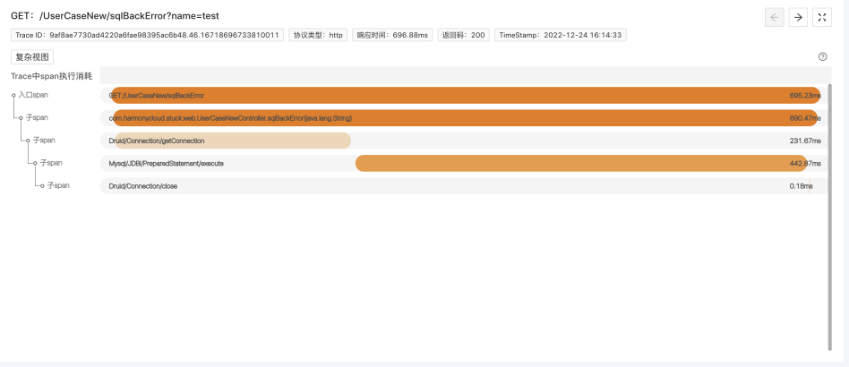
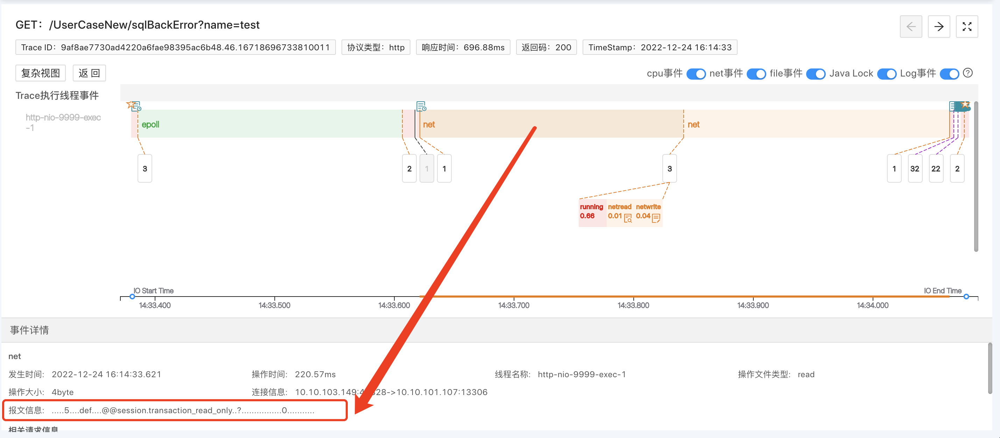
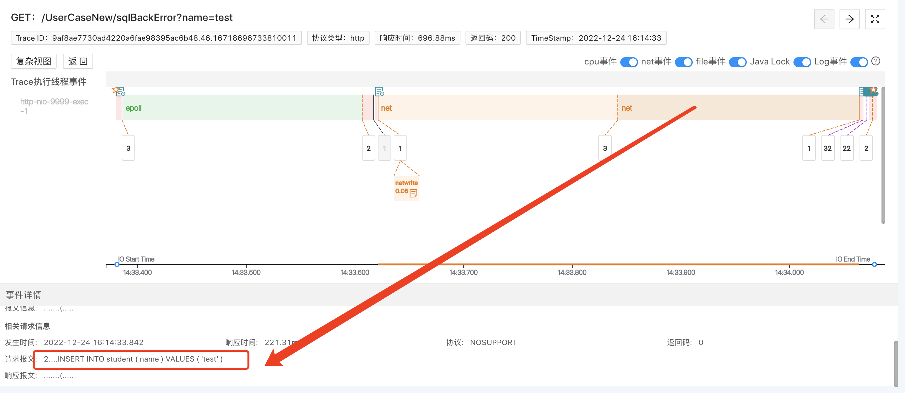
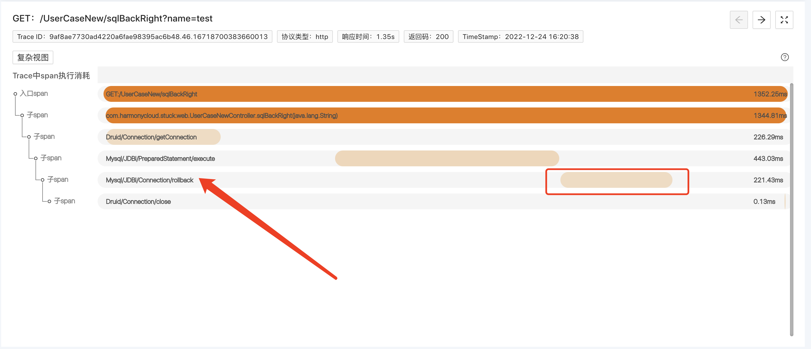
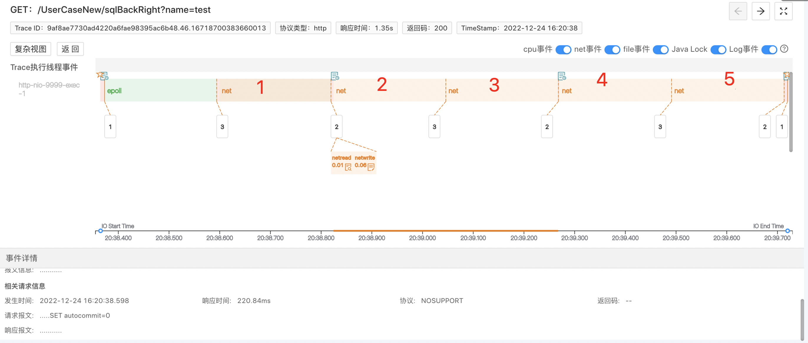
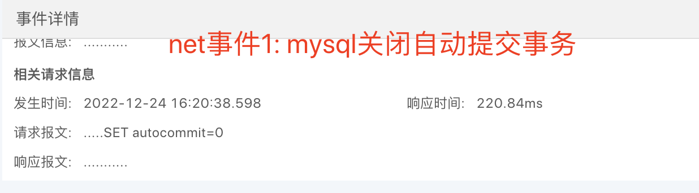
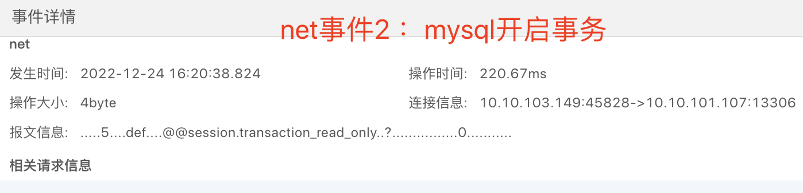
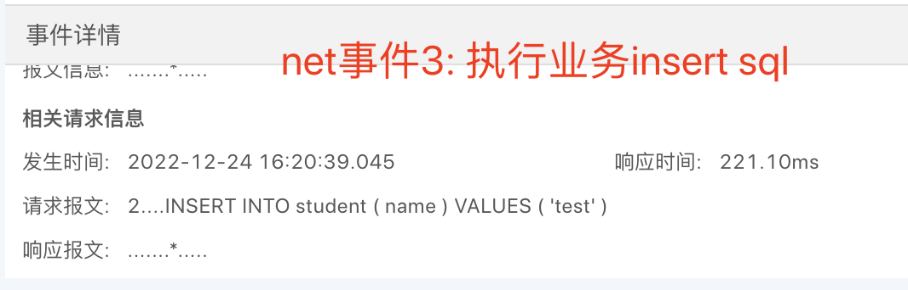
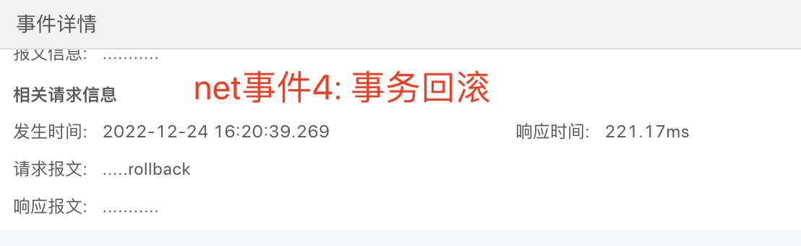
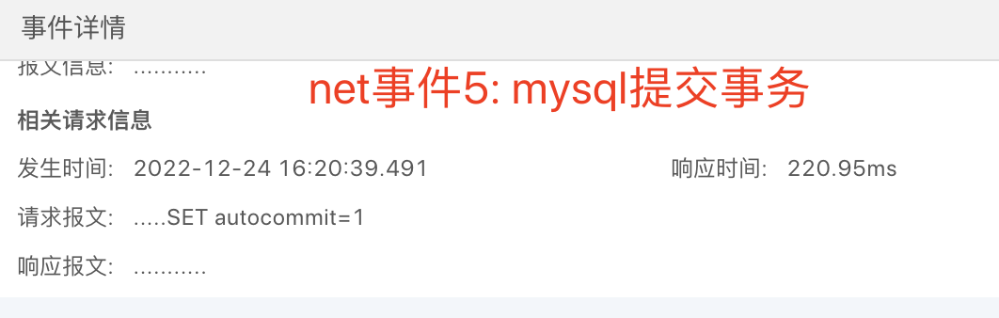

<a name="wIBxn"></a>
### 1. 业务问题排障痛点
- 依赖打埋点日志排查问题
- 业务问题大部分是由开发代码逻辑漏洞引起的，主要靠排查代码，再通过使用控制台、日志、数据库管理平台等工具加以辅助，来找出漏洞所在。倘若不是熟悉代码的owner，排查时间周期更是不可预估，以小时计。

而我们本次事务失效的案例，无法通过打日志买点的方式判断Spring事务是否生效，而且事务失效一般都是在对账或出现用户投诉的时候才被发现，经常会造成生产脏数据，清洗数据费时费力，如何实现快速排查？
<a name="HNiQy"></a>
### 2. 程序摄像头Trace Profiling标准化步骤排障
<a name="GvUem"></a>
#### 2.1 找关键Trace
通过Trace系统，结合时间点，找出相关可能存在问题的关键Trace，并在程序摄像头系统上找到需要排查的Trace的profile记录。<br />
<a name="pT6lt"></a>
#### 2.2 查Span信息
选择好profile之后，本页面会展示本Trace的span执行消耗分析，如下图。从span中，我们可以看到，这条Trace，在数据库连接池Druid在connection之后，execute了sql语句，最后close了connection，并没有看到任何rollback方法的调用。<br />其实到这里我们已经基本可以推断事务没有执行回滚。<br />
<a name="uZnkt"></a>
#### 2.3 分析Trace执行线程事件
我们点击span展开，查看对应的详细信息，通过线程事件详情数据，来明确事务是否执行回滚。
> **对数据库的访问其实就是一次net调用，程序摄像头可以抓到所有网络请求(redis、api、mysql等等）的报文，可以通过查看本次请求是否在执行业务sql后之后发起rollback报文请求，以此确定它有没有执行事务回滚。**

本次工作线程做了两次对数据库的net请求，点击第一次，可以看到报文信息，显示我们代码里确实设置了Transaction事务。<br /><br />接着，线程做了第二个net事件，是执行了插入sql，在此之后，工作线程没有再发起sql相关的net请求。<br />由此，我们可以明确，本次请求，没有执行事务回滚。<br />

#### 2.4 事务失效demo在线演示地址
http://218.75.39.90:9504/#/thread?query=es&pid=24355&stime=1672888787128&etime=1672888788128&protocl=http
<a name="C5VUQ"></a>
#### 2.5 事务生效场景示例
便于大家比对，我们同样用程序摄像头Trace Profiling捕捉了事务生效时的请求记录

##### 2.5.1 事务生效demo在线演示地址
http://218.75.39.90:9504/#/thread?query=es&pid=24355&stime=1672888797141&etime=1672888798141&protocl=http
<a name="NJ6db"></a>
##### 2.5.2 请求span分析
<br />事务生效时，我们明显从trace的span信息中看到，在execute之后，调用了rollback方法。
<a name="q8Iwd"></a>
##### 2.5.3 请求执行线程事件分析
<br />我们可以看到，相对上一个事务失效的测试请求，这上面多了3个net事件，我们点击查看具体的请求报文，看看它们做了什么事情：<br /><br /><br /><br /><br /><br />我们可以根据事件+报文信息，清楚的看到本次请求的执行过程，明确本次事务成功执行。
<a name="kHv7p"></a>
### 3. 精准还原执行现场，10分钟黄金时间排障
生产环境的场景远比本次案例复杂的多，它的运行过程像个黑盒子，程序摄像头Trace Profiling能够监测记录所有系统内核调用事件、且与metric数据整合，为我们打开了“黑盒子”。以此实现10分钟黄金时间快速排障，通过线程按时间轴执行事件的方式精准还原请求执行现场，降低排障门槛，降低对专家经验的依赖。
<a name="lRLty"></a>
### 4. 事务知识点拓展
使事务生效条件如下：

- 开启事务：对于SpringBoot项目，SpringBoot通过DataSourceTransactionManagerAutoConfiguration

自动配置事务管理，需要@EnableTransactionManagement注解开启使用就可以了。

- 对象要被Spring管理，事务方法所在的类要被加载为bean对象，即@Transactional必须通过代理过的类从外部调用目标方法才能生效。
- @Transactional注解只能作用在public修饰的方法上。
- 抛出RuntimeException。

在上述案例中，我们就是通过第二个条件，来控制事务是否生效，demo代码如下，从外部调用createUserWrong()方法时，如果@Transactional是加在createUserWrong()上，事务生效；如果加在createUser()，事务部生效。
```java
@Transactional
public void createUserWrong(String name) {
        this.createUser(name);

if (name.contains("test"))
    throw new RuntimeException("invalid username!");

}

public void createUser(String name) {

    StudentDO studentDO = new StudentDO();
    studentDO.setName(name);

    //新增学生
    studentMapper.insert(studentDO);
}
```
