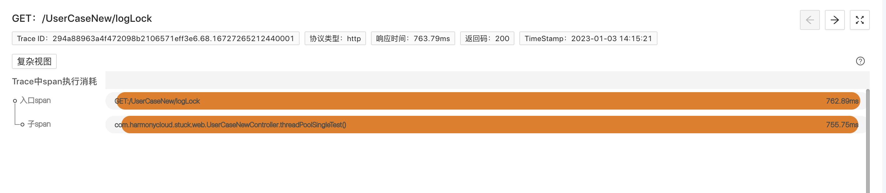
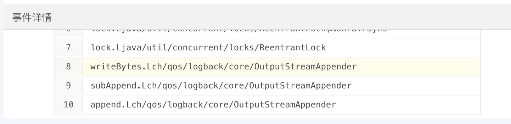

### 1. 常规排障痛点
- 多线程问题，在生产环境一般是高阶问题，需要一定的开发经验
- 往往需要通过打埋点日志的方式，反推线程行为，分析故障根因
- 非必现问题无从下手

### 2. 程序摄像头Trace Profiling标准化步骤排障

> 要启用程序摄像头Trace Profiling，请先[安装kindling](http://kindling.harmonycloud.cn/docs/installation/kindling-agent/install-kindling-in-kubernetes/), 
再[启用Trace Profiling功能](http://kindling.harmonycloud.cn/docs/usage/enable-trace-profiling/)
 

#### 2.1 找关键Trace
通过Trace系统，结合时间点，找出相关可能存在问题的关键Trace，并在程序摄像头系统上找到需要排查的Trace的profile记录。 

#### 2.2 查Span信息
选择好profile之后，本页面会展示该Trace的span执行消耗分析，如下图。 

#### 2.3 分析Trace执行线程事件
> 程序摄像头Trace Profiling对于多线程问题的排查在可观测领域是颠覆性的，它做到了可视化排障，通过捕捉记录一次请求下所有工作线程的系统调用事件、整合metric数据，精准还原故障现场。对于线程之间的资源竞争、lock的抢占，通过可视化的方式，让排查者一目了然。

我们点击span展开，查看对应的详细信息，通过线程事件详情数据来分析根因。  我看可以看到，主线程上除了日志标记、正常执行逻辑计算的running事件，占大部分耗时的是lock事件，我们点击事件查看堆栈：  “logback”、“OutputStreamAppender”，大家有想到什么吗？其实这是线程是在等待日志锁。在大量并发场景下，所有的业务日志打在同一个文件里，就出现了资源抢占问题，当某一线程在读写日志的时候，其他线程只能等待，最后导致了请求响应速度不如预期。

#### 2.4 案例demo在线演示地址
[点击试用](http://218.75.39.90:9504/#/thread?folder=Demo_Demo-69579c8597-xpw9k_javedemo_24355&file=http_L1VzZXJDYXNlTmV3L2xvZ0xvY2s=_1672887050012697307_true
)

### 3. 精准还原执行现场，10分钟黄金时间排障
程序摄像头Trace Profiling能够：

- 捕捉每次请求下所有工作线程（包括所有并发子线程）的执行实况
- 可以看到线程之间是否存在锁资源竞争
- 将日志、堆栈、报文等数据整合到线程的系统调用事件上
- ......

生产环境的场景远比本次案例复杂的多，它的运行过程像个黑盒子，程序摄像头Trace Profiling为我们打开了“黑盒子”，实现10分钟黄金时间快速排障，通过线程按时间轴执行事件的方式精准还原请求执行现场，降低排障门槛，降低对专家经验的依赖。

### 4. 关于程序摄像头 Trace Profiling

[官网地址](http://kindling.harmonycloud.cn/)

[GitHub](https://github.com/kindlingproject/kindling)
