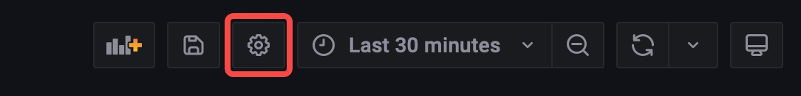

The topology plugin provides support for filtering namespaces and workloads. To apply filters, you can click on the filter icon located in the upper left corner of the topology page. 

By default, there is no "All" option available due to potential performance issues when dealing with a large number of namespaces and workloads. However, you have the option to enable the `All` option by configuring the dashboard settings. This allows you to have a comprehensive view of all namespaces and workloads, but please be aware that it may impact the performance of the topology plugin.

## How to filter "All" namespaces or workloads
To filter "All" namespaces or workloads in the topology dashboard, you can follow these steps:
1. Open the topology dashboard, and click on the `Dashboard settings` icon located in th upper righ corner.

2. Open the `Variables` tab in the left sidebar.
3. Select `namespace` or `workload` to edit its options.
4. Enable `Include All option` in the `Selection options` section.
5. Set the default value in the `Custom all value` box as you wish.
6. Save the configuration by clicking on the `Update` button.

After completing the above steps, you can see the `All` option in the namespace or workload filter.

### Limitations
According to the load test, the topology plugin can support up to 150 workloads at a same time. If you have more than 1000 namespaces or workloads, you may experience performance issues.